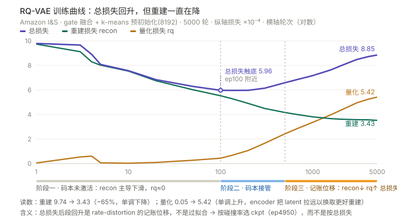

# GenRetrieval — 多模态生成式召回（MiniOneRec 升级版 2.0）


在 [MiniOneRec](https://github.com/AkaliKong/MiniOneRec) 开源框架上做的系统性升级：
**Amazon Reviews 2023 + 图文多模态 → 门控融合 → RQ-VAE 语义 ID（SID）→ LLM 生成式召回**。

> **当前进度（2026-09-16）**：**数据与 SID 构建阶段已在两个域上定版**
> —— 域 A `Industrial_and_Scientific`（25,847 商品）与域 B `Video_Games`（25,611 商品）
> 各跑完完整 pipeline（M1 / M2 完成）；**召回阶段基线矩阵已建好并本地实跑**（见 §7 与 [`baseline/`](baseline/)）；
> **SFT 数据集（M3）双域已产出并通过体检**；基座权重已下载校验、**SID 词表注册已落地并自检通过**。
> 下一步 = **IandS 单域 Run-0 训练**（先跑通一域，再考虑 VG），见 §8 与
> [`docs/SFT_PIPELINE.md`](docs/SFT_PIPELINE.md)。
> 本 README 讲"项目是什么、SID 怎么定版的、怎么复现"；
> 完整实验与结论见 **[docs/SID_PIPELINE.md](docs/SID_PIPELINE.md)**。

---

## 1. 它解决什么问题

生成式召回把"检索"改写成"生成"：LLM 直接生成下一个物品的**语义 ID 序列**。
SID 的质量决定了这件事的上限——同一个 SID 下的物品应当语义相近，前缀应当形成层次聚类。

本项目的三个增量点：

1. **多模态融合 SID**：文本（Qwen3-Embedding-0.6B）+ 图像（SigLIP）经**门控融合**成单向量，
   再送 RQ-VAE 做 3 层残差量化。融合阶段用**用户行为共现**做 InfoNCE 监督，
   使"会被一起买的物品在向量空间里靠近"——这正是 SID 需要的性质。
2. **SID 质量三层评估体系**（ICR / 保真度 / 检索结构，指标定义与公式见 §3.0），所有选型用数字裁决，不靠直觉。
3. **碰撞即语义桶**：不做 Sinkhorn 碰撞消解，同码物品整桶召回，消歧交给下游排序
   （依据：碰撞组实拍 + Snap《Semantic IDs for Recommender Systems at Snapchat》的线上实践）。

---

## 2. 流水线与定版配方

```
Amazon23 官方 5core 分片（I&S / VG 两域独立，不合并）
   │  ⚠️ 分片只是**数据源**；评估用的切分协议是 **plain LOO**（见 §7.1），不是官方 timestamp 切片
   │
   ├─ 文本 ──→ Qwen3-Embedding-0.6B ────→ (N, 1024)
   └─ 图像 ──→ SigLIP-base-patch16-224 ─→ (N, 768)
                    │
                    ↓  门控融合 gate（共现 InfoNCE，60 轮）
              (N, 1024)  emb_fused_gate_e60
                    │
                    ↓  RQ-VAE：3 层 × 256 码 × 32 维，--init_samples 8192，5000 轮
              SID codes (N, 3)
                    │
                    ↓  导出（同一 ckpt 两版，互不覆盖）
            sid_raw【默认交付：语义桶】 / sid_sk【存档：Sinkhorn 唯一化】
                    │
                    ↓  SFT → RL（MiniOneRec 路线，待上云）
              生成式召回
```

**定版配方**：`gate` 融合 + `--init_samples 8192` + 5000 轮 + **交付 `sid_raw`**。

```bash
# 一条命令复现 SID（I&S，本地 4GB 卡约 1.5h，含编码与融合约 1h）
bash scripts/multimodal/encode_all.sh IandS
bash scripts/multimodal/fuse_long.sh IandS 60 5
RESULTS_ROOT=results/sid_e5000 INIT_SAMPLES=8192 \
  bash scripts/multimodal/run_sid_exp.sh IandS 5000 "gate"
# 域 B 复验（VG：融合 60 轮 + SID 2 组，约 2h）
bash scripts/multimodal/run_vg_sid.sh
```

---

## 3. 关键结果（双域：I&S N=25,847 ｜ VG N=25,611）

### 3.0 指标定义与公式（各指标首次出现处给出；完整版见 [docs/SID_PIPELINE.md §0.1](docs/SID_PIPELINE.md)）

| 指标 | 定义与公式 | I&S 定版读数 | VG 复验读数 |
|---|---|---|---|
| **Recall@K**（共现检索，融合阶段代理指标） | `R@K = 1/Q · Σ_q 1[ Top-K(q) ∩ Gold(q) ≠ ∅ ]`：按融合向量余弦取 Top-K（排除自身），Gold = 留出共现伙伴，Q = 3,000 个 query；随机基线 `≈ avg_pos · K / N` | 0.1100（基线 0.003） | 0.2113（基线 0.0066） |
| **ICR**（唯一码率）**← 跨域选型主判据** | `ICR = 不同 SID 元组数 / N`，碰撞率 `= 1 − ICR` | 0.9582 | 0.9744 |
| **LCP ratio**（前缀语义保持） | `mean_NN lcp(i,j) ÷ mean_随机对 lcp(i,j)`；`lcp` = 两个 SID 的最长公共前缀层数；随机基线恒为 1 | 222.1 | 163.6 |
| **prefix cohesion**（前缀内聚比） | 同前缀组内两两余弦均值 ÷ 随机分组（5 次置换）的同值 | prefix-1 = 2.086 | prefix-1 = 1.585 |
| **重建 MSE / R²**（量化保真度）**← 跨域选型主判据** | `MSE = 1/(N·D) · Σ‖x̂ − x‖²`，`R² = 1 − MSE / Var(x)` | R² = 0.6530 | R² = 0.8691 |
| **L0 死码率** | `dead_l = 1 − 第 l 层被用到的码数 / K`，K = 256 | 0% | 3.52%（L1/L2 为 0） |
| **HR@K / NDCG@K**（端到端，SFT/RL 阶段） | `HR@K = 1/U · Σ_u 1[rank_u ≤ K]`；`NDCG@K = 1/U · Σ_u 1[rank_u ≤ K] / log₂(rank_u + 1)`（单正样本 ⇒ IDCG = 1） | 见 §3.4 V0 基线 | 待 SFT |

> ⚠️ **主判据不是 LCP**：第二域复验时发现 LCP 这一族指标**跨域会排序反转**
> （VG 上 RQ-KMeans 的 LCP ratio 206.3 反超 RQ-VAE 的 163.6，而它的 raw ICR 落后 8.6 个点）。
> 原因是随机基线只有 ~0.005，ratio 被极小分母放大；且 VG 上前缀结构已饱和、失去区分度。
> 所以跨域选型改用 **raw ICR + 重建 R²**（这两项两域排序完全一致）。推导见
> [SID_PIPELINE §2.11](docs/SID_PIPELINE.md)。

### 3.1 融合：监督融合才是增益来源（两域各用互斥留出对评估）

| 模式 | I&S R@10 | I&S R@100 | vs 纯文本 | VG R@10 | VG R@100 | vs 纯文本 |
|---|---:|---:|---:|---:|---:|---:|
| text（单模态基线） | 0.0830 | 0.2280 | — | 0.1497 | 0.3957 | — |
| concat（PCA 线性） | 0.0883 | 0.2347 | +6.4% | 0.1587 | 0.4493 | +6.0% |
| mlp | 0.1013 | 0.3623 | +22.1% | 0.1917 | 0.6063 | +28.1% |
| **gate（定版）** | **0.1100** | **0.3820** | **+32.5%** | **0.2113** | **0.6337** | **+41.2%** |
| 随机基线 | 0.00305 | 0.03048 | — | 0.00659 | 0.06589 | — |
| 留出对 / query 数 | 80,079 / 3,000 | | | 186,275 / 3,000 | | |
| `avg_pos` | 7.88 | | | 16.88 | | |

- 随机基线按 `R_rand@K ≈ avg_pos · K / N` 算（定义见 §3.0）：I&S `7.88×10/25,847 = 0.00305`，
  VG `16.88×10/25,611 = 0.00659`。**两域基线差 2.16× 全部来自 `avg_pos`，所以跨域只能比"相对 text 的增益"。**
- **VG 上的增益更大**（gate/text +41.2% vs +32.5%，gate/mlp +10.3% vs +8.6%），
  且模态互检索也更强（text→image R@10 **0.6363** vs 0.6217，image→text **0.5837** vs 0.5377）。
  这与开跑前的预期一致——游戏的封面是决策主导信息，工业品的图只是补充。

**为什么跑四个模式而不是只比 text / gate**：四档构成"融合复杂度阶梯"——
`text`（无融合）→ `concat`（无参拼接）→ `mlp`（参数化变换）→ `gate`（输入自适应门控）。
`mlp` 与 `gate` 参数量相同、训练轮数相同、损失相同，唯一区别是"融合权重是否由输入决定"，
因此 `gate 0.1100 vs mlp 0.1013（+8.6%）` 才能把增益归因到**门控机制本身**，
而不是"只要上 MLP 就能学"。少了这一档，+33% 里有多少来自"有参数"就说不清。
（这也是本阶段敢多试的原因：一次融合几十分钟，比下游一次 RQ-VAE 便宜一个量级。）

### 3.2 SID 消融：定版 `gate + init8192 + 5000 轮`（6 组，≈5.4 GPU 小时）

这 6 组**不是并列罗列，而是两组独立消融**——变量分别是"输入表示"与"量化器配置"：

| run | 唯一变量 | ICR | LCP ratio | 重建 R² | L0 死码率 | 耗时 |
|---|---|---|---|---|---|---|
| text | **输入**：纯文本 embedding（无融合） | 0.8383 | 117.5 | 0.8698 | 65.5% | 58 min |
| gate + 首 batch 初始化 | **init 采样数** = 首个 batch | 0.9505 | 151.4 | 0.6399 | 32.6% | 58 min |
| **gate + init8192（定版）** | **init 采样数** = 8192 | **0.9582** | **222.1** | **0.6530** | **0%** | 61 min |
| gate + 全量初始化 | **init 采样数** = 全量 N | 0.9567 | 212.7 | 0.6468 | 8.6% | 62 min |
| gate + 训练期 Sinkhorn | **训练期是否开 Sinkhorn** | 0.9537 | 205.5 | 0.6427 | 4.3% | 83 min |
| rqkmeans（FAISS-RQ） | **量化器路线**（见下） | 0.8395 | 175.8 | — | 0% | **6 s** |

为什么只消融这些：`init` 与"训练期 Sinkhorn"是唯二能改变结论的变量
（死码 32.6%→0%、LCP 151→222）；而 `256×3` 码本、32 维 latent、`beta=0.25` 沿用上游已验证配方，
改它们属于调参而非选型，在 4GB 卡上单次 1 小时，不划算。
`rqkmeans` 只要 6 秒却能裁掉"要不要用 RQ-VAE"这个路线问题，是全场性价比最高的对照。

- **LCP ratio** = 语义近邻对的 SID 前缀长度 ÷ 随机对（random 的 222 倍，公式见 §3.0）→ 前缀层次结构强。
- `rqkmeans` 两点补充：① 它的 Sinkhorn **改码比例 27.06%**（RQ-VAE 只需 6.54%）；
  ② 它的 MSE 是 emb 空间直接量化（无 decoder），与 RQ-VAE 的 decoder 重建**不可横比**，故表中 R² 留空。
  综合裁决：维持 RQ-VAE。
- `mlp` 融合向量的 SID 在早期 1500 轮阶段跑过（`results/sid/IandS/mlp/`），
  定版阶段没再跑——gate 已在融合阶段胜出，再跑一遍属于重复验证，不划算。

训练曲线（三条线分离即"rate-distortion 记账位移"，**总损失后期回升但重建仍在降**，
所以按碰撞率而非总损失选 ckpt）：



### 3.3 为什么不消解碰撞（语义桶）

- 碰撞账本：965 组 / 2,046 物品（7.9%），**桶均 2.1、最大 5**。
- 实拍最大三组全是同系列规格变体（O 圈 / 自攻螺丝 / 拉紧带），**组内 cos 0.92~0.95**（随机对 0.18）。
- Sinkhorn 只能到 ICR 0.9997，残留 7 组**全部是逐位相同的重复 embedding**（Amazon 同品多 listing），
  确定性规则数学上不可分；代价是改写 6.54% 物品的码、LCP 222.1→209.4。
- 工业界证据：Snap（SIGIR'26, arXiv 2604.03949，官方代码 = `refs/GRID`）Table 5 显示
  唯一性 92.95%→70.58% 时 Recall@10 仅 6.1→6.0（~70% 以上即平台期），
  其线上 A/B 用的就是"每码映射 100 个物品 + relevance-guided 消歧"。

⚠️ **诚实边界**：未做 raw vs sk 的 SFT 端到端消融（成本有限）。这是"离线指标 + 工业界先例"
支撑的设计选择，不是端到端验证过的结论。`sid_sk.npy` 随每次导出产出，可随时切回唯一化口径。

### 3.4 V0 基线（复刻版 MiniOneRec，RTX 3090 实测，beam=10）

| 配置 | HR@1 | HR@3 | HR@5 | HR@10 | NDCG@5 | NDCG@10 |
|------|------|------|------|-------|--------|---------|
| 0.5B SFT | 0.036 | 0.057 | 0.068 | 0.093 | 0.052 | 0.060 |
| 0.5B RL-epoch2 | 0.047 | 0.070 | 0.083 | 0.109 | 0.066 | 0.074 |
| 官方 1.5B 权重 | 0.085 | 0.113 | 0.133 | **0.154** | 0.109 | **0.116** |

这是后续 SFT / RL 阶段要超越的锚点。

### 3.5 VG 第二域复验：配方跨域可迁移（2026-09-13）

**为什么只跑 2 组**：I&S 的 6 组是**选型**（配方在那里定）；VG 只回答"换一个分布还成立吗"，
再跑 6 组消融 = 重复已知结论。所以 VG 只跑 `RQ-VAE`（定版配方）+ `RQ-KMeans`（路线对照）。

```bash
bash scripts/multimodal/fuse_long.sh VG 60 5   # 融合 60 轮（旧产物是 3 轮口径，不可比，故重跑）
bash scripts/multimodal/run_vg_sid.sh          # SID 2 组 + 三件套 + 对比表
```

| 指标 | **VG RQ-VAE** | VG RQ-KMeans | I&S RQ-VAE（参照） | I&S RQ-KMeans（参照） |
|---|---:|---:|---:|---:|
| **raw ICR** | **0.9744** | 0.8882 | 0.9582 | 0.8395 |
| 最大冲突组 | 7 | 12 | 5 | 14 |
| L0 死码率 | **3.52%** ⚠️ | 0% | 0% | 0% |
| LCP ratio | 163.6 | 206.3 | 222.1 | 175.8 |
| 重建 R²（口径不同，仅参考） | **0.8691** | 0.7770 | 0.6530 | 0.4460 |
| Sinkhorn 后 ICR | 0.9954 | 0.9959 | 0.9997 | 0.9996 |
| Sinkhorn 改码比例 | **3.93%** | 18.10% | 6.54% | 27.06% |
| 耗时 | 4,015 s | **5.5 s** | 3,644 s | **6 s** |

**验收判据（开跑前写死，含未达标项）**：ICR ≥ 0.94 → **0.9744 ✅**；
L0 死码 = 0% → **3.52% ⚠️ 未达标**（9/256 个码弃用，L1/L2 为 0）；
LCP ratio ≥ 150 → **163.6 ✅**；R² ≥ 0.6 → **0.8691 ✅**。
逃逸条件（死码 > 5% 或 LCP < 100 才补跑 VG init 消融）**未触发 → 不补跑**。
死码根因已查清（见 §3.5 发现 4 与 [SID_PIPELINE §2.8.2](docs/SID_PIPELINE.md)）：
**不是塌缩，而是 VG 的融合点云维度太低（有效秩 32 vs I&S 109），256 个 L0 码对本域供给过剩**，
多余的 9 个质心落在数据云之外、永远拿不到梯度。

**四个新发现**：

1. **LCP 族指标跨域会排序反转**——VG 上 RQ-KMeans 的 LCP ratio 反超 RQ-VAE，
   而它的 raw ICR 落后 8.6 个点。→ 跨域主判据改为 **raw ICR + 重建 R²**（详见 §3.0 警示）。
2. **"融合后 ICR 上限"不是流水线天花板**——它只约束纯 argmin；Sinkhorn 靠 batch 分桶能突破
   （VG 0.9954 > 理论值 0.9936）。
3. **非孪生碰撞可以被 100% 清干净**——VG 的 Sinkhorn 残余碰撞 119 份**逐份都在孪生组内**
   （I&S 残余 7 份同理），"残留碰撞 ≡ 重复 embedding"在双域成立。
4. **"init8192 → L0 零死码"是 I&S 的域内结论，不能外推**——VG 上 L0 死码 3.52%。
   实测根因是**输入空间有效秩差一个量级**（VG 32.0 vs I&S 109.2；达 50% 方差所需 PC 数
   17 vs 111）：VG 的 1024 维里只有约 32 维在动，256 个 L0 元胞铺不满，最孤立的 9 个质心
   （离样本距离 0.174~0.178，而活码全 ≤ 0.113，**零重叠**）落在数据云外成了永久死码。
   同一原因也解释了 VG 为什么重建更易（R² 0.869 vs 0.653）——**"好压"与"会塌"是一体两面**。

### 3.6 SID 产物落盘位置

两域目录同构，`results/sid_e5000/<IandS|VG>/<配置>/`：

| 内容 | 文件 |
|---|---|
| **交付 SID**（语义桶） | `gate__init8192/sid_raw.npy` — `(N,3)` int，纯 argmin |
| 唯一化存档 | `gate__init8192/sid_sk.npy` — 末层 Sinkhorn 版，可随时切回 |
| 模型权重 / 训练日志 | `gate__init8192/ckpt/selected_model.pth` ｜ `train.log`、`train_metrics.json` |
| 三件套评估 / 汇总 | `gate__init8192/eval_raw.json`、`eval_sk.json` ｜ `summary.json` |
| RQ-KMeans 对照 | `rqkmeans/`（同结构） |
| 路线对比表 | `compare_rqkmeans.md` |
| 上游融合向量 | `data/Amazon23/<IandS|VG>/emb/long/emb_fused_gate_e60.npy` |

---

## 4. 快速开始

> 完整版（环境分步、数据准备、故障排除）见 **[docs/QUICKSTART.md](docs/QUICKSTART.md)**。

| 项目 | 云端训练（正式） | 本地迭代（SID 阶段） |
|------|------------------|----------------------|
| GPU | RTX 3090 24GB | RTX 3050 Ti 4GB |
| Python / CUDA | 3.11 / 11.8 | 3.11 / 11.8 |

### 4.1 上云启动 SFT 训练（最短路径）

🔴 **先搞清什么必须带上云** —— SFT 数据与模型权重**都不在 git 里**（`.gitignore` 明确排除）：

| 内容 | 体积 | 入 git？ | 上云方式 |
|---|---:|:---:|---|
| `data/Amazon23/<域>/sft/` | 1.4 GB | ❌ | **必须上传**（或在云端按 §4.2 重建） |
| `models/Qwen3-0.6B` | 1.5 GB | ❌ | **不用上传** —— 云端用脚本从 ModelScope 拉，比传更快 |
| `results/sid_e5000/` | 0.9 GB | ❌ | 只有要在云端**重建 SFT 数据**时才需要；直接训练不需要 |
| 代码 / 文档 / 脚本 | 很小 | ✅ | `git clone` 即可 |

```bash
# ── 本地：把 SFT 数据推上去（约 1.4 GB / 域；--relative 会保留目录结构）──
rsync -avP --relative data/Amazon23/IandS/sft  user@<云主机>:~/GenRetrieval/
rsync -avP --relative data/Amazon23/VG/sft     user@<云主机>:~/GenRetrieval/   # 多域

# ── 云端：克隆代码 + 建环境 ──────────────────────────────────────────
git clone git@github.com:TangPeng7477/GenRetrieval.git && cd GenRetrieval
bash scripts/setup_env.sh            # 约 2-4 min（torch 2.6.0+cu118 + requirements-core.txt）
source .venv/bin/activate            # 后面所有命令都要在这个环境里
python scripts/check_deps.py --strict # 依赖完备性：AST 扫真实 import vs requirements-core.txt

# ── 云端：拉权重（1.5 GB；ModelScope 实测 ~5.5 MB/s，带 sha256 校验 + 冒烟测试）──
bash scripts/download_base_models.sh          # 幂等，已下过的会 skip
# bash scripts/download_base_models.sh --target all   # 连 teacher Qwen3-1.7B（4.06 GB）

# ── 云端：跑前自检（不需要 GPU，约 1 min）────────────────────────────
python scripts/sft/verify_run0_registration.py --domain IandS    # SID 注册 + 数据端到端
python scripts/sft/probe_constrained_decoding.py --domain IandS --n-rows 20   # 训练/评估口径一致

# ── 云端：训练 ───────────────────────────────────────────────────────
bash sft_run0.sh                     # 默认 IandS -> outputs/IandS-run0/
# TASKS=T1 bash sft_run0.sh          # 任务消融（SFT_PIPELINE §3.3）
# RUN_TAG=S0 bash sft_run0.sh        # 课程学习 S0

# ── 云端：评估 + 汇总 ────────────────────────────────────────────────
bash evaluate_run0.sh                # EXP_ID 自动反推 -> results/sft/IandS-run0/
python scripts/sft/collect_eval_results.py     # -> docs/SFT_EVAL_RESULTS.md

# ── 本地：把结果拉回来（results/ 不入 git，必须手动取）──────────────
# rsync -avP user@<云主机>:~/GenRetrieval/results/sft/ ./results/sft/
```

**四个容易踩的点**（都已写进脚本，这里先提醒）：

- ⚠️ **依赖完整性有工具把关**：`scripts/check_deps.py --strict` 用 AST 扫主干脚本的真实
  import、与 `requirements-core.txt` 比对（含 `sklearn`→`scikit-learn` 这类别名映射），
  并区分「真缺」与「已知例外」（`torch` 按 CUDA 单独装、`flash_attn` 有 `try/except`
  降级到 `sdpa`）。历史上 **`fire` 就漏过** —— `fire.Fire(train)` 是 `sft.py` 的入口，
  漏装会在启动瞬间 `ModuleNotFoundError`；现已在 `requirements-core.txt:45`。
  当前实测 **缺 0 个 ✔**。上云前跑一次可提前拦住这类问题。
- ⚠️ **`sft_run0.sh` 的默认 batch 是给 3090 的**（`BATCH_SIZE=64` / `MICRO_BATCH_SIZE=4`）。
  换小显存卡时**只调 `MICRO_BATCH_SIZE`**（累积步数自动变），别动总 `BATCH_SIZE`。
- ⚠️ **评估的显存由 `BATCH_SIZE × NUM_BEAMS` 决定**（beam 展开后的序列总数），不是 batch 单独决定。
  4GB 卡 `batch4 × beam20 = 80` 条可跑、`batch8 × beam50 = 400` 条会 OOM；3090 上不用管。
- ⚠️ **云端没有 `./.venv/Scripts/python.exe`**（那是 Windows 路径），脚本会自动退回 PATH 里的
  `python` —— 所以**必须先 `source .venv/bin/activate`**，否则会用到系统 python（缺 numpy）。

> 训练 / 评估的详细参数映射见 **§8.7** 与 [docs/SFT_PIPELINE.md](docs/SFT_PIPELINE.md) §3.2；
> 结果记录规范见 [docs/SFT_EVAL_RESULTS.md](docs/SFT_EVAL_RESULTS.md) 与
> [docs/SFT_PIPELINE.md](docs/SFT_PIPELINE.md) §3.7。

### 4.2 从零重建全流程（SID 阶段；换域 / 换数据时才需要）

```bash
# 环境（云平台 / Linux）
bash scripts/setup_env.sh                      # Windows 用 scripts\setup_env.ps1
# 数据
bash scripts/data/download_amazon23.sh
python scripts/data/prepare_amazon23.py --category Industrial_and_Scientific --short IandS
python scripts/multimodal/download_images.py --short IandS
# 编码 → 融合 → SID（详见 QUICKSTART §2.5）
bash scripts/multimodal/encode_all.sh IandS
bash scripts/multimodal/fuse_long.sh IandS 60 5
RESULTS_ROOT=results/sid_e5000 INIT_SAMPLES=8192 bash scripts/multimodal/run_sid_exp.sh IandS 5000 "gate"
# 域 B：Video_Games（同一套命令，只换 --category/--short；SID 只跑定版 2 组，不重做消融）
python scripts/data/prepare_amazon23.py --category Video_Games --short VG
python scripts/multimodal/download_images.py --short VG
bash scripts/multimodal/encode_all.sh VG
bash scripts/multimodal/run_vg_sid.sh
# SFT 训练 / 评估 —— 若只想跑 SFT，直接看 §4.1（含数据上传与权重下载的最短路）
python scripts/sft/verify_run0_registration.py --domain IandS   # 跑前自检（不需 GPU）
bash sft_run0.sh
bash evaluate_run0.sh
python scripts/sft/collect_eval_results.py
bash rl_run0.sh   # RL（GRPO）；前置依赖 SFT Run-0 的产物，见 §8.8
```

> ⚠️ 不要直接 `pip install -r requirements.txt`（含 `torchrec`/`fbgemm_gpu`/`deepspeed` 等装不上或冗余项），
> 用裁剪后的 `requirements-core.txt`。
> ⚠️ >100MB 的下载（torch / 数据集 / 模型权重）不要在受限沙箱内执行，实测限速可达 51 倍。

---

## 5. 代码地图

### 5.1 核心链路（本项目实际运行，★ = 主干）

```
scripts/data/download_amazon23.sh        官方 5core/timestamp 分片 + meta（hf-mirror）
        ↓
scripts/data/prepare_amazon23.py         → item2id / *.inter / stats.json / domain 文件
        ↓
scripts/multimodal/download_images.py    并发抓图（I&S 覆盖 100%，VG 99.84%）
scripts/multimodal/encode_text.py        Qwen3-Embedding-0.6B      → (N, 1024)
scripts/multimodal/encode_image.py       SigLIP-base-patch16-224   → (N,  768)
        ↓   （scripts/multimodal/encode_all.sh 串行调度上面三步）
scripts/multimodal/fuse_embeddings.py    ★ 四模式融合 + 共现 InfoNCE + 留出对 R@K
        ↓   （fuse_long.sh = 全量对 60 轮，定版口径）
rq/train_rqvae.py                        ★ RQ-VAE 训练（kmeans init，按碰撞率选 ckpt）
        ↓
rq/build_sid_dual.py                     ★ 导出 sid_raw（默认交付）/ sid_sk（存档）
rq/build_sid_rqkmeans.py                 ★ RQ-KMeans 对照（MiniOneRec 原版 FAISS-RQ）
        ↓
rq/eval_sid.py                           ★ 三件套评估
rq/diag_sinkhorn_residual.py               残留碰撞诊断（eps × iters 双扫描）
        ↓
scripts/multimodal/{compare_sid_modes, compare_rqkmeans, make_sid_summary}.py
```

- **编排**：`scripts/multimodal/run_sid_exp.sh`（I&S 实验矩阵）、`run_vg_sid.sh`（VG 全流程）
- **诊断**：`scripts/multimodal/diag_collision.py`（碰撞组溯源 / 孪生 embedding 定位）、
  `probe_gate_twins.py`（门控是否用上图像：A/B/C 三类细分）、
  `probe_twin_sinkhorn.py`（孪生组在 raw/sk 下的存活账本）、
  `probe_dataset_stats.py`（双域字段覆盖率 / 评分分布 / 长尾 / 冷启动）、
  `probe_latent_rank.py`（融合向量与 latent 的有效秩 + L0 码本覆盖 → 死码溯源）、
  `probe_alignment_methods.py`（跨模态「映射到同一语义空间」的方法对比 + 因素正交拆解：
  降维 / 白化 / 映射族 / 检索空间 / 正则强度，含 `alpha`、`lambda` 扫描与 CCA 截断曲线。
  **跨模态 R@10：现状 0.58/0.61 → 降维 0.72/0.80 → 再加白化 0.81/0.88**，
  详见 `docs/UPGRADE_PLAN.md §4.6.3`）
- **环境**：`scripts/setup_env.sh` | `setup_env.ps1`、`download_models.sh`、`tools/hf_repair_cache.py`
- **被直接 import 的上游文件**（复制自 MiniOneRec 但在用）：`rq/datasets.py`（EmbDataset）、
  `rq/rqkmeans_faiss.py`（FAISS-RQ 量化器）、`rq/models/{rqvae,rq,vq,layers}.py`

### 5.2 V0 复刻链路（MiniOneRec 原样保留，**M3 起部分启用**）

| 状态 | 文件 |
|---|---|
| **✅ M3 在用**（2026-09-16） | `data.py`（三个 SFT Dataset 类；**已改 1 处**，修 train/eval prompt 不一致 → §8.7）· `sft.py`（**已改 5 处** → [SFT_PIPELINE §4.6](docs/SFT_PIPELINE.md)）· `LogitProcessor.py`（Trie 约束解码，**只在评估端用**）· `evaluate.py`（已就位，待训练产物）· `calc.py`（评估指标，`evaluate_run0.sh` 实际在调） |
| **🔧 RL 已适配**（2026-09-17） | `rl.py`（**已改 5 处** → [RL_PIPELINE §7](docs/RL_PIPELINE.md)）· `minionerec_trainer.py`（自定义 GRPO 训练器 `ReReTrainer`；`[实测]` trl 0.24.0 + transformers 4.57.1 下 import 通过）· `sasrec.py`（仅 `sasrec` 奖励需要） |
| ⏸ 未启用 | `SASRecModules_ori.py` `utility.py` `convert_dataset.py` `split.py` `merge.py` `data_test.py` `sinkhorn_demo.py` |
| ⏸ 上游分支 | `convert_dataset_gpr.py` `sft_gpr.py` `rl_gpr.py` `ts_rec_data.py` `ts_rec_sft.py` `ts_rec_data/` `config/zero2_opt.yaml` |
| ⏸ 旧数据管线 | `data/amazon18_data_process.py` `data/amazon23_data_process.py` `data/process.py` |
| ⏸ 另一条索引路线 | `rq/rqvae.py`(原版) `rq/trainer.py` `rq/utils.py` `rq/rqkmeans_constrained.py` `rq/rqkmeans_plus.py` `rq/generate_indices*.py` `rq/text2emb/` |

§3.4 的 V0 数字来自原 MiniOneRec 项目（RTX 3090 实测），在本仓仅作待超越的锚点。

> ⚠️ 🔴 根目录 `sft.sh` / `sft_3090.sh` / `evaluate.sh` / `evaluate_3090.sh` **仍是 MiniOneRec 原版**，
> 内部数据路径写死为 `./data/Amazon/train/${CATEGORY}*11.csv` —— **本仓不存在该路径**，
> 直接跑会 `ls` 空、`${test_file}` 为空字符串。本项目入口是 **`sft_run0.sh`**（§8.7）与 **`rl_run0.sh`**（§8.8）。

### 5.3 召回基线（`baseline/`，独立包，不改动主干）

```
baseline/run.py                     统一入口（模型注册表 = 实验登记表，定版 4 模型见 §7.2）
baseline/common/{data,metrics,nn,base}.py   数据加载 / 指标口径 / 训练评估骨架（唯一口径源）
baseline/models/seq.py                      gru4rec · sasrec（序列建模）
baseline/models/two_tower.py                twotower_id · twotower_mm（双塔，后者已移出主榜）
baseline/models/{heuristic,mf}.py           pop·itemknn / bprmf（已移出主榜，实现保留）
baseline/generative/retrieval.py            content_ann（融合向量近邻）· sid_prefix（已移出主榜）
baseline/generative/sid_gr.py               sid_gr：SID 自回归 + Trie 约束解码（已移出主榜）
baseline/scripts/{summarize,diagnose_coldstart,probe_sequence_reconstruction,diag_sidprefix}.py
baseline/{SURVEY,README,RESULTS}.md         综述 / 口径与设置 / 自动生成的结果表
```

## 6. 文档地图

| 文档 | 内容 |
|---|---|
| **[docs/SID_PIPELINE.md](docs/SID_PIPELINE.md)** | **SID 唯一入口**：参考方法综述 + 本项目实现与知识点 + 探索过程全记录 + 定版配方（新读者从这进） |
| [docs/KNOWLEDGE_BASE.md](docs/KNOWLEDGE_BASE.md) | 知识点与机理总览（RQ-VAE / Sinkhorn / 死码 / **指标口径总表（含公式）** + FAQ） |
| [docs/QUICKSTART.md](docs/QUICKSTART.md) | 从零跑通（环境 → 数据 → SID → 训练） |
| [docs/UPGRADE_PLAN.md](docs/UPGRADE_PLAN.md) | 升级方案与里程碑（M1~M6） |
| **[docs/PRECISION_GUIDE.md](docs/PRECISION_GUIDE.md)** | **混合精度速查**：bf16/fp16/fp32 位分配与数值范围（带图）+ 对本项目的显存/数值影响 + **V100 能不能跑** |
| [docs/DATASET.md](docs/DATASET.md) | Amazon23 数据集档案与切分口径 |
| **[docs/EVAL_PROTOCOL.md](docs/EVAL_PROTOCOL.md)** | **召回评估协议定版**：数据集划分依据 + 指标定义 + 冷/热分桶 + 报数模板 + 给 SFT/RL 的三条闸门 |
| **[docs/SFT_PIPELINE.md](docs/SFT_PIPELINE.md)** | **SFT 唯一入口**：提示词设计依据（文献对照）+ 四任务数据集规格 + **上游产物→训练参数映射（§3.2）** + 体检实测 + 碰撞映射口径 |
| **[baseline/SURVEY.md](baseline/SURVEY.md)** | **召回基线文献综述**：经典/生成式 baseline 清单、公开数字（标核验等级）、能/不能横比的原因 |
| **[docs/RL_PIPELINE.md](docs/RL_PIPELINE.md)** | **RL 唯一入口**：**数据集零新增（全部复用 SFT 产物）** + 上游→参数映射 + 约束映射实测 + 奖励可用性 + 对原版的改动清单 |
| [baseline/README.md](baseline/README.md) | 召回基线的评估口径、复现设置与命令、踩坑记录 |
| [baseline/RESULTS.md](baseline/RESULTS.md) | 双域基线实测结果表（自动生成，随跑随更新） |
| — | `docs/EXPERIMENT_LOG.md`（实验流水账）为本地文档，按要求未上传 |
| [docs/V0_MINIONEREC_TECH_DOC.md](docs/V0_MINIONEREC_TECH_DOC.md) | V0 复刻版技术文档（归档） |

---

## 7. 数据集划分与召回基线矩阵（`baseline/`，2026-09-14 定版）

在启动 SFT/RL 之前先立标尺：**没有同口径的基线，"生成式召回提升了多少"这句话无法成立**。
**划分与指标的口径定版见 [docs/EVAL_PROTOCOL.md](docs/EVAL_PROTOCOL.md)**；
完整清单、文献数字与口径差异见 **[baseline/SURVEY.md](baseline/SURVEY.md)**；
复现设置与踩坑见 **[baseline/README.md](baseline/README.md)**；实测结果表见 **[baseline/RESULTS.md](baseline/RESULTS.md)**。

### 7.1 数据集划分（定版 = plain LOO）

> 数据源仍是 Amazon23 **官方 5core 分片**，但**评估切分用的是 plain LOO**（`scripts/data/prepare_amazon23_loo.py`），
> 与 TIGER / LETTER / LC-Rec / IDGenRec / CCFRec / MTGRec / EAGER 7/8 同类目论文**完全同构**。

| 项 | 定版 | 说明 |
|---|---|---|
| 过滤 | 5core（user / item 各 ≥5 次交互） | 官方分片自带 |
| test | 每用户**最后一条**交互 | plain LOO |
| valid | 每用户**倒数第二条** | plain LOO |
| train | 前 K−2 条做 **sliding-window**（target 之前 ≥2 项，history ≤20） | 每用户多条样本 |
| 候选集 | **全库、无负采样** | 与论文一致 |
| 屏蔽 | `history ∪ 重建的完整训练序列 ∪ valid 目标` | 不屏蔽会给所有方法放水 |

**样本数（实测，`data/Amazon23/<域>/<域>.stats.json`）**：

| 域 | n_items | n_users | train | valid | test |
|---|---:|---:|---:|---:|---:|
| IandS | 25,847 | 50,985 | 208,999 | 50,984 | 50,982 |
| VG | 25,611 | 94,762 | 435,534 | 94,761 | 94,759 |

- "完整训练序列"不是从文件读的，而是**从滑窗样本反推重建**（三条前提已实测验证，
  `baseline/scripts/probe_sequence_reconstruction.py`）；不做会给所有方法放水
  （实测 I&S 补掉 3,722 个、VG 补掉 10,186 个本应屏蔽的物品）。
- ✅ **与论文逐格对齐**：I&S test 50,985、VG test 94,762 —— 与 CCFRec / MTGRec 报的用户数**完全相同**。
- ⚠️ 官方自带的序列推荐参考实现用的是 **0core**（候选空间 I&S 是 5core 的 16.5×、VG 的 5.4×），
  **连"官方参考实现的数字"也不能直接当目标线** —— 三套口径两两不可横比（`SURVEY.md §1.5.2`）。
- ⚠️ **切 LOO 的代价**：冷启动命题从主榜消失（LOO 下冷目标 ≈0）。v1 timestamp 时代那条
  "sid_prefix 冷/热比 80%(I&S) / 94%(VG)" 的结论改在 **MiniOneRec-style sliding-window time-split 附录**
  单独跑（`EVAL_PROTOCOL.md §6` 待办）。

### 7.2 对比基线矩阵（定版 4 个模型）

| 组 | 模型 | 结构 | 输入特征 |
|---|---|---|---|
| A_classic | **`gru4rec`** | GRU(1 层) + 末位预测 | ID embedding（纯协同） |
| A_classic | **`sasrec`** | 因果自注意力(2 层 2 头) + 末位预测 | ID embedding（纯协同） |
| A_classic | **`twotower_id`** | 双塔：历史 **mean 池化**（★无时序建模） | ID embedding（纯协同） |
| B_retrieval | **`content_ann`** | 历史融合向量 mean 池化 + 余弦检索 | **多模态融合向量**（冻结） |

> 已移出主榜（实现类与产物均保留可回溯）：`sid_prefix` / `sid_gr`（2026-09-13）、
> `twotower_mm`（2026-09-14）、`pop` / `itemknn` / `bprmf`（2026-09-13）、`bert4rec`（更早）。
> 移出理由写在 `baseline/run.py` 的 registry 注释里。

**口径统一**：全库排序（无负采样）、history ≤ 20、**训练目标统一全库 softmax**
（不用原版的 sampled softmax / BPR，避免"损失函数"与"检索范式"两个变量混在一起）、
指标用唯一实现 `baseline/common/metrics.py`。

### 7.3 主榜实测（v2 LOO，2026-09-14，8 组）

| 模型 | IandS HR@10 | IandS NDCG@10 | VG HR@10 | VG NDCG@10 | 参数量 |
|---|---:|---:|---:|---:|---:|
| **sasrec** | **0.0395** | **0.0225** | **0.0971** | **0.0546** | 1.74M |
| gru4rec | 0.0361 | 0.0199 | 0.0871 | 0.0484 | 1.66M |
| twotower_id | 0.0345 | 0.0185 | 0.0740 | 0.0403 | 1.67M |
| content_ann | 0.0288 | 0.0149 | 0.0237 | 0.0124 | 0（冻结） |

**三条结论**：

1. **时序建模的价值被干净量化**：池化 → GRU → 自注意力，
   IandS `0.0345 → 0.0361 → 0.0395`（**+14.5%**）、VG `0.0740 → 0.0871 → 0.0971`（**+31.2%**）。
   VG 交互更密，先后顺序携带的信息更多，收益是 IandS 的两倍多。
2. **`sasrec` 与论文同梯队**：IandS 0.0395 vs TIGER 自带 sasrec 0.0422（差 −6.4%）；
   VG 0.0971 已**超过** MTGRec 复现的 TIGER（0.0868），逼近 MTGRec 的 0.0956。
   → 这是复现实现正确的锚点证据，也是 **SFT/RL 的达标线**（`EVAL_PROTOCOL.md §5` 闸门 1）。
3. **VG 全面强于 IandS**（sasrec ×2.46、gru4rec ×2.41）：VG 交互密度更高，
   与 SID 阶段"VG ICR 更高 / 协同更密"的结论一致。

### 7.4 复现命令

```bash
# 数据（LOO 切分，双域）
./.venv/Scripts/python.exe scripts/data/prepare_amazon23_loo.py --categories Industrial_and_Scientific --short IandS --sid_dir results/sid_e5000/IandS/gate__init8192
./.venv/Scripts/python.exe scripts/data/prepare_amazon23_loo.py --categories Video_Games --short VG --sid_dir results/sid_e5000/VG/gate__init8192

# 跑基线（4 模型 × 双域，4GB 卡约 40 min）
./.venv/Scripts/python.exe -m baseline.run --model all --domain all

# 生成结果表
./.venv/Scripts/python.exe -m baseline.scripts.summarize --out baseline
```

> `--sid_dir` 用于保证 `.inter` 的 item 集合与已定版的 `sid_raw` 对齐（LOO 合并三段后会多出
> 1 个无 SID 的冷启动 item，不过滤会让 SID 类模型越界）。
> 注意：`--model all` 只包含 7.2 的 4 个模型；已移出的模型需先在 `baseline/run.py` 的 registry 取消注释。

---

## 8. SFT 数据集（M3/M4，2026-09-14 已产出）

在启动 SFT 之前先把"喂给模型的每一条样本"定死。
**完整设计依据（文献对照 + 四任务定义 + 口径）见 [`docs/SFT_PIPELINE.md`](docs/SFT_PIPELINE.md)**；
验收闸门仍是 [`docs/EVAL_PROTOCOL.md §5`](docs/EVAL_PROTOCOL.md)（HR@10 > sasrec）。

> ⚠️ **已纠正**（2026-09-14）：先前写"提示词改动会让 V0 锚点（§3.4）失效"——**这个说法不成立**。
> V0 是 Amazon18 + 全局时间 8:1:1 + Qwen2.5-0.5B，本项目是 Amazon23 + LOO + Qwen3-0.6B，
> 数据集都不同，HR@10 本来就**不可比**（`SFT_PIPELINE §5.3`）。
> 本项目真正的对照是自己的 4 个 baseline（同一套 EvalSet），与提示词格式无关。

### 8.1 提示词三流派与本项目选择

| 流派 | 代表 | 训练信号落在哪 |
|---|---|---|
| A. 无提示词、平铺 NTP | **TIGER**（NeurIPS'23） | 整条序列（含历史段） |
| **B. 指令问答对（本项目）** | **P5**（RecSys'22）／**MiniOneRec**／**LC-Rec**（ICDE'24） | **只落在 target 段** |
| C. 文本化 ID | **IDGenRec** | 只落在 target 段 |

选 B 的理由：**只对 target 段计 loss**（历史段是纯条件，0.6B 小模型不该把容量花在"复述历史"上），
且只有 B 形态能把 T2/T4 这类"SID ↔ 文本"对齐任务塞进同一个 batch（LC-Rec 的 alignment 主张）。
LC-Rec 的对齐任务思想（`item2index`/`index2item`/`fusionseqrec`）被吸收成本项目的 T2/T3/T4。

### 8.2 四个任务（模板落盘在 `info/prompt_templates.json`）

| 任务 | 输入 → 输出 | 样本数（I&S / VG，train） |
|---|---|---|
| **T1 `seq2sid`**（主） | 历史 SID 序列 → 目标 SID，**提示词与 MiniOneRec 逐字一致** | 208,999 / 435,534 |
| **T2 `sid↔title`** | 物品标题 ↔ SID 双向 | 51,694 / 51,222 |
| **T3 `seq2title`** | 历史 SID → 目标标题 | 同 T1 |
| **T4 `text2sid`**（新增） | `title+brand+categories+features` → SID | 25,847 / 25,611 |

### 8.3 体检实测（`scripts/data/verify_sft_data.py`，`data/Amazon23/sft_verify.json`）

| 检查项 | IandS | VG |
|---|---:|---:|
| 768 个 SID token 各占 **1 个 token** | ✅ | ✅ |
| CSV ↔ index.json 往返一致 | 0 条不一致 | 0 条不一致 |
| T1 total 长度 max（含 target+EOS） | **179** | **179** |
| T4 total 长度 max（**抽样值，已作废**） | ~~309~~ | ~~221~~ |
| MiniOneRec 三个 Dataset 类直接可用 | ✅ | ✅ |

→ `cutoff_len` **带 T4 用 400**（全量真值 391 / 362，18 / 3 条超 320，见 §8.4）。
→ 训练端**不是"一行不用改"**：`sft.py` 已改 3 处（词表注册 / `padding_side` / `torch_compile`），
   `requirements-core.txt` 补了 `fire`。完整清单见 [SFT_PIPELINE §4.6](docs/SFT_PIPELINE.md)。

### 8.4 明文 prompt 渲染（`scripts/data/build_sft_prompts.py`，双格式）

§8.2 的产物是结构化中间态，`build_sft_prompts.py` 再渲染成**明文 prompt**，双格式各一套：

| 格式 | 形态 | 用途 |
|---|---|---|
| **`chatml`** | `<\|im_start\|>system/user/assistant` | **主榜 Run-0**：Qwen3 原生格式，与预训练一致 |
| `alpaca` | `### Instruction / ### User Input / ### Response` | 格式消融对照（非为比 V0） |

口径（2026-09-14 定版）：

- **所有引号一律去掉**，SID / title / text 全裸写 —— `<a_5>` 的尖括号本身是定界符，
  且 completion 里带引号会让 Trie 约束解码的首 token 变成 `"` 而不是 `<a_*>`
- **completion 末尾不加 `\n`** —— MiniOneRec 原文有，但在 Trie 下必被 −inf 屏蔽，是死权重
- completion 不含 EOS（训练端 `encode(eos=True)` 追加）
- T1 的 input 保留 instruction 原句重复（去掉后指令不够明确）；history 一律用 SID 序列

**逐 token 校验**：用 MiniOneRec 三个 Dataset 类生成 ground truth，与"verbatim 复刻版"逐 id 比对，
要求 0 差异（报告 `data/Amazon23/sft_prompts_verify.json`）。
`[实测]` 双域各抽 100 条：T1 100/100、T2a 49/49、T2b 51/51、T3 100/100 **全部逐 token 一致**。

`[实测]` 全量长度（双域 × 双格式，共 173 万条）：

| 任务 | 样本数 I&S / VG | total_max（含 completion+EOS） | >320 |
|---|---:|---:|---:|
| T1 `seq2sid` | 208,999 / 435,534 | 179 / 179 | 0 / 0 |
| T2 `sid↔title` | 51,694 / 51,222 | 161 / 143 | 0 / 0 |
| T3 `seq2title` | 208,999 / 435,534 | 277 / 251 | 0 / 0 |
| T4 `text2sid` | 25,847 / 25,611 | **391 / 362** | **18 / 3** |

→ **`cutoff_len` 从 320 修正为 400**（带 T4 时）。之前 §8.3 报的"T4 max 309"是**抽样**值，
全量真值 391 —— 定 max 类参数必须用全量，抽样会漏长尾。

### 8.5 碰撞桶的映射口径（本项目特有）

SID 定版为语义桶，一个 SID 可能对应 2~5 个物品（I&S 碰撞 7.92%）。
**主榜用严格口径**：每桶取训练频次最高的 1 个物品作代表（平局取最小 item_id，无泄漏），
与 baseline 同构；宽松口径（目标 ∈ 整桶即命中）单独报作上界 → `EVAL_PROTOCOL §3.4.2`。

### 8.6 复现（数据构造）

```bash
./.venv/Scripts/python.exe scripts/data/prepare_sft_data.py --domain IandS   # ~24 s
./.venv/Scripts/python.exe scripts/data/prepare_sft_data.py --domain VG      # ~35 s
./.venv/Scripts/python.exe scripts/data/verify_sft_data.py  --domain all
# 明文 prompt 渲染（可选；训练端暂未消费，见 SFT_PIPELINE §3.2）
./.venv/Scripts/python.exe scripts/data/build_sft_prompts.py --domain all --verify
```

### 8.7 训练 / 评估入口（2026-09-16）

**当前决策：先 IandS 单域跑通，验证整条链路有效后再上 VG。**

```bash
# 1) 基座权重。student 已下并校验（1,503,300,328 B / sha256 f47f7117…6874b 逐位一致）
bash scripts/download_base_models.sh                 # 幂等，已下载的会 skip
bash scripts/download_base_models.sh --target all    # 需要 teacher 时（4.06 GB）

# 2) 跑训练前自检：SID 注册 + 数据端到端 token 化（不需要 GPU，约 1 分钟）
./.venv/Scripts/python.exe scripts/sft/verify_run0_registration.py --domain IandS

# 3) 训练（0.6B 需 24GB 卡，本地 4GB 跑不了）
bash sft_run0.sh                     # 默认 IandS -> outputs/IandS-run0/
DOMAIN=VG bash sft_run0.sh           # 换域
TASKS=T1 bash sft_run0.sh            # 只跑主任务 -> outputs/IandS-run0-T1/
RUN_TAG=S0 bash sft_run0.sh          # 课程学习 S0 -> outputs/IandS-S0/
PRECISION=fp16 bash sft_run0.sh      # V100/Volta 卡必须显式切 fp16（默认 bf16；详见 PRECISION_GUIDE）

# 4) 评估（EXP_ID 自动反推；前置检查会跑「prompt 一致性 / Trie 形状」自检）
bash evaluate_run0.sh                # -> results/sft/IandS-run0/eval_IandS_beam50.json
MODEL_PATH=outputs/IandS-run0-T1/final_checkpoint bash evaluate_run0.sh
EXP_ID=x MODEL_PATH=/abs/ckpt bash evaluate_run0.sh  # 完全显式
SKIP_PROBE=1 bash evaluate_run0.sh   # 跳过口径自检

# 指标只产出 HR / NDCG（不报告 MRR —— 生成式下 ≈1/beam 是结构常数）
cat results/sft/IandS-run0/eval_IandS_beam50.metrics.json

# 5) 汇总到入 git 的结果表（record 每次评估的模型版本 / HR / NDCG / 推理时间）
./.venv/Scripts/python.exe scripts/sft/collect_eval_results.py   # -> docs/SFT_EVAL_RESULTS.md

# 4b) 不训练也能跑：evaluator 冒烟测试 + 随机下界锚点（IandS 实测 HR@K 全 0）
EXP_ID=dryrun-untrained MODEL_PATH=models/Qwen3-0.6B \
  SID_VOCAB_PATH=data/Amazon23/IandS/sft/info/sid_vocab.json \
  MAX_SAMPLES=300 NUM_BEAMS=20 bash evaluate_run0.sh   # 详见 SFT_PIPELINE §3.5
```

**上游产物 → 训练参数映射**（完整表见 [SFT_PIPELINE §3.2](docs/SFT_PIPELINE.md)）：

| 上游文件 | 训练/评估参数 |
|---|---|
| `data/Amazon23/IandS/sft/train/IandS_5_train.csv` | `sft.py --train_file` |
| `data/Amazon23/IandS/sft/valid/IandS_5_valid.csv` | `sft.py --eval_file` |
| `data/Amazon23/IandS/sft/index/IandS.index.json` | `sft.py --sid_index_path` |
| `data/Amazon23/IandS/sft/index/IandS.item.json` | `sft.py --item_meta_path` |
| `data/Amazon23/IandS/sft/info/sid_vocab.json` | `sft.py --sid_vocab_path`（**本项目新增**，留空自动推导） |
| （无对应上游文件） | `sft.py --tasks`（**本项目新增**）：默认四路全开 = 469,692 条，行为等价 MiniOneRec；传子集做任务消融 |
| `data/Amazon23/IandS/sft/test/IandS_5_test.csv` | `evaluate.py --test_data_path` |
| `data/Amazon23/IandS/sft/info/IandS.item_info.txt` | `evaluate.py --info_file` |

🔴 域代号是 **`IandS`**（用于路径），`--category` 要写**全名** `Industrial_and_Scientific` —— 两者别混。

**实验命名**：一个 `EXP_ID`（`<域>-<RUN_TAG>[-<任务集>]`，例 `IandS-run0`）串起训练产物与评估结果；
评估端从 `MODEL_PATH` 自动反推，换版本只动环境变量。详见 [SFT_PIPELINE §3.6](docs/SFT_PIPELINE.md)。

**约束解码只在评估端用**（训练是 teacher forcing：label 由数据给定，不存在自由生成，加了只会污染 loss）。实现 = `LogitProcessor.py` + `evaluate.py:206`，默认 `num_beams=50`；Trie 由 `info/*.item_info.txt`（25,847 条，覆盖全库）现场重建。

`[实测]` Trie 恰为 **5 步** `[256, 98, 1, 1, 1]` —— step3 只放 `\n`、step4 只放 EOS，与训练 target `[a,b,c,\n,EOS]` **逐位对应**（详见 [SFT_PIPELINE §3.4](docs/SFT_PIPELINE.md)）。

> 🔴 **本轮顺带修掉一处上游遗留 bug**：`data.py` 的 `EvalSidDataset` 把输入句式改成了另一句，而三个训练类用的是原句 —— **train/eval prompt 不一致**（共同前缀仅 49 token、长度差 4）。指令部分相同所以模型能部分泛化、**不会崩到 0**，但会静默掉点。已统一，并把该检查接进 `evaluate_run0.sh` 前置流程。
🔴 `evaluate.py --base_model` 必须指向**训练输出目录**（自带扩展后的 tokenizer = 152437）；
指回 `models/Qwen3-0.6B` 会让 SID 被切成碎片、Trie 全挂。

> ⚠️ 根目录 `sft.sh` / `sft_3090.sh` / `evaluate.sh` / `evaluate_3090.sh` 是 MiniOneRec 原版，
> 数据路径写死 `./data/Amazon/...`（**本仓不存在**），**不要直接用**。
>
> ⏸ M4 的语义初始化已备好码本 `info/codebook.npy` `(3,256,32)`，训练端尚未接。

### 8.8 RL 入口（GRPO，2026-09-17 适配）

**🔴 RL 不需要新数据集** —— 三个 Dataset 类全部直接读 SFT 阶段已落盘的同名产物
（`train/*.csv`、`index/*.item.json`、`index/*.index.json`），prompt 在 `pre()` 里现场构造。
详见 [docs/RL_PIPELINE.md](docs/RL_PIPELINE.md) §1。

```bash
# 前置：必须有 SFT 产物（RL 从 SFT 模型接着训；指回原始基座会静默崩，rl.py 已加护栏）
bash sft_run0.sh                        # -> outputs/IandS-run0/final_checkpoint

# RL（GRPO）：默认从 IandS-run0 接着训，reward=rule（UPGRADE_PLAN §6 的 R0 锚点）
bash rl_run0.sh                         # -> outputs/IandS-rl0/
SFT_EXP_ID=IandS-S0 bash rl_run0.sh     # 换 SFT 来源
REWARD_TYPE=ranking RUN_TAG=R1 bash rl_run0.sh    # 换奖励 / 消融标签
DOMAIN=VG bash rl_run0.sh               # 换域（需先给 category_dict 补 Video_Games）
PRECISION=fp16 bash rl_run0.sh          # V100/Volta 卡必须显式切 fp16

# 指标：RL 不产出 results/ 文件，训练内 HR/NDCG 走日志
grep -E 'HR@|NDCG@|reward' logs/rl/IandS-rl0/rl.log | tail -30

# 训完要对齐「全库排序」口径，仍走评估入口（final_checkpoint 自带 tokenizer）
MODEL_PATH=outputs/IandS-rl0/final_checkpoint bash evaluate_run0.sh
```

**上游 → 参数映射**：`--train_file` / `--eval_file` / `--sid_index_path` / `--item_meta_path` /
`--info_file` **与 SFT 阶段同名同源**；`--model_path` = `outputs/<SFT_EXP_ID>/final_checkpoint`。
完整表见 [RL_PIPELINE §2.1](docs/RL_PIPELINE.md)。

**奖励可用性**：`rule` / `ranking` / `ranking_only` 立即可用；`semantic` 缺 `--ada_path`
（item embedding 的 pickle）、`sasrec` 缺 `--cf_path`（根 `sasrec.py` 的权重）——
`rl.py` 已加护栏，缺了会明确报错而不是抛 `KeyError`。

⚠️ 根目录 `rl.sh` / `rl_3090.sh` 同样是 MiniOneRec 原版，路径写死 `./data/Amazon/...`，**不要直接用**。

---

## 9. 引用

```bibtex
@misc{MiniOneRec,
    title={MiniOneRec: An Open-Source Framework for Scaling Generative Recommendation},
    author={Xiaoyu Kong and Leheng Sheng and Junfei Tan and Yuxin Chen and Jiancan Wu and An Zhang and Xiang Wang and Xiangnan He},
    year={2025}, eprint={2510.24431}, archivePrefix={arXiv}, primaryClass={cs.IR},
}

@article{SnapSID2026,
    title={Semantic IDs for Recommender Systems at Snapchat: Use Cases, Technical Challenges, and Design Choices},
    author={Ju, Clark Mingxuan and Zhao, Tong and Neves, Leonardo and others},
    journal={arXiv preprint arXiv:2604.03949}, year={2026},
    note={SIGIR 2026 Industry Track; 官方代码 github.com/snap-research/GRID（本仓 refs/GRID 镜像）},
}
```
