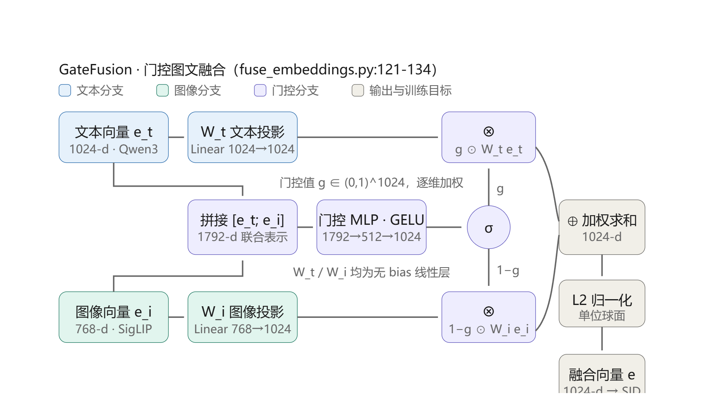
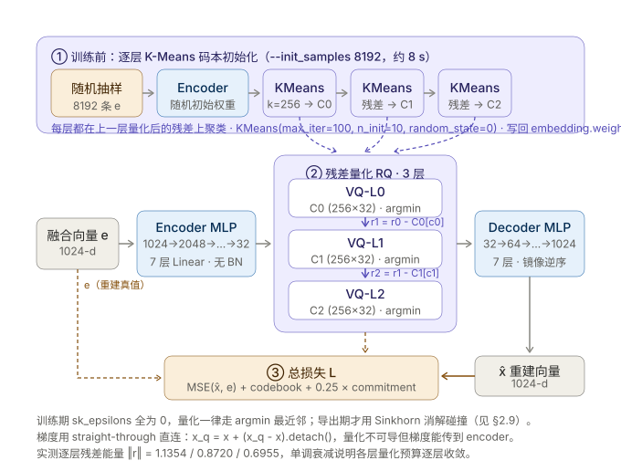

# 语义 ID（SID）构建：方法参考、实现细节与实验全记录

> 定位：**SID 阶段的唯一入口**。把原先分散的三份文档
> （`SID_PIPELINE.md` 流程结论 / `MULTIMODAL_SID_SURVEY.md` 工业调研 / `SID_TRAINING_RECIPES.md` 开源配方）
> 合并成一份，按「参考方法 → 本项目实现与知识点 → 探索过程 → 边界与下一步」组织。
>
> - **第一部分**是别人怎么做（大致介绍，含代码级配方，用于定位与对标）；
> - **第二部分**是我们实际用的模型与知识点（详细，可当实现说明书）；
> - **第三部分**是我们自己踩出来的过程与数字（详细，含失败实验）；
> - 机理推导与 FAQ 另见 `docs/KNOWLEDGE_BASE.md`；流水账见 `docs/EXPERIMENT_LOG.md`（本地，不上传）。
>
> 最后更新：2026-09-13 · 域：Amazon23 `IandS`（Industrial_and_Scientific，25,847 items）

---

## 0. TL;DR：定版配方与最终指标

**默认配方（一条命令可复现）**

```
Amazon23 I&S 官方 5core/timestamp 分片
  → 文本 Qwen3-Embedding-0.6B (1024d) + 图像 SigLIP-base (768d)
  → gate 门控融合（共现 InfoNCE，60 轮）
  → RQ-VAE 3 层 × 256 码 × 32 维，--init_samples 8192，5000 轮（bs 2048，lr 1e-3）
  → 直接导出 sid_raw（纯 argmin，不做 Sinkhorn 碰撞消解）
```

```bash
# 域 A（选型 + 定版）
RESULTS_ROOT=results/sid_e5000 INIT_SAMPLES=8192 \
  bash scripts/multimodal/run_sid_exp.sh IandS 5000 "gate"
# 域 B（同配方复验，不重做消融）
bash scripts/multimodal/run_vg_sid.sh
```

**双域状态（2026-09-13 完成）**

| 域 | N | 跑了什么 | 目的 | 结果 |
|---|---:|---|---|---|
| **IandS** | 25,847 | 融合 4 模式 + SID **6 组消融** + 碰撞溯源 | **选型**（配方在这里定） | 定版 `gate+init8192`：ICR 0.9582 / LCP 222.1 / R² 0.6530 / 死码 0% |
| **VG** | 25,611 | 融合 2 模式（60 轮）+ SID **2 组**（RQ-VAE / RQ-KMeans） | **复验**配方跨域可迁移 | ICR 0.9744 / LCP 163.6 / R² 0.8691 / L0 死码 3.52%（§3.8） |

> VG **不重做消融**是刻意的：消融回答的是"该选哪个配置"，配方已在 I&S 上裁定，
> 在第二个域重跑 6 组 = 重复已知结论（约 5.4 GPU 小时买不到新信息）。
> VG 只回答一个新问题——**同一套配方换个分布还成立吗**。

### 0.2 SID 产物落盘位置（找文件用这一张表）

两个域的目录结构完全同构（`results/sid_e5000/<域>/<配置>/`）：

| 内容 | 路径（以 VG 为例） | 说明 |
|---|---|---|
| **交付 SID** | `results/sid_e5000/VG/gate__init8192/sid_raw.npy` | **默认交付**：(N,3) int，纯 argmin，语义桶口径 |
| SID（唯一化存档） | `results/sid_e5000/VG/gate__init8192/sid_sk.npy` | 末层 Sinkhorn 消解版，可随时切回 |
| SID 元信息 | 同目录 `sid_raw.stats.json` / `sid_raw.json` | 口径、ICR、ckpt 路径、耗时 |
| 模型权重 | 同目录 `ckpt/selected_model.pth` | 按碰撞率选出的 ckpt（另有 best_loss / last） |
| 训练日志 | 同目录 `train.log` / `train_metrics.json` | 逐 epoch 三相损失 + 碰撞率 |
| 三件套评估 | 同目录 `eval_raw.json` / `eval_sk.json` | uniqueness / structure / fidelity 全量指标 |
| 汇总 | 同目录 `summary.json` | 一文件装齐训练 + raw + sk + Sinkhorn 代价 |
| 对照路线 | `results/sid_e5000/VG/rqkmeans/` | 同结构，RQ-KMeans 版 |
| **路线对比表** | `results/sid_e5000/VG/compare_rqkmeans.md` | 四列（RQ-VAE raw/sk × RQ-KMeans raw/sk） |
| 上游融合向量 | `data/Amazon23/VG/emb/long/emb_fused_gate_e60.npy` | SID 的唯一输入，(N,1024) |
| ckpt 选型依据 | `data/Amazon23/VG/emb/long/fusion_report.json` | 60 轮留出曲线 |

IandS 把上表路径里的 `VG` 换成 `IandS` 即可；融合阶段还有 `results/sid_e5000/IandS/{text,gate__init0,gate__initfull,gate__trainsk}/` 四组消融。

### 0.1 指标定义与公式（全文统一口径）

> ⚠️ **本节只覆盖"SID 质量"指标**（ICR / 重建 R² / LCP / 死码率）。
> **"召回效果"指标**（HR@K / NDCG@K / MRR / coverage / gini / beam_ceiling）的定版口径
> 在 **`docs/EVAL_PROTOCOL.md`**（唯一权威源）—— **两套指标不要串用**。
>
> 本项目所有选型都由数字裁决，所以先把指标口径钉死。下面每个公式都与
> `rq/eval_sid.py`、`scripts/multimodal/fuse_embeddings.py`、`utility.py` 的实现逐行对齐；
> **后文各章在指标首次出现时只给读法，不再重复公式**。
>
> 记号：物品集 I，N = |I| = 25,847；物品 i 的 SID 是 L=3 层 token 元组
> `c_i = (c_{i,0}, c_{i,1}, c_{i,2})`，每层码本大小 K = 256；
> 融合向量 `x_i ∈ R^1024`（structure/fidelity 评估前做 L2 归一化），重建向量 `x̂_i`。

**A 组 · 唯一性 uniqueness**（`eval_sid.py: uniqueness_metrics`）

```
ICR（唯一码率）    ICR = |{ c_i : i ∈ I }| / N              # 不同 SID 元组的个数 ÷ 物品数
碰撞率             collision_rate = 1 - ICR
碰撞账本           把共享同一 SID 的物品记为一组 g：组数 G、涉及物品数 Σ_g |g|、
                   桶均 = (Σ_{g:|g|>1} |g|) / |{g:|g|>1}|、最大组 = max_g |g|
per-layer 死码率   dead_l = 1 - |{ c_{i,l} : i ∈ I }| / K   # 第 l 层从未被用到的码占比
归一化熵           H_l = -Σ_k p_{l,k} log p_{l,k}，H_l^norm = H_l / log K
                   （p_{l,k} = 第 l 层第 k 个码的被选频率）
perplexity         ppl_l = exp(H_l)                         # 等效"用码数"，上界 K
```

**B 组 · 保真度 fidelity**（`eval_sid.py: fidelity_metrics`，需 ckpt）

```
重建 MSE           MSE = 1/(N·D) · Σ_i ‖ x̂_i - x_i ‖²              （D = 1024，输入空间度量）
重建 R²            R² = 1 - MSE / Var(x)                            （Var = 全体逐维方差）
重建 cosine        cos = 1/N · Σ_i cosine(x̂_i, x_i)
逐层累积           只用前 k 层码向量求和 ẑ = Σ_{l<k} e_l[c_{i,l}] 后解码 → MSE(k) / R²(k)
改码比例           Δ_code = 1/N · Σ_i 1[ 交付码 ≠ 纯 argmin 码 ]    （任一层不同即计 1）
保真度代价         ΔMSE = MSE(交付码) - MSE(argmin 码)              # A 组与 B 组在全层的差
```

**C 组 · 检索结构 retrieval structure**（`eval_sid.py: structure_metrics`）

```
LCP（公共前缀）    lcp(i,j) = Σ_{l=0}^{L-1} Π_{t≤l} 1[c_{i,t} = c_{j,t}]
                   # 前缀必须逐层全等才继续累加；代码里是 cumprod(eq).sum()
LCP ratio          LCP_ratio = mean_{(i,j) ∈ NN} lcp(i,j) ÷ mean_{(i,j) ∈ Rand} lcp(i,j)
                   NN  = 3,000 个 query 各自的余弦最近邻（FAISS IndexFlatIP，排除自身）
                   Rand= 200,000 个随机对。随机基线恒为 1，越大 = 前缀越承载语义
LCP gain           LCP_gain = mean_NN lcp − mean_Rand lcp          （绝对增量，辅助读数）
prefix hit@l       P_nn(l) = P(lcp ≥ l)（近邻对） vs P_rand(l)（随机对）的对比曲线
prefix cohesion    coh(l) = Σ_g (n_g / N) · [ Σ_{i≠j ∈ g} cos(x_i, x_j) / (n_g (n_g − 1)) ]
                   # 按前 l 层前缀分组 → 组内两两余弦均值 → 按组大小加权
cohesion ratio     coh_ratio(l) = coh(l) ÷ mean_{perm} coh_perm(l)
                   # 分母 = 5 次"标签随机置换"的零假设（即随机分组的同值）
                   ⚠️ 可信判据：3 ≤ 平均组大小 ≤ N/10 且 pair_coverage > 0.5，否则标"不可信"
余弦相似度         cos(u, v) = ⟨u, v⟩ / (‖u‖·‖v‖)，向量已 L2 归一化时退化为点积
```

**D 组 · 融合阶段的代理指标**（`fuse_embeddings.py: recall_at_k / info_nce`）

```
共现检索 Recall@K  R@K = 1/|Q| · Σ_{q∈Q} 1[ Top-K(q) ∩ Gold(q) ≠ ∅ ]，|Q| = 3,000
                   Top-K(q) = 融合向量空间里与 q 余弦最近的 K 个物品（排除自身）
                   Gold(q)  = 与 q 共现的留出伙伴（与训练对互斥）
随机基线           R_rand@K ≈ avg_pos · K / N   （avg_pos = 7.88 → R@10 基线 0.003、R@100 基线 0.030）
InfoNCE（训练损失） L = −1/B · Σ_a log [ exp(sim(v_a, v⁺_a)/τ) / Σ_{b=1..B} exp(sim(v_a, v⁺_b)/τ) ]
                   # 双向对称（a→b、b→a 各算一次）；B = 512，τ = 0.07；随机基线 = ln B = 6.24
```

**E 组 · 端到端指标**（V0 基线 / 后续 SFT·RL 阶段，`utility.py: calculate_hit`）

```
HR@K     HR@K   = 1/|U| · Σ_u 1[ rank_u ≤ K ]                    # 真实下一个物品是否进 top-K
NDCG@K   NDCG@K = 1/|U| · Σ_u 1[ rank_u ≤ K ] / log₂(rank_u + 1)
         # 单正样本 ⇒ IDCG = 1，所以 DCG 就是 1/log₂(rank+1)；未命中记 0
```

**外部文献指标**（只在 §1.2、§0 引用处出现）沿用原论文口径：
阿里 FORGE 的 **Gini coefficient**（码本使用均衡度）
`G = [ 2·Σ_{i=1}^{n} i·p_(i) ] / ( n · Σ_i p_(i) ) − (n+1)/n`，其中 `p_(i)` 是把各码使用频次**升序**排列后的第 i 个；
`G = 0` 表示完全均衡，`G → 1` 表示使用极度集中（可与 ICR / 死码率互补，本项目暂未接入，见 §5.2）。
Snap / AdaSID 论文里的 Recall@K 与上式同形，只是 Gold 定义不同（点击/购买正样本）。

**最终 SID 质量（`gate__init8192`，N=25,847）**（指标定义见 §0.1）

| 指标 | 值 | 说明 |
|---|---|---|
| ICR（唯一码比例） | **0.9582** | 965 组 / 2,046 物品（7.9%）共享码，桶均 2.1、最大 5 |
| LCP ratio | **222.1** | 语义近邻对的 SID 前缀长度 / 随机对，random 的 222 倍 |
| prefix-1 内聚比 | **2.086** | 同前缀组内向量相似度 / 随机基线 |
| 重建 R² | **0.6530** | decoder 重建，量化噪声约 34.7% |
| 第 0 层死码率 | **0%**（256/256 满用） | 塌缩问题在该配置下不存在 |

**为什么不再做 Sinkhorn 碰撞消解**（2026-09-13 定版，理由四条）

1. **碰撞组不是噪声，是语义簇**：实拍最大 3 组全是同品牌同系列规格变体（O 圈 / 自攻螺丝 /
   拉紧带），组内两两 cos 0.92~0.95，随机对基线 0.18 —— 生成式召回整桶返回后交给排序，
   正是工业界形态（YouTube PLUM：code → 桶 → ranker）。
2. **消解不彻底，而彻底化的收益没有证据**：Sinkhorn 只能把 ICR 从 0.9582 提到 0.9997，
   残留 14 物品 / 7 组全部是**逐位相同的重复 embedding**（确定性规则数学上不可分）；
   且消解要改写 6.54% 物品的码，LCP 222.1→209.4、R² 0.6530→0.6504 —— **换唯一性、丢结构**。
3. **工业界证据：唯一性本身不是硬指标**。Snap《Semantic IDs for Recommender Systems at
   Snapchat》（SIGIR'26 Industry Track, arXiv 2604.03949，官方代码 = `refs/GRID`）Table 5：
   唯一性 92.95%→70.58%，Amazon Beauty 的 GR Recall@10 只从 6.1 掉到 6.0 —— **~70% 以上即平台期**；
   原文："Uniqueness should not be evaluated as a gold standard"。其 Table 4 的线上 A/B 更是
   直接用"Top 10 SIDs、每码映射 100 个物品、relevance-guided 消歧"（view +0.57%、share +4.39%）。
4. **学术侧独立复现同一条结论**（2026-09-13 补充，读源码核实）：Snap 的
   **GRID**（*Generative Recommendation with Semantic IDs: A Practitioner's Handbook*,
   CIKM 2025, arXiv:2507.22224；仓库 `snap-research/GRID`）用 **5 seed 逐项消融**对比了两种去重策略——
   TIGER 式**追加码位** vs **冲突时随机选一个物品**：原文 *"both perform **comparably**,
   with TIGER's strategy having a **slight edge**. However, TIGER's approach **increases sequence length
   and decoding complexity**, and its requirement for **global SID distribution knowledge is impractical
   for large item sets**."* → 与本项目"**不做唯一化、整桶保留**"的取舍同向。
   ⚠️ 引用时注意：GRID 的评估是 **beam 内排序**（`SIDRetrievalEvaluator` + `top_k_for_generation: 10`），
   不是全库排序；细节与出处见 `baseline/SURVEY.md §1.5.4`。

> 口径声明：本项目**不做** raw / sk 的 SFT 端到端消融（成本有限）。上述决策依据是
> 离线结构指标 + 工业界先例，属"有依据的设计选择"，不是端到端验证过的结论。
> `sid_sk` 仍随每次导出一并产出（`sid_sk.npy`），随时可切回唯一化口径。

---

# 第一部分 · 参考方法：别人怎么做（大致介绍）

## 1.1 共同骨架与工业落地全景

2026 年工业界的多模态 SID 已收敛出一条**共同骨架**：

```
多模态 embedding（各自冻结的 encoder）
  → 融合成单一向量
  → RQ（残差量化）成层级离散码
  → LLM 自回归生成
```

但**融合层的位置**和**碰撞处理策略**上各家给出了不同答案 —— 这两处也正是我们做取舍的地方。

| 公司 | 系统 | 场景 | 关键贡献 |
|---|---|---|---|
| Google/YouTube | **PLUM** (arXiv:2510.07784) | Shorts / 长视频 | **SID-v2**：多模态融合 + 多分辨率码本 + 共现对比正则；线上 Panel CTR **+4.96%** |
| 阿里/淘宝 | **FORGE** (arXiv:2509.20904) | 猜你喜欢 | SID 构建策略系统性基准；**两个免训练评估指标**；线上 **+0.35% 交易量** |
| 快手 | **AdaSID** (arXiv:2604.23522) | 电商短视频 | **自适应碰撞处理**（两阶段）；线上 **GMV +0.98%** |
| 快手 | **OneRec** 系列 | 4 亿+ DAU 全场景 | 首次工业级替代级联；V2 转 decoder-only，训练算力 **-94%** |
| Snap | **GRID** (CIKM'25) | 学术基准 | SID 组件系统性 ablation 框架，官方代码 `refs/GRID` |
| Meta | HSTU / LIGER | ranking + retrieval | 推荐领域首个 Scaling Law（1.5T 参数，A/B +12.4%） |
| 京东 / 腾讯 / 阿里国际 | OxygenREC / GPR / Masked Diffusion GR | 多场景 | 指令跟随式 GR / 多场景 GR / 掩码扩散生成 |

## 1.2 四种主流范式（简述）

### PLUM / YouTube —— "融合即投影 + 对比正则进量化器"

SID-v2 四项增强：① 多模态 embedding 各自 encoder 后 concat 再投影成单向量；
② **多分辨率码本**（第 level 层码本 = `2048 / 2^(level-1)` → 2048 / 1024 / 512，浅层强区分、深层编残差）；
③ Progressive Masking 强制层级可解释；④ **共现对比正则 `L_con` 直接加进 RQ-VAE 训练目标**，
把协同信号注入 tokenization 过程。线上 Shorts Panel CTR +4.96%，CPT 约 260B tokens。

> 对我们的意义：PLUM 把对比损失加在**量化器**上；我们是"先训融合网络、冻结后再训 RQ-VAE"的
> **两阶段分离**。这是明确的升级点（见第五部分）。

### FORGE / 淘宝 —— "SID 构建策略基准 + 免训练评估"

系统性研究 SID 构建自由度：默认 **3 层 × 8192** 最优；`1024_4096_32768` 组合能提升 HR@1000；
RQ-VAE 是最合适的 tokenizer。提出两个**不需要跑 GR 训练**的评估指标：
`embedding hitrate`（每个 SID 码反查到的 embedding 能否稳定命中同类物品，衡量"码↔语义"的一致性）
+ `Gini coefficient`（衡量码本使用均衡度，公式见 §0.1 末尾）。线上 +0.35% 交易量，已全量部署。

> 对我们的意义：我们 `rq/eval_sid.py` 的三件套目标与之一致；Gini 可直接量化
> "Sinkhorn 是否把物品摊得太均匀"，值得作为第 4 个指标补进来。

### AdaSID / 快手 —— "自适应碰撞处理"（★ 直接命中我们的实测问题）

论文批评现有方法"依赖固定重叠正则（fixed overlap regularization），
不能自适应区分某个重叠应该被抑制还是保留"。两阶段框架：

**Stage 1 — 语义自适应重叠放宽**：对冲突物品对 `(i,j)`，看连续多模态 embedding 的 cos 相似度
`sim_ij`，若 `sim_ij ≥ η` 则**判定语义兼容、不惩罚**。阈值**深度感知**（冲突越深要求越严）：

| 冲突层级 | 阈值 η |
|---|---|
| 1 级 | 0.18 |
| 2 级 | 0.24 |
| 3 级 | 0.30 |

**Stage 2 — 自适应压力分配**：未放行的冲突，惩罚权重 = 空间拥挤度 `a_ij`（1~3）
× 时间衰减 `λ_col(τ) = 1 - (1-λ_min)·τ`；总损失
`L_col_ada = Σ [(1 - g_ij) × a_ij × λ_col(τ) × margin_loss]`。

离线上 Toys + TIGER：vs RQ-VAE 基线 **Recall@5 +42.6%**；线上快手电商 GMV **+0.98%**。

> 这正是我们实测到的现象：**Sinkhorn 无差别消解 = 论文批评的 fixed overlap regularization**。
> 我们最终的"语义桶"决策与 AdaSID 的结论同源，只是我们选了更省事的形态（整桶保留 + 下游排序消歧）。

### OneRec / 快手 —— "统一生成 + 多模态 tokenization"

把召回、排序、解释统一进单一生成模型；item 用 hierarchical quantization（RQ-KMeans 或 RQ-VAE）
压成 "itemic tokens"；V2 转纯 decoder-only "lazy" 架构 → 训练算力 -94%，可扩到 8B+；
RL 用 GRPO / ECPO / DPO。

## 1.3 五家开源实现的真实训练配方（读代码核对，非论文转述）

### 三个训练阶段必须分开谈

```
① 融合投影（本项目自加）     → 维度对齐，10^1 轮量级
② SID tokenizer（码本）      → 量化，按路线差 300 倍
③ 生成式模型（SFT / RL）     → LLM 微调，按 step 算，几个 epoch
```

### 各家配方

| 项目 | 数据集 | tokenizer | 层×码本 | tokenizer 训练量 | 融合方式 | 生成器训练量 |
|---|---|---|---|---|---|---|
| **MiniOneRec** | Amazon23 I&S | RQ-VAE | 3×256 | **5,000~10,000 轮**（bs 20480 / lr 1e-3 / warmup 50） | 无（纯文本） | SFT ≤10 ep（lr 3e-4, 8×H100），GRPO 2 ep，beam 16 |
| **ETEGRec** (SIGIR'25) | Amazon23 sci/inst/game | RQ-VAE 端到端 | 3×256, e_dim 128 | **10,000 轮**（bs 1024, wd 1e-4, linear sched） | 无（SASRec 协同） | `--cycle=2` tokenizer↔推荐器交替；`lr_rec=5e-3` / `lr_id=1e-4` |
| **MQL4GRec** (ICLR'25) | Amazon18 | **RQ-VAE ×2（文本/图像各一个）** | **4×256** | **500 轮**（bs 2048, eval_step 2） | **不融合，双 SID** | pretrain 30 ep + finetune 200 ep，5 个跨模态任务 |
| **GRID** (Snap, CIKM'25) | Amazon P5 | **RQ-KMeans** | 3×256 | **30 步/层**（SGD lr=0.5，只更新质心） | 无 | TIGER 320,000 步 |
| GRID | Amazon P5 | RQ-VAE | 3×256, latent 64 | **3,000 步**（**Adagrad** lr 1e-3，BN→L2 归一化） | 无 | 同上 |
| **MMGRec** (arXiv'24) | 多模态 | Graph RQ-VAE | — | — | **concat + GCN 注入 CF** | R@10 0.1269 |
| **本项目** | Amazon23 I&S + VG | RQ-VAE（同 MiniOneRec） | 3×256, e_dim 32 | **5,000 轮**（bs 2048, lr 1e-3, AdamW） | **concat/mlp/gate → 单向量** | 待 SFT |

**GRID 的 RQ-VAE config 值得单独抄**（`configs/experiment/rqvae_train_flat.yaml`）：
encoder MLP `input_dim → [768,256,128] → 64`、decoder 镜像、`BetaQuantizationLoss(beta=0.25)`、
**Adagrad lr=0.001**（不是 Adam）、`WarmupLinear(warmup_steps=1000)`、`max_steps=3000`、
`init_buffer_size=3072`（MiniBatchKMeans, KMeans++, max_iter=1000）、量化前 **BatchNorm → L2 归一化**。

### ★ Sinkhorn 该放在哪：MiniOneRec 与 MQL4GRec 是两派

`sk_epsilons` 两家都有，但**插入位置完全不同**：

| | 训练期 | 导出期 |
|---|---|---|
| **MiniOneRec** | `sk_epsilons=[0,0,0]` **完全不开** | 前 L-1 层强制 0.0、**仅最后一层 0.003**，while 循环 ≤20 轮、**只对碰撞组重编码** |
| **MQL4GRec** | `sk_epsilons=[0,0,0,0.003]` **训练期就带** | 直接导出，无后处理 |
| **本项目** | **纯 argmin**（= MiniOneRec 口径，`--train_use_sk` 默认 False） | raw = 纯 argmin；sk = 仅末层、仅碰撞组、eps 0.003、iters 50、batch 64、≤20 轮 patience 3 |

判断是否真在跑 Sinkhorn，只看 `vq.py` 这一个条件：

```python
if not use_sk or self.sk_epsilon <= 0:
    indices = torch.argmin(d, dim=-1)      # 最近邻
else:
    Q = sinkhorn_algorithm(d, self.sk_epsilon, self.sk_iters)
    indices = torch.argmax(Q, dim=-1)      # 最优传输分配
```

注意 `RQVAE.forward(use_sk=True)` 与 `get_indices(use_sk=False)` 的**默认值是反的**，
所以"训练期开不开"完全取决于 trainer 调哪个入口。

## 1.4 我们抄了什么、改了什么、拒绝了什么

| 决策 | 来源 | 我们的处理 |
|---|---|---|
| 导出期 **只动最后一层** | MiniOneRec `generate_indices.py:106-110` | ✅ 抄。保前缀语义结构（Trie beam / LCP 的命根子） |
| 导出期 **只修碰撞组**、迭代到收敛（上限 20 轮） | 同上 | ✅ 抄。全量跑 Sinkhorn 会把不撞的 item 也挪位，白白损失保真度 |
| 训练期 **不开** Sinkhorn | MiniOneRec | ✅ 采纳（MQL4GRec 派经实测被支配，见 §3.3） |
| k-means 初始化 | 上游是"训练首 batch" | 🔧 **改成独立 init pass（8192 样本）**：L0 死码 32.6%→0% |
| 逐层训练 `train_layer_wise` | GRID（仅 RQ-KMeans 路线启用） | ❌ 不适用（我们 RQ-VAE 端到端） |
| 量化前 BN→L2 归一化 | GRID | ⚠️ 未接，可选精修 |
| 共现对比损失下沉到量化器 `L_con` | PLUM | ⚠️ 未接（我们只加在融合层），列为高 ROI 改进 |
| 语义自适应碰撞 | AdaSID | ⚠️ 未接；我们改用更省事的"整桶保留 + 下游排序消歧" |
| 多分辨率码本（2048/1024/512） | PLUM | ⚠️ 未接；仍是均匀 256×3 |

---

# 第二部分 · 本项目实际用的模型与知识点（详细）

## 2.1 流水线、产物与耗时

| 阶段 | 脚本 | 产物 | 耗时（实测） |
|---|---|---|---|
| 数据准备 | `scripts/data/prepare_amazon23.py` | `data/Amazon23/IandS/{item.json, item2id, *.inter, stats.json}` | 分钟级 |
| 图像下载 | `scripts/multimodal/download_images.py` | `images/*.jpg` 25,824 张 / 2.7GB | 26 min（32 线程） |
| 文本编码 | `scripts/multimodal/encode_text.py` | `emb/emb_text_title-features-category.npy` (N,1024) | ~4 min（token 预算装箱后 101 item/s） |
| 图像编码 | `scripts/multimodal/encode_image.py` | `emb/emb_image_siglip.npy` (N,768) + `mask` | ~20 min |
| 融合训练 | `scripts/multimodal/fuse_embeddings.py` / `fuse_long.sh` | `emb/long/emb_fused_gate_e60.npy` (N,1024) | 60 轮 ≈ 20 min |
| RQ-VAE 训练 | `rq/train_rqvae.py`（`run_sid_exp.sh` 编排） | `ckpt/selected_model.pth` + `train_metrics.json` | **3,644 s（5000 轮）** |
| SID 导出 | `rq/build_sid_dual.py` | `sid_raw.*` / `sid_sk.*` | 9 s |
| 质量评估 | `rq/eval_sid.py` | `eval_raw.json` / `eval_sk.json` | ~30 s |

⚠️ 两域（I&S / VG）**各自独立跑，不合并、不共享码本**；本文所有数字均为 I&S。

## 2.2 数据

| 项 | I&S |
|---|---|
| items / users | 25,847 / 46,341 |
| train / valid / test | 251,576 / 16,074 / 13,232 |
| history_len 上限 | 20（train p50=3、test p50=5） |
| 图像 URL 覆盖 → 下载有效 | 100% → **99.91%**（25,824 张） |
| 时间泄漏 | 无（max train 2021-08-11 < min test 2022-07-17，全局时间切分） |

切分用官方 `benchmark/5core/timestamp` 分片（23.9MB），省 2.2GB 全量评论下载与自跑 k-core。
valid/test 中"无 train 历史"的用户必须丢弃（1,856 / 4,207），否则指标口径不可解释。

## 2.3 文本塔：Qwen3-Embedding-0.6B

| 项目 | 值（★ = 本机 `config.json` 实测读出） |
|---|---|
| 出身 | 阿里 Qwen 团队，2025-06 发布，Apache 2.0 |
| 架构 | ★ `Qwen3ForCausalLM` —— **本质是 decoder-only 因果 LM**，经 LoRA 微调成双塔 embedding |
| 层数 / 宽度 | ★ 28 层 / hidden 1024，intermediate 3072 |
| 注意力 | ★ GQA：16 Q 头 / 8 KV 头；★ `head_dim=128` |
| 词表 / 上下文 | ★ 151,669；★ 32,768（RoPE θ=1e6）；★ `tie_word_embeddings=true`，★ bf16 |
| 输出 | 1024 维（MRL 支持 32~1024 截断） |
| 池化 | **last-token pooling**：取最后一层 `[EOS]` 位置隐状态（需**左 padding**） |
| 官方评测 | MTEB (Eng) **70.70** / MMTEB 64.33 / MTEB-Code 75.41 |
| 本机实测 | dim=1024，I&S 文本均长 711 字符 / token 均 173（中位 175，p95 256）；显存 1.19GB |

**三个容易被忽略的设计点**

1. **`head_dim` 与 `hidden_size / num_heads` 解耦**：★ 实测 `16 × 128 = 2048 ≠ hidden 1024`。
   Qwen3 刻意把 head_dim 固定 128，写自定义 attention 或估 FLOPs 时按老公式会算错一倍。
2. **它是因果 LM，不是双塔编码器**：embedding 只是"把最后一层隐状态抠出来"——
   这也解释了为什么必须 last-token pooling（因果注意力下只有末位 token 能看见全部前文）。
3. **指令感知**：query 侧加 `Instruct: {任务描述}\nQuery: {query}`，文档侧不加；
   官方称不加指令掉 1%~5%。我们**只做物品侧编码、不加指令**（合理）；
   将来若要编码用户 query，必须走 `get_detailed_instruct`。

**三阶段训练范式**（可直接复用到面试）：① 用 Qwen3-32B **合成**弱监督文本对做大规模对比预训练
→ ② 高质量标注数据监督训练 → ③ **Slerp 球面插值模型融合**。去掉任一阶段都会掉点。

**为什么停在 0.6B**：4B 是 MTEB 74.60 / 2560 维（fp16 权重 8GB）、8B 是 75.22 / 4096 维（16GB），
**4GB 卡上只有 0.6B 跑得动**。诚实的差距：0.6B 的 70.70 低于最佳竞品 73.30。
真正的解法是"轻量域适应"或在云端 3090 上换 4B 重编码——那也是唯一能验证
"编码器规模是否是瓶颈"的实验设计。

## 2.4 图像塔：SigLIP-base-patch16-224

| 项目 | 值 |
|---|---|
| 出身 | Google DeepMind，ICCV 2023 Oral，arXiv:2303.15343 |
| 视觉塔 | ViT-B/16，12 层，hidden 768，patch 16×16，输入 224×224 → 196 patches |
| 训练数据 | WebLI（仅英文图文对） |
| 官方零样本 / 检索 | ImageNet 73.4%；COCO R@1：T→I 49.7 / I→T 67.5（576-patch） |
| 输出 | 768 维，已 L2 归一化，两塔共享空间 |
| 本机实测 | 覆盖 25,824/25,847 = **99.91%**，858s，显存 0.42GB |

**核心创新 —— 逐对 sigmoid 损失（替代 CLIP 的 softmax InfoNCE）**：

- CLIP 的 softmax 要在整批相似度矩阵上做**全局归一化**，需 all-gather 同步、显存 O(B²)、损失与 batch 强耦合；
- SigLIP 把对齐转成**所有图文对组合上的二分类**（对角线为正、非对角线为负），逐对 sigmoid CE 求和，
  **不需要看到全 batch** → 可分块计算，显存降到 O(b²)；
- 再加**可学习温度 t 与偏置 b**（初始化 log 10 / −10）缓解 1:N−1 极端不平衡——消融显示这个 bias **至关重要**；
- 副产品结论：对比学习的 batch 收益 **32k 就饱和**。

**对我们的意义（诚实版）**：sigmoid 的卖点是**训练效率**，而我们纯推理（冻结、不微调），
这个优势用不到。选它的真实理由是：开箱即用的强图文对齐 + 只占 0.42GB + 768 维省下游开销。
⚠️ 局限：SigLIP 学的是**通用英文网络图文**，不是电商商品域（白底图 + 包装盒 + 文字特写分布有偏），
我们**没有做任何域适应**——这是流水线里一个未被验证的假设。

## 2.5 融合：四模式 + 共现 InfoNCE

同一留出集（**80,079 对，avg_pos 7.88，随机基线 R@10 = 0.003**；
R@K / 随机基线 / InfoNCE 的定义与公式见 **§0.1 D 组**）：

| 模式 | R@10 | R@50 | R@100 | vs text | 参数量 |
|---|---|---|---|---|---|
| text（单模态基线） | 0.0830 | 0.1783 | 0.2280 | — | 0 |
| concat（PCA 线性） | 0.0883 | 0.1790 | 0.2347 | +6% | 0 |
| mlp_e60 | 0.1013 | 0.2693 | 0.3623 | +22% | 1.44M |
| **gate_e60** | **0.1100** | **0.2787** | **0.3820** | **+33%** | 3.28M |

**结论：监督融合才是多模态增益来源，线性拼接几乎白给。**
gate 的乘性门控让模型自己学"每个物品信文本还是信图像"，缺图商品（23 个）自动偏文本。

⚠️ 公平性边界：gate 参数量是 mlp 的 2.27×，且 mlp 有 LN+Dropout 而 gate 分支没有 →
现有证据只支持"gate_e60 是最好的可用配置"，**不支持"门控机制优于 MLP"的机制性结论**。

**轮次行为（`fuse_long.sh IandS 60 5`，12 个留出点）**：

| epoch | 5 | 10 | 15 | 20 | 30 | 40 | 50 | 60 |
|---|---|---|---|---|---|---|---|---|
| R@10 | 0.0855 | 0.0960 | **0.0995** | 0.0920 | 0.0990 | **0.1080** | 0.0955 | 0.0985 |
| R@50 | 0.2135 | 0.2355 | 0.2330 | 0.2360 | 0.2395 | 0.2445 | 0.2495 | **0.2515** |
| R@100 | 0.2955 | 0.3245 | 0.3215 | 0.3220 | 0.3285 | 0.3375 | 0.3405 | **0.3430** |

- **R@10 在 e10 后即饱和**：e10=0.096 → e60=0.0985，中间无趋势震荡（e40 的 0.108 是噪声）。
- **R@50/R@100 到 e60 仍单调改善**（+17.8% / +16.1%），无拐点。
- loss 一路单调降（11.29 → 10.22），**无法用来判断何时停**。

→ 面向 top-10 精度取 **10~15 轮**；面向长尾覆盖与码本语义结构取 **40~60 轮**。
正式配方取 **e60**（下游是 RQ-VAE，更看重整体语义结构）。

**评估必须用与训练互斥的留出对**：实测训练对自评有 **13.6 倍水分**（0.610 vs 0.045），
不切分则所有 epoch 结论都不可信。

**门控没有塌缩（实证，非推断）**：融合向量里仍存在逐位重复的组（IandS 30 组 / VG 133 组），
一度怀疑 `g = sigmoid(MLP([e_t ; e_i]))` 饱和到 0/1、把图像分支整个关掉了。逐组实测推翻：

| 域 | 文同+图同 → 融合必同 | 文同+图不同+融合仍同 | 文同+图不同 → 融合不同 |
|---|---:|---:|---:|
| IandS（文本重复 40 组） | 30 | **0** | 10 |
| VG（文本重复 150 组） | 133 | **0** | 17 |

反向（图同 + 文不同）：IandS 337 组 / VG 164 组，融合后仍相同的 **0 组**。

⟹ 门控对两个模态的差异**双向敏感**，从未丢弃任一模态；剩下的重复组是**输入本身完全相同**
（Amazon 同品多 listing 连主图 URL 都一字不差），任何确定性映射都不可分，
与门控/融合方式无关。详见 `DATASET.md` §8.5。

### 定版门控网络结构（GateFusion）



对应实现 `scripts/multimodal/fuse_embeddings.py:121-134`：

```python
g = sigmoid(MLP([e_t ; e_i]))            # 1792 → 512 → 1024，GELU
e = g ⊙ W_t·e_t + (1-g) ⊙ W_i·e_i        # 逐维凸组合
e = F.normalize(e, dim=-1)               # L2 归一化到单位球面
```

三条分支的读法：

| 分支 | 结构 | 维度链路 | 作用 |
|---|---|---|---|
| 文本（蓝） | `W_t = Linear(1024, 1024, bias=False)` | 1024 → 1024 | 把文本向量投到公共空间 |
| 图像（绿） | `W_i = Linear(768, 1024, bias=False)` | 768 → 1024 | 把 SigLIP 向量投到**同一**空间 |
| 门控（紫） | `MLP(1792→512→1024) + sigmoid` | 1792 → 1024 | 产出逐维权重 `g ∈ (0,1)^1024` |

四个值得记住的设计点：

1. **门控是逐维的，不是标量**。1024 个维度各有各的 `g`，网络自己决定"第 k 维信文本还是信图像"。
   这是 gate 相对 mlp 唯一的可解释性来源——`g` 能导出来做分层统计。
2. **`g` 与 `1-g` 是凸组合**，两个分支共享同一个门控张量：参数量减半、输出天然有界，
   与 LSTM 遗忘门同源，不会有"两条分支都放大导致数值爆炸"的问题。
3. **两个投影层都无 bias**。配合输入已 L2 归一化，避免 bias 引入一个与方向无关的常量偏移，
   让融合结果只由两个模态的相对方向决定。
4. **门控分支吃的是原始 `concat(e_t, e_i)`，不是投影后的向量**。
   所以门控看到的是两个模态的"原始语义"，而加权的是"投影后的语义"——
   这正是它和 `MLPFusion`（直接把 concat 喂进一个 MLP 出结果）的本质区别，
   也是 §3.3 消融中 gate 0.1100 vs mlp 0.1013 这个 +8.6% 的唯一变量。

训练信号只有底部那条 InfoNCE：正样本来自 `train.inter` 的共现对
（history 内两两 + `(history_last, target)`），batch 内其余物品作负样本，`τ = 0.07`。
**没有对 `g` 加任何正则或稀疏约束**，门控的分配完全是被共现信号逼出来的。

## 2.6 RQ-VAE：结构、损失与超参



> **备用位图版**：[`figures/rqvae_arch.png`](figures/rqvae_arch.png)（同一张图的 PNG 导出）。
> 仓库内文档统一引 SVG（矢量、体积小、可 diff）；PNG 供**不支持 SVG 内联渲染**的场合使用
> （Markdown 导出、贴公众号、部分编辑器预览）。改动图时两者要一起更新。

上图把三个阶段画在一起：**① 训练前的逐层 K-Means 码本初始化**（虚线框，机理见 §2.7）、
**② 主链的编码 → 残差量化 → 解码**、**③ 损失的三个来源**。
对应实现 `rq/models/rqvae.py`（编解码）+ `rq/models/rq.py`（残差递推）+ `rq/models/vq.py`（单层量化）。

图里两个最容易看错的地方：

- **① 里的 encoder 是随机初始权重**，而且和主链是**同一个网络实例**。
  init pass 只写码本（`embedding.weight` 与 `initted=True`），**不动 encoder 权重**；
  也就是说码本是"照着随机 encoder 的输出"聚出来的，随后训练才把两边一起拉齐。
- **③ 的 `MSE(x̂, e)` 里的 `e` 是原始 1024 维融合向量**（图中左侧虚线），不是 encoder 输出 `z`。
  重建目标是让解码结果回到**输入**，所以编码损失与量化损失被一起惩罚。

```
x (1024d 融合向量)
  → Encoder MLP  [2048, 1024, 512, 256, 128, 64] → z (32d)
  → 残差量化 3 层：每层 256 个码 × 32 维
       r0 = z                    c0 = argmin_k ||r0 - e_k||     r1 = r0 - e_{c0}
       c1 = argmin_k ||r1 - e_k||     r2 = r1 - e_{c1}
       c2 = argmin_k ||r2 - e_k||
  → ẑ = Σ_l e_{c_l}（straight-through，梯度直接复制到 encoder）
  → Decoder MLP（镜像）→ x̂
```

**损失**

```
L = ||x - x̂||²                                   # 重建
  + Σ_l ||sg[z_l] - e_{c_l}||²                   # codebook loss（只训码本）
  + β · Σ_l ||z_l - sg[e_{c_l}]||²               # commitment loss（只训 encoder），β = 0.25
```

**超参（`rq/train_rqvae.py`）**：AdamW / lr 1e-3（warmup 后 constant）/ grad_clip 1.0 /
bs 2048 / `kmeans_init=True` / `num_emb_list=[256,256,256]` / `e_dim=32` / seed 2024 /
`--select_ckpt collision --burn_in_frac 0.1`。

**三个要点**

1. **straight-through**：量化不可导，梯度从 decoder 直接穿过量化层回传 encoder，
   码本则靠 codebook loss 单独更新（用 `sg` 切断另一侧）。
2. **commitment β=0.25** 是 TIGER/ETEGRec/MiniOneRec 的共识值；它约束 encoder 别把 latent 拉得离码本太远。
3. **为什么先压到 32 维再量化**：高维直接量化碰撞率高得多——RQ-KMeans 在 1024 维直接量化的
   raw ICR 只有 0.8395，而 RQ-VAE 压到 32 维后有 0.9582（§3.4）。

## 2.7 残差量化与 k-means 预初始化（我们的关键改造）

（流程见 **§2.6 结构图的阶段 ①**，实现在 `rq/train_rqvae.py:preinit_codebooks`。）

**逐层 k-means 初始化**：每层码本在训练首 batch 上跑 k-means 得到初始质心。
上游实现用的是**训练第一个 batch**（2048 条），样本覆盖面不足 → 第 0 层码本严重不均。

**我们的改造 —— 独立 init pass（`--init_samples N`）**：训练前随机抽 N 条样本过一次 encoder，
在 latent 上逐层 k-means：

```
抽 N 条 → encoder → latent (N,32)
  L0: k-means(latent)          → 256 质心；残差 r0 = latent - q0
  L1: k-means(r0)              → 256 质心；残差 r1 = r0 - q1
  L2: k-means(r1)              → 256 质心
写入各层 embedding.weight，置 initted=True，训练循环 bs 保持 2048 不变
```

实测（N=8192）：三层均 256/256 非零码，init 耗时 **7.9~9s**，
**逐层残差能量** `E_l = mean_i ‖ r_{i,l} ‖₂`（第 l 层量化前残差向量的模长均值）
= **1.1354 / 0.8720 / 0.6955**（单调衰减 ⟹ 各层量化预算逐层收敛，浅层承担主要区分度）。

**⚠️ 踩坑：k-means 不可复现**。原 `layers.py` 的 `KMeans(...)` 没设 `random_state`、且 `shuffle=True`，
实测同一输入两次聚类质心 max|diff| = **1.605e-01**，而元素量级仅 1.661e-01（**96.6%**）
—— 这正是"第 0 层用码数在 seed 间波动 59~85"的根因。已改为 `random_state=0, n_init=10`，
复测 L0 **bit-level 一致**（L1/L2 残留 1.9e-9 属 CPU float32 多线程归约噪声，可忽略）。

**⚠️ 踩坑：init 样本量不是越大越好**。8192 是甜点（L0 死码 0%、LCP 222.1）；
全量 25,847 反而略差（死码 8.6%、LCP 212.7）且 init 成本 28.5s。排序：**8192 ≥ full ≫ 首 batch**。

## 2.8 码本塌缩与死码

**现象**：训练中大量码从未被选中（死码），尤其**第 0 层**（gate__init0 时 L0 死码 32.6%）。

**机理**：梯度只流向被选中的码 → 被选中的码不断向样本靠拢 → 更容易被选中（**富者愈富的正反馈**）。
第 0 层残差能量最大（1.1354 vs 0.8720 vs 0.6955），可选码的"地盘"最悬殊，塌缩最狠。

**四种通用修法（学术界）** —— 我们一条都没接，靠 init pass 在本配置下绕开了：

| 方法 | 做法 | 代价 |
|---|---|---|
| EMA 更新 | 码本用指数滑动平均而非梯度 | 需维护额外状态 |
| diversity loss | 显式加"码本使用熵"正则 | 多一个超参 |
| dead code reset | 定期把死码重置到样本密集区 | 需监控与触发策略 |
| random last levels | 深层码本随机初始化不训 | 牺牲深层表达力 |

**我们的选择**：init8192 在 **I&S** 上把 L0 死码打到 **0%**（ep500 即满用并保持到 5000 轮），
零额外超参、零训练期代价。但要诚实两点：① 这是"**绕开**"不是"**修复**"；
② **它在 VG 上失效了**（L0 死码 3.52%）—— 见 §2.8.2，
这也就当场回答了"换数据集是否仍成立"（答案：不成立，机制见下）。

### 2.8.1 码本利用率记在哪（找数据看这一节）

**重要：每 50 轮才记一次，不是每轮。** 门控在 `rq/train_rqvae.py:345`：
`if (ep + 1) % args.eval_step == 0 or ep == 0:`（`--eval_step` 默认 50）。

| 看什么 | 在哪 | 字段 |
|---|---|---|
| 逐轮 loss / lr / 耗时 | `train_metrics.json → curve[]` | **每轮一条**（共 5000 条）：`epoch / loss / recon_loss / lr / sec` |
| **逐轮码本利用** | 同一个 `curve[]`，但只有 ep 1,50,100…5000 | **仅 101 条**带：`collision_rate` / `n_unique` / **`layer_usage=[L0,L1,L2]`**（各层被选中的码数） |
| 人读版 | `train.log` | 同样 101 行文本，`usage=` 即 `layer_usage` |
| init 起点账本 | `train_metrics.json → kmeans_preinit.layers[]`；`train.log` 开头 | `{layer, used_codes, n_codes}` |
| 最终 / 事后细账 | `eval_raw.json`、`eval_sk.json → uniqueness.per_layer[i]` | `codebook_size / n_used / dead_code_rate / entropy / entropy_norm / perplexity / max_usage / usage_p50` |
| Sinkhorn 逐轮残留 | `build_sid.log` | `[sinkhorn] round k: 冲突物品=… -> unique=… ICR=…` |

`train.log` 的两行样例（VG）：

```
[init ] L0: kmeans on 8,192 samples (seed=2024) -> 非零码 256/256  residual‖·‖=0.9870
epoch    50/5000  loss=0.00030  recon=0.00026  collision=0.10687  unique=22,874/25,611  usage=[56, 255, 247]  (1.3s)
```

⚠️ **踩坑：`curve` 的 key 是异构的**。非 50 倍数的轮次**没有** `layer_usage`，
所以 `[e['layer_usage'] for e in curve]` 会在第一个非 50 倍数处直接 **KeyError**。
正确取法：`[e for e in curve if 'layer_usage' in e]`（得 101 条）。

码本字段由 `eval_collision()`（`rq/train_rqvae.py:178-196`）产出：对**全部物品**跑一次
`model.get_indices(d, use_sk=False)`，再逐层 `np.unique(ind[:, l]).size`。
用 `use_sk=False` 是为了与导出期 `sid_raw` 口径一致。这是 **P-7** 的产物 ——
当时的教训是"**码本塌缩是单调正反馈，没有训练期监控就只能事后盲评**"。

### 2.8.2 VG 的 L0 死码：同一个塌缩，但没恢复完（3.52%）

逐 50 轮的 L0 用码数（`layer_usage[0]`）：

| 域 | ep1 | **ep50** | ep100 | ep500 | ep1000 | ep3000 | 选中轮 | ep5000 |
|---|---|---|---|---|---|---|---|---|
| IandS | 256 | **122** | 207 | 255 | **256** | 256 | 256 (ep4950) | 256 |
| VG | 256 | **56** | 119 | 177 | 200 | 215 | **247** (ep4650) | 250 |

三个结论：

1. **塌缩发生在 warmup 结束那一轮，不是后期漂移。** 两域都在 **ep50** 跳水 ——
   正是 `warmup_epochs=50` 把 lr 拉到峰值 1e-3 的时刻 —— 并同时出现 `collision` 峰值
   （VG 0.1069 / IandS 0.0330）。机理见 §2.6 要点①：init pass 的 k-means 是在**随机 encoder**
   的输出上聚的，warmup 期间 encoder 一重排，初始划分即失效 → 一批质心同时变空。
2. **VG 塌得更深、恢复更慢**：ep50 只剩 56 码（I&S 122），到 5000 轮仍只回到 **250**，
   **全程从未回到 256**；I&S 在 ep1000 就完全恢复。查死码时它仍在缓慢爬升。
3. **VG 的 L0 是"重头薄尾 + 孤岛"**：头部码占 **614 个物品**（I&S 最大 241）、尾部最小 4
   （I&S 11），`entropy_norm` 0.9602 vs 0.9855。

**根因（`scripts/multimodal/probe_latent_rank.py` 实测）**：不是 VG "学坏了"，
而是**它的点云用不满 256 个顶层码**。

| L0 码本覆盖（VG） | 数值 |
|---|---|
| 死码 9 个在"离样本最远的质心"榜上的名次 | **第 248~256 名**（共 256 名，越大越远）—— 恰是**最孤立的 9 个** |
| 死码质心 → 最近样本距离 | **0.1737 ~ 0.1777**（9 个几乎同距） |
| 活码同一指标 | max **0.1129**、mean 0.0579 |

两群**完全没有重叠**，间隙从 0.113 跳到 0.174（**1.54×**）—— 9 个死码**全部**落在数据云之外。
argmin 永远不选它们 → 拿不到任何梯度 → **永久保持死**（§2.8 的富者愈富正反馈）。
它们不是被"挤死"的，而是**从训练后的数据云里就没被覆盖到**。

**为什么 VG 会多出这 9 个孤岛？—— 因为它的数据云维度低一个量级。**
同一份 `emb_fused_gate_e60.npy`（1024 维）的协方差谱（`probe_latent_rank.py` 第 [1] 段）：

| 输入空间几何 | IandS | VG |
|---|---|---|
| 有效秩（participation ratio） | **109.2** | **32.0** |
| stable rank | 16.5 | 7.2 |
| 达 50% 方差所需 PC 数 | **111** | **17** |
| 前 32 个 PC 方差占比 | 32.4% | **59.9%**（≈ `e_dim=32` 的瓶颈宽度） |
| 平均两两余弦 / 最近邻余弦 | 0.183 / 0.533 | **0.455 / 0.809** |
| 精确重复行 | 30 | 164（同品多 listing，见 §8.5） |

VG 的 1024 维里**只有约 32 维在动**（I&S 是 109 维）。把点云压在 32 维 latent 上、
再用 **256 个 Voronoi 元胞**去铺时，**点云有效维度越低，越多元胞落进"没有数据的空方向"**：
少数元胞吞掉大部分质量（头码 614），边缘元胞直接成为孤岛（9 个）。I&S 有效秩 109，铺得开，所以不塌。

这条被**重建难度**独立印证：VG 的 `recon_loss` 在 ep50 就降到 0.000262（I&S 0.000602），
init pass 三层残差模长 VG 0.9870/0.7523/**0.5977** vs I&S 1.1354/0.8720/**0.6955**
—— 同一个 32 维瓶颈，VG 能压得更扁，这正是最终 R² **0.869 vs 0.653** 的来源。
**"好压"与"会塌"是同一件事的两面**：latent 越集中，重建越容易，顶层码本越铺不满。

**处置（不掩盖也不过度反应）**：3.52% 未触发先验逃逸线（死码 >5% 才补跑 init 消融），
L1/L2 死码为 0（塌缩只发生在残差能量最大的 L0，与 §2.8 机理一致），
raw ICR 0.9744 仍高于 I&S —— 判定为"**可接受但不理想**"，保留记录。
要在 VG 上根治，按性价比排序：① `--init_samples` 上调或换 seed（起点更均匀，最便宜）；
② diversity loss / dead-code reset（§2.8 主表，属"**修复**"而非"绕开"）；
③ L0 码本 256 → 128（本域本来就用不满，省一半码位还给 L1/L2）。
**真正的教训**：**"init8192 → L0 零死码"是 I&S 的域内结论，不可外推到 VG**（同类问题见 §5.1 #11）。

## 2.9 Sinkhorn 碰撞消解：算法、能力与边界

**算法**：把 [B, K] 距离矩阵 `d` 转成分配问题，用 Sinkhorn 迭代求**近似双随机矩阵** Q，
再 `argmax(Q)` 得到分配：

```python
Q = sinkhorn_algorithm(d, eps=0.003, iters=50)   # 行列交替归一化
indices = torch.argmax(Q, dim=-1)
```

**为什么能消碰撞**：双随机约束让每个码在一批里"被用且只用一次"，迫使拥挤码本腾位。

**⚠️ 关键坑：batch 必须 ≤ K**。Sinkhorn 的 [B,K] 双随机约束下，若 B > K，
每码期望 B/K 个物品 → **结构性碰撞**。我们最初导出 batch=2048（≫ K=256），
ICR 只有 0.935；改到 **batch=64**（MiniOneRec 实际值）后 ICR 直接到 **0.9997**。

**为什么消不彻底（实测）**：残留下来的 14 物品 / 7 组 **100% 是逐位相同的重复 embedding**。
对相同输入，任何确定性规则（argmin 也好、argmax-of-Sinkhorn 也好）必给相同输出，
**数学上不可分**。实测调参完全无效：

| 扫描 | 结果 |
|---|---|
| eps 0.003 → 1.0 | 最多消 1 组，MSE 代价 +0.11（比正常消解大 4~5 个量级）；eps≥0.3 反而 Q 趋均匀、argmax 退化、碰撞回升 |
| iters 50 → 20000 | 同样只消 1 组 |

**"该全碰撞却只剩 7 组"的机理**：sid_raw 里 30 组孪生 embedding **100% 全碰撞**（两套量化器都验证）。
Sinkhorn 消解循环每轮把碰撞名单按 64 一桶重新分组——**同桶孪生必然同码**（列归一化对等比缩放的行无效），
**异桶则上下文不同、可能拆开一个**，拆开后即退出名单、结果固化。29/30 组索引差 ≥64，
所以这是一场**确定性但任意的抽签**：RQ-VAE 抽中 23/30、rqkmeans 21/30；
两套 run 的残留名单几乎不重叠（仅 2 组相同），证实是抽签而非几何规律。

## 2.10 训练动力学：三相结构与"为什么不能按 loss 选 ckpt"


| 阶段 | 轮次 | 现象 |
|---|---|---|
| 一 · 码本未激活 | ep1~100 | recon 主导下滑（9.74→5.53），rq ≈ 0（码本还没接管） |
| 二 · 码本接管 | ep100~500 | recon 继续降、rq 起飞（0.44→2.43），**总损失触底 5.96（ep100 附近）** |
| 三 · 记账位移 | ep500~5000 | recon 缓慢降（4.16→3.43），rq 继续涨（2.43→5.42），**总损失单调回升 6.59→8.85** |

**读数**：重建 **9.74 → 3.43（−65%，全程单调下降）**；量化 **0.05 → 5.42（单调上升）**。

**含义**：后段总损失回升是 **rate-distortion 的记账位移**——encoder 把 latent 拉得更远
（离码本更远 ⇒ rq 变大）以换取更好的重建，**不是过拟合**。
→ 选 ckpt 必须按**碰撞率**（默认 `--select_ckpt collision --burn_in_frac 0.1`，本 run 选中 ep4950），
**不能按总损失**（那样会在 ep100 就停）。

另外还有一个早期现象值得知道：**"塌缩谷"** —— ep2~3 碰撞率会崩到 ~1.0（warmup 早期 encoder 大幅漂移、
码本还没跟上的固有过渡态），与 init 方式无关。这也是 `burn_in_frac` 要跳过前 10% 的原因之一。

## 2.11 SID 质量三件套（`rq/eval_sid.py`，定义与公式见 §0.1 A/B/C 组）

| 维度 | 指标 | 定版读法 |
|---|---|---|
| **uniqueness** | ICR、碰撞率、per-layer 死码率、最大冲突组 | 语义桶口径下 ICR 是"桶化程度"，不再是硬门槛；**跨域时它是最稳的判据** |
| **fidelity** | 逐层累积重建 MSE / R² / cosine | 同时报"实际交付 codes"与"纯 argmin 上限"，差值 = 消解代价 |
| **retrieval structure** | LCP ratio、prefix cohesion vs random | **域内**选型有区分度，**跨域不可横比**（见下方警告） |

- **LCP ratio** = 语义近邻对的 SID 最长公共前缀长度 ÷ 随机对的同值。random=1 是基线。
- **prefix cohesion** = 同前缀组内向量平均相似度 ÷ 随机基线。
- ⚠️ 深前缀层（prefix-2/3）组大小≈1 时 cohesion 会标"样本不足/退化，不可信"，别拿它下结论。

### ⚠️ LCP ratio 的两个读法陷阱（2026-09-13 双域实测后补）

**陷阱一：分母极小，ratio 会被随机基线抖动放大。**
随机对的 LCP 均值只有 **0.0045~0.0059**（三层码本，随机对几乎不可能撞前缀）。
RQ-VAE vs RQ-KMeans 在 VG 上 `LCP(nn)` 只差 **0.4%**（0.9680 vs 0.9717），
但 `ratio` 差了 **26%**（163.6 vs 206.3）——差异全部来自分母。
**所以报 LCP 时 `nn_mean` 与 `ratio` 必须一起报，只看 ratio 会被分母带走。**

**陷阱二：跨域不可横比，甚至可能排序反转。**

| raw 口径 | IandS RQ-VAE | IandS RQ-KMeans | 谁赢 | VG RQ-VAE | VG RQ-KMeans | 谁赢 |
|---|---:|---:|---|---:|---:|---|
| raw ICR | 0.9582 | 0.8395 | RQ-VAE | 0.9744 | 0.8882 | RQ-VAE |
| 重建 R² | 0.6530 | 0.4460 | RQ-VAE | 0.8691 | 0.7770 | RQ-VAE |
| Sinkhorn 改码率 | 6.54% | 27.06% | RQ-VAE | 3.93% | 18.10% | RQ-VAE |
| **LCP(nn)** | 0.9950 | 0.8893 | **RQ-VAE（大胜）** | 0.9680 | 0.9717 | **RQ-KMeans（微胜）** |
| **LCP ratio** | 222.1 | 175.8 | **RQ-VAE** | 163.6 | 206.3 | **RQ-KMeans** |
| prefix-1 内聚比 | 2.0857 | 2.1291 | RQ-KMeans | 1.5851 | 1.6047 | RQ-KMeans |

VG 上 LCP 排序反转的直接原因：VG 的语义近邻对**本来就落在同一个粗簇内**
（RQ-KMeans 的 top-5 语义邻居"首 token 命中率"也有 0.659，RQ-VAE 是 0.727），
前缀结构在这个域上**已经饱和、失去区分度**；而同一时间它的 raw ICR 落后 8.6 个点、
最大冲突组 12 vs 7。换句话说：**在 VG 上，粗粒度前缀命中是"廉价"的，
拿它当选型依据会把一个把码本用得更不均衡的方案判为更优。**

**结论（写进选型原则）**：主判据用 **raw ICR + 重建 R²**（两域排序一致），
LCP / cohesion 作为**域内**结构参考；跨域汇报时只讲"两个域上都成立"的那部分结论。

## 2.12 对照路线：RQ-KMeans（MiniOneRec 原版 FAISS-RQ）

`rq/rqkmeans_faiss.py` 直接调用 FAISS `ResidualQuantizer`（3 层 × 256 码、beam=1、
**在 1024 维融合向量上直接量化**，无 encoder/decoder）。它代表"无梯度"路线：
GRID 的 RQ-KMeans 只要 **30 步/层**，我们全量跑完只要 **6 秒**。

---

# 第三部分 · 探索过程全记录

## 3.1 阶段一：编码器与融合（2026-09-11~12）

1. 两个塔都冻结只推理；**4GB 卡上两塔必须串行**（并行会显存 thrashing、进度归零）。
2. 融合四模式消融 + 60 轮留出曲线 → 定 **gate_e60**（R@10 0.1100，+33%）。
3. 关键认知：**留出对与训练对必须互斥**，否则 13.6 倍水分让所有 epoch 结论失效。

## 3.2 阶段二：1500 轮三模式（2026-09-12）

固定导出 batch=64 后跑 text / mlp / gate 三模式 × 1500 轮。

| 模式 | ICR | LCP ratio | R² | 结论 |
|---|---|---|---|---|
| text | — | — | 0.852 | 纯文本基线，唯一性/保真度都好但语义结构与协同信号弱 |
| mlp | 0.9901 | 90.5 | 0.7140 | "省事的安全默认"，但 LCP 远差于 gate |
| gate | 0.9505 | 151.4 | 0.475 | 轮数明显不足（R² 只有 0.475） |

→ 触发"轮次太少"的判断，去查五家开源实现的真实配方（第一部分 §1.3），
确认 RQ-VAE 端到端路线的标准量级是 **5000~10000 轮**。

## 3.3 阶段三：5000 轮五组消融（2026-09-12，14:50→20:20，5.5h）

固定 seed=2024、k-means `random_state=0`，全部 **raw 口径**：

| run | ICR | LCP ratio | R² | prefix-1 内聚 | L0 死码率 | 结论 |
|---|---|---|---|---|---|---|
| text（5000 轮） | 0.8383 | 117.5 | **0.8698** | 1.548 | 65.5% | 纯文本基线 |
| gate__init0 | 0.9505 | 151.4 | 0.6399 | 2.003 | 32.6% | 上游默认（首 batch 初始化） |
| **gate__init8192** | **0.9582** | **222.1** | **0.6530** | **2.086** | **0%** | ✅ **定版** |
| gate__initfull | 0.9567 | 212.7 | 0.6468 | 2.075 | 8.6% | 全量初始化反而略输 |
| gate__trainsk | 0.9537 | 205.5 | 0.6427 | 2.050 | 4.3% | 训练期 Sinkhorn，被 init8192 支配 |

**四条结论**

1. **轮数收益集中在 gate**：1500→5000 轮，gate R² 0.475→0.640（**+0.165**），text 只 +0.017
   （已接近 3×256 的表示上限）。
2. **`--init_samples 8192` 是甜点**：L0 在 ep500 就满用并保持到 5000 轮，LCP 151→222；
   全量 25,847 反而略差（死码 22 个、LCP 低 10），init 成本 28.5s vs 9s。
3. **训练期 Sinkhorn（MQL4GRec 配方）不采用**：首次让自变量真生效后确认它**有效**
   （L0 死码 32.6%→4.3%），但耗时 +44%（4996s vs 3473s），且被零成本的 init8192 全面支配。
4. **选 ckpt 必须按碰撞率**（见 §2.10）。

## 3.4 阶段四：RQ-KMeans 对照（2026-09-12）

量化器**原样调用** MiniOneRec 复刻代码，碰撞消解用**同款** Sinkhorn（同一 embedding、同一 eval）：

| 指标 | RQ-VAE(gate+init8192) raw→sk | RQ-KMeans(MiniOneRec) raw→sk |
|---|---|---|
| ICR | 0.9582 → 0.9997 | 0.8395 → 0.9996 |
| LCP ratio | 222.1 → 209.4 | 175.8 → 163.3 |
| 保真度 R² | 0.6530 → 0.6504（decoder 重建） | 0.4460 → 0.3797（直接量化） |
| Sinkhorn 改码比例 | 6.54% | **27.06%** |
| 耗时 | 3,644 s | **6 s** |

**结论：维持 RQ-VAE。** raw ICR 差 12 个点（0.84 vs 0.96）就是"先压到 32 维 latent 再量化"的价值；
Sinkhorn 后唯一性打平，但 rqkmeans 要改写 27% 物品的码，LCP 与保真度全面落后。
⚠️ 两者 R² 口径不同（decoder 重建 vs 直接量化），只能作参考性对照。

## 3.5 阶段五：碰撞溯源（2026-09-12~13）

**碰撞账本（`gate__init8192` sid_raw）**：965 组 / 2,046 物品（7.9%），
组大小 {2:872, 3:73, 4:17, 5:3}，桶均 2.1、最大 5。

**实拍三个最大组（全是同系列规格变体）**

| 组 | 内容 | 组内两两 cos | 随机对基线 |
|---|---|---|---|
| (172,166,152) | Mr O-Ring 硅胶 O 圈 ×5（同 70A 硬度，只差内径/外径） | 0.9456 | 0.1814 |
| (179,149,164) | Fastenere 自攻螺丝 ×5（同盘头/驱动，只差 #4~#10、长度） | 0.9196 | 0.1814 |
| (25,27,170) | CLUTCH 拉紧带 ×5（只差 16"/20"、2~4 件装） | 0.9359 | 0.1814 |

**残留碰撞的溯源**：

| 层 | 重复情况 |
|---|---|
| 数据源 | Amazon **同品多 listing**：30 组 60 个物品 title+features+categories 逐字相同、主图 URL 相同、**ASIN 不同**（9/30 组价格也不同） |
| 文本编码层 | 40 组 / 82 个逐位重复（0.32%）—— 输入字符串逐字相同，编码器忠实输出，**不是转码 bug** |
| 融合层 | 图像分支**救回 10 组**（同文不同图）；剩 30 组连图都一样 → 融合无能为力 |

→ **"残留碰撞 ≡ 重复 embedding" 严格成立**：Sinkhorn 后残留的 14 物品 / 7 组 100% 是孪生组，
非孪生碰撞一个不剩。

**一个 nuance（诚实边界）**：碰撞组 ≠ "最相似集合"的精确边界。碰撞物品的**组外**最近邻
100% 共享 prefix-1、但只有 31% 共享 prefix-2；O 圈组所在的 prefix-2 家族桶有 **12 个**成员
（碰撞的只有 5 个）。**真正的语义家族在前缀层，比碰撞组大一圈**；
而 Sinkhorn 拆开后前缀完全不变（(172,166,152) → (172,166,{13,30,127,152,209})）
——**消解只影响末层的"家族内区分"，两种方案的家族结构完全一样**。

**机制证据（补，2026-09-13）**：上表"融合层救回 10 组"不是运气——逐组细分证明
**只要任一模态有差异，融合输出必然有差异**：文同图不同的全部被拆开；图同文不同的
IandS 337 组 / VG 164 组也全部被拆开（两域 B 类均为 0，见 §2.5 表）。
所以"能救的都救了"，剩下 30 组是输入完全相同，属数据问题而非模型能力问题。

VG 同口径对照：文本重复 150 组 → 融合后 133 组（图像分支救回 17 组），
孪生涉及 297 个物品（占 1.16%），**是 IandS 的 4 倍多**——VG 同品多 listing 远多于工业器材。

**"ICR 上限"的口径必须说清楚（2026-09-13 修正）**：上面算出的
0.9988（IandS）/ 0.9936（VG）**只是纯 argmin 口径的上限**，
即"逐位相同的 embedding 必然 argmin 到同一个码"。它**不是整条流水线的天花板**——
导出期 Sinkhorn 实测能突破它：VG `sid_sk` 的 ICR = **0.9954 > 0.9936**。

**Sinkhorn 拆得动孪生吗？拆得动，靠的是 batch 分桶。** 直接对 `sid_raw.npy` / `sid_sk.npy`
按孪生组核对（复现脚本 `scripts/multimodal/probe_twin_sinkhorn.py <IandS|VG>`）：

| 域 | 孪生组 | 涉及物品 | `sid_raw` 整组同码 | `sid_sk` 整组同码 | `sid_sk` 组内残余碰撞份数 | 孪生物品被改码 | 全体改码率（对照） |
|---|---:|---:|---:|---:|---:|---:|---:|
| IandS | 30 | 60 | **30/30（100%）** | 7/30（23.3%） | 7 | **85.0%** | 6.5% |
| VG | 133 | 297 | **133/133（100%）** | 88/133（66.2%） | 119 | **74.1%** | 3.9% |

三条读数：

1. **raw 口径下孪生 100% 同码**（两域都是），"逐位相同 → 同码"严格成立 → 上表的"上限"是硬约束。
2. **Sinkhorn 能拆开一部分**：IandS 拆掉 23/30 组（76.7%），VG 拆掉 45/133 组（33.8%）。
   机制不是"识别出它们其实不同"，而是导出 Sinkhorn 按 `batch=64` 分桶——
   **两个孪生落进不同 batch 时，列归一化的分母不同，argmax 就可能落到不同的末层码**。
   这是分桶的副产物，与语义无关。
3. **非孪生碰撞被 100% 清干净**：IandS `sid_sk` 残余的 7 份、VG 残余的 119 份多余码，
   **逐份都是孪生组内的**。所以"残留碰撞 ≡ 重复 embedding"这个结论
   **在加了 VG 之后依然严格成立**，而且现在有了逐组的账本。

> 顺带一个语义上的诚实判断：Sinkhorn 拆开孪生 = **给同一个商品的不同 listing 分配不同 SID**。
> 保真度代价极小（VG `R²` 0.8691→0.8683，Δ0.0008；改码 3.9%），
> 但它买到的唯一性在语义上没有对应物——这些 listing 本来就是同一件商品。
> **这正是"ICR 不该当黄金标准"的最好例子**：一个纯指标上的 +2.1 个点，
> 实际是把同品 listing 随机拆到不同的桶里（对上 §1.2 的 Snap 结论）。

## 3.6 阶段六：决策定版 —— 语义桶（2026-09-13）

| | sid_sk（唯一化） | **sid_raw（语义桶，定版）** |
|---|---|---|
| ICR | 0.9997 | 0.9582（桶均 2.1、最大 5） |
| LCP ratio | 209.4 | **222.1** |
| 重建 R² | 0.6504 | **0.6530** |
| 导出侧 | 需 Sinkhorn 迭代（改码 6.54%） | 纯 argmin，一步到位 |
| SFT 训练目标 | 每物品唯一 | 同一 SID 可出现在 1~5 个物品样本（学"SID↔商品族"，无标签冲突） |
| 推断侧 | SID→1 物品 | SID→整桶（≤5）；同码同路径，beam/Trie 不受影响 |
| 先例 | TIGER / MQL4GRec / ETEGRec | YouTube PLUM；Snap 线上 A/B（每码 100 品 + relevance-guided） |

**裁决依据**三条见 §0。决策的哲学是"**要么不做，要么做彻底**"：
既然 Sinkhorn 也到不了 1.0（残留全是数学上不可分的重复 embedding），
那就不如把碰撞当语义桶、把消歧责任交给下游排序。

> 已明确**不做** raw vs sk 的 SFT 端到端消融（时间成本有限），
> 并在所有文档中标注为"未经端到端验证的设计选择"。

## 3.7 踩坑清单（按发现顺序）

| # | 坑 | 后果 / 修法 |
|---|---|---|
| 1 | `train_rqvae.py` 把 `use_sk=False` **硬编码** | `--sk_epsilons` 从未生效 → 一份"训练期 Sinkhorn 有效"的结论**作废**（自变量没变，差异只是 k-means 随机性）。已加 `--train_use_sk` 开关 |
| 2 | 导出 Sinkhorn **batch=2048 ≫ K=256** | 结构性碰撞，ICR 只有 0.935；改 **batch=64** → 0.9997 |
| 3 | k-means **无 `random_state`** | 同输入两次质心差 96.6% 量级；L0 用码数在 seed 间波动 59~85。已加 `random_state=0, n_init=10` |
| 4 | 融合评估用**训练对自评** | 13.6 倍水分（0.610 vs 0.045）。改用互斥留出对 |
| 5 | 4GB 卡上**两塔并行编码** | 显存 thrashing、进度归零。必须串行 |
| 6 | 用**总 loss** 选 ckpt | 会在 ep100 就停（后段 loss 回升是记账位移）。改用碰撞率 + burn-in 10% |
| 7 | 早期结论说"本项目走 FAISS RQ-KMeans" | **勘误**：把 esci-ai-search 项目的路线串到本项目上了。本项目是 **RQ-VAE 端到端** |
| 8 | 合成数据微测（6000 物品 / 码本 64×64） | 数学上不可能唯一，消解空转 20 轮、保真度 −51%。**教训：码本总容量必须远大于物品数**，该数字不作为正式结论 |
| 9 | 看到融合向量仍有逐位重复，**凭直觉归因为"门控饱和把图像分支关掉了"** | 逐组实测推翻：文同+图不同 → 融合必不同（B=0，两域一致），图同+文不同 → 也必不同。真因是**输入本身完全相同**（同品多 listing 连主图 URL 都相同）。**教训：机制类结论必须先做分组统计再下判断**（§2.5 / DATASET §8.5） |
| 10 | 把 **LCP ratio 称为"选型主指标"**（单域结论直接外推） | VG 复验时排序反转：RQ-KMeans LCP ratio 206.3 > RQ-VAE 163.6，与 IandS 结论相反。查明两点：① 分母（随机基线）只有 ~0.005，ratio 被分母放大——两者 `LCP(nn)` 其实只差 0.4%；② VG 前缀结构已饱和、失去区分度。**改为 raw ICR + 重建 R² 作主判据**（详见 §2.11） |
| 11 | 把"融合后 ICR 上限 0.9936"当成整条流水线的天花板 | 该上限**只对纯 argmin 成立**；导出期 Sinkhorn 靠 batch 分桶能突破它（VG 实测 `sid_sk` 0.9954 > 0.9936）。已补逐组孪生存活账本（§3.5） |
| 12 | 引用 VG 融合的 `avg_pos` 时**误报为 17.30** | 实际 `fusion_report.json` 里是 **16.88**（`n_eval_pairs` 186,275）。差 0.42 会让随机基线从 0.00659 变成 0.00676。**教训：跨阶段引用数字要回读机器可读产物，不要用中间日志里的临时打印** |

---

## 3.8 阶段七：VG 第二域复验（2026-09-13，融合 50 min + SID 68 min）

**定位：这不是选型，是复验。** IandS 的 6 组消融回答"该选哪个配置"；
配方一旦定下，在第二个域重跑 6 组就是重复已知结论。VG 只回答一个新问题——
**同一套配方换一个分布，还成立吗？**

所以 VG 只跑 **2 组**：`RQ-VAE`（定版配方，证明可迁移）+ `RQ-KMeans`（路线对照，6 秒成本）。
**判据在开跑之前就写死了**（避免事后解释）：ICR ≥ 0.94、L0 死码 = 0%、LCP ratio ≥ 150、R² ≥ 0.6；
逃逸条件：若死码 > 5% 或 LCP < 100，才补跑 VG 自己的 init 消融。

### (1) 前置：VG 融合必须按定版口径重跑

VG 目录里原有的 `emb_fused_gate.npy` 是 **3 轮 + 20 万对**的默认档口径，且评估没做留出切分；
IandS 定版是 **60 轮 + 全量对 + 互斥留出对评估**。口径不同，SID 数字不可比，所以先重跑：

```bash
bash scripts/multimodal/fuse_long.sh VG 60 5          # 融合 60 轮
bash scripts/multimodal/run_vg_sid.sh                 # SID 2 组 + 三件套 + 对比表
```

| 步骤 | 实测 | 备注 |
|---|---|---|
| 融合（60 轮、全量对、留出评估） | ~50 min | 输出 `data/Amazon23/VG/emb/long/emb_fused_gate_e60.npy` |
| RQ-VAE（`--init_samples 8192`，5000 轮） | **4,015 s（67 min）** | 9,819,040 参数；按碰撞率选中 ep **4650**（碰撞率 0.025614） |
| RQ-KMeans（MiniOneRec FAISS-RQ） | **5.5 s** | 量化器训练 2.4 s |
| 三件套 + 对比表 | 全流程 `EXIT=0` | `results/sid_e5000/VG/` |

### (2) VG 融合：四个模式与 IandS 完全同构，且增益更大

| 模式 | IandS R@10 | VG R@10 | IandS R@50 | VG R@50 | IandS R@100 | VG R@100 |
|---|---:|---:|---:|---:|---:|---:|
| text（单模态） | 0.0830 | 0.1497 | 0.1783 | 0.3117 | 0.2280 | 0.3957 |
| concat | 0.0883 | 0.1587 | 0.1790 | 0.3560 | 0.2347 | 0.4493 |
| mlp | 0.1013 | 0.1917 | 0.2693 | 0.4800 | 0.3623 | 0.6063 |
| **gate（定版）** | **0.1100** | **0.2113** | **0.2787** | **0.5177** | **0.3820** | **0.6337** |
| 随机基线 | 0.00305 | 0.00659 | 0.01524 | 0.03295 | 0.03048 | 0.06589 |
| **gate / text** | **+32.5%** | **+41.2%** | | | | |
| **gate / mlp** | **+8.6%** | **+10.3%** | | | | |

**这是本阶段最干净的一个正面结果**，三条都对上了开跑前的判断：

1. **融合增益在 VG 上更大**（gate/text +41.2% vs +32.5%，gate/mlp +10.3% vs +8.6%）——
   正好命中 §DATASET 里写下的预期"VG 图像是主导性信息，融合增益应 ≥ IandS"。
2. **模态互检索也更强**：text→image R@10 **0.6363**（IandS 0.6217）、image→text R@10 **0.5837**（IandS 0.5377）
   ——封面确实比工业品图更能代表商品。
3. **随机基线不可跨域比**：VG 0.00659 vs IandS 0.00305，差 2.16×，**全部来自 `avg_pos`**
   （VG 16.88 vs IandS 7.88，公式 `avg_pos·K/N`）。所以跨域汇报时只能比"相对 text 的增益"，不能比绝对值。

> VG 的行为信号密度是 IandS 的 2.1 倍（训练对 **1,676,478** vs 720,716；留出对 **186,275** vs 80,079）
> ——游戏域的共现强得多，这也是 `gate/text` 增益更大的物质基础。

### (3) VG SID 结果（raw 口径为交付口径）

| 指标 | **VG RQ-VAE** | VG RQ-KMeans | IandS RQ-VAE（参照） | IandS RQ-KMeans（参照） |
|---|---:|---:|---:|---:|
| **raw ICR** | **0.9744** | 0.8882 | 0.9582 | 0.8395 |
| 最大冲突组 | 7 | 12 | 5 | 14 |
| 碰撞物品数 | 1,221 | 5,056 | — | — |
| L0 / L1 / L2 死码率 | **3.52% / 0 / 0** | 0 / 0 / 0 | 0 / 0 / 0 | 0 / 0 / 0 |
| L0 归一化熵（ppl） | 0.960（205.3） | 0.987（238.7） | 0.985（236.2） | 0.973（220.7） |
| LCP(nn) | 0.9680 | 0.9717 | 0.9950 | 0.8893 |
| LCP ratio | 163.6 | 206.3 | 222.1 | 175.8 |
| prefix-1 内聚比 | 1.5851 | 1.6047 | 2.0857 | 2.1291 |
| 首 token 命中率（top-5 语义邻居） | 0.7265 | 0.6594 | 0.6327 | 0.5601 |
| 重建 R²（口径不同，仅参考） | **0.8691** | 0.7770 | 0.6530 | 0.4460 |
| **Sinkhorn 后 ICR** | 0.9954 | 0.9959 | 0.9997 | 0.9996 |
| Sinkhorn 改码比例 | **3.93%** | 18.10% | 6.54% | 27.06% |
| 训练 + 导出耗时 | 4,015 s | **5.5 s** | 3,644 s | **6 s** |

### (4) 跨域验收判据核对（逐条，含未达标项）

| 判据（跑前写死） | 阈值 | VG 实测 | 结论 |
|---|---|---|---|
| raw ICR | ≥ 0.94 | **0.9744** | ✅ 通过（且比 IandS 还高 1.6 个点） |
| L0 死码率 | = 0% | **3.52%**（9/256 个码未被使用） | ⚠️ **未达标**（但未触发补跑条件，见下） |
| LCP ratio | ≥ 150 | **163.6** | ✅ 通过 |
| 重建 R² | ≥ 0.6 | **0.8691** | ✅ 通过（远高于 IandS 的 0.6530） |
| 逃逸条件：死码 > 5% 或 LCP < 100 | 才补跑 VG init 消融 | 3.52% 与 163.6 | **不触发 → 不补跑** |

**关于 L0 死码 3.52%（唯一未达标项，诚实说明）**：

- 现象：第 0 层 256 个码里 **9 个**在 5000 轮训练后完全弃用；L1 / L2 满用（0%）。
- **不是塌缩**：对比 `gate__init0`（首 batch 初始化）的 L0 死码 **32.6%**，3.52% 是另一个量级；
  L0 归一化熵仍有 **0.960**（ppl 205/256），说明在用码的使用是均衡的。
- 原因**未做机制性验证**，只能说：init8192 在 VG 的分布上没有像 IandS 那样恰好"铺满" L0
  （IandS 的 L0 熵 0.985 / ppl 236.2，比 VG 更均衡）。要定性需要补跑 VG 的 init 采样数消融——
  **按预设的逃逸条件，这次不补跑**，把它作为已知缺口记录（§5.1）。
- **口径提醒**：这条判据来自 IandS 定版跑出的结果（L0 = 0%），**把它当成通用阈值本身就不严格**——
  换一个域是否必须为 0，我们没有依据。所以这里报"未达标"而不是"失败"。

### (5) 本阶段三个新发现（都已被上面两张表证伪/证实过）

1. **LCP 类指标在 VG 上失去区分度，跨域排序会反转**（详见 §2.11 的两个陷阱）。
   决定性证据：VG 上 RQ-VAE 的 raw ICR 领先 8.6 个点、最大冲突组 7 vs 12，
   但 LCP ratio 反而落后 26%。**选型主判据改为 raw ICR + 重建 R²**。
2. **"融合后 ICR 上限"不是整条流水线的天花板**：它只约束纯 argmin；
   导出期 Sinkhorn 能靠 batch 分桶突破（VG 0.9954 > 0.9936）。逐组账本见 §3.5。
3. **非孪生碰撞可以 100% 清干净**：VG `sid_sk` 残余的 119 份多余码**逐份都在孪生组内**，
   IandS 残余的 7 份同理。"残留碰撞 ≡ 重复 embedding"在双域成立。

### (6) 双域结论稳定性总账（对照 §DATASET §13 的三条预设判据）

| 预设判据 | 结果 | 说明 |
|---|---|---|
| ① SID 三件套的**相对排序**两域一致 → 结论稳健 | **部分成立** | ICR / R² / Sinkhorn 改码代价 / 首 token 命中率：**4 项两域一致（RQ-VAE 赢）**；LCP(nn) 与 prefix-1 内聚：**两域不一致**（VG 上 LCP 微偏 RQ-KMeans，内聚两域都微偏 RQ-KMeans）→ 已按 ② 处理 |
| ② 排序不一致则限定到具体域，并分析原因 | **已执行** | 原因已查明：VG 前缀结构饱和 + LCP ratio 分母放大（§2.11）。结论落点：**路线级判断（RQ-VAE）跨域稳健，但 LCP 这一族指标只在域内有区分度** |
| ③ 图像融合的增益在 VG 上应 ≥ IandS | **成立** | gate/text +41.2% vs +32.5%；gate/mlp +10.3% vs +8.6%；模态互检索也全面更高 |

**一句话落点**：**路线级结论（RQ-VAE + 语义桶）在两个域上都成立；
但"选型主指标"这条方法学结论被 VG 推翻了一半**——这本身就是本阶段最有价值的产出，
因为它把一个会被面试追问的脆弱点提前暴露出来了。

---

# 第四部分 · 面试话术（可直接用）

**Q: 你们的 SID 是怎么构建的？**

> 文本走 Qwen3-Embedding-0.6B、图像走 SigLIP，先做融合消融——对比了纯文本、PCA 线性、
> MLP、门控融合四种，用共现对比损失（同用户行为序列内共现的物品对做 InfoNCE）做监督，
> 这样融合向量优化的是"推荐友好度"而不是单纯的模态对齐，R@10 从 0.083 提到 0.110（+33%，随机基线 0.003）。
> 融合后统一 1024 维进 RQ-VAE：压到 32 维 latent、3 层 ×256 码，训练 5000 轮。
> 关键改造是**独立 k-means 预初始化**（8192 样本），把第 0 层死码从 32.6% 打到 0%。

**Q: SID 质量怎么评估？**

> 三层免训练评估：uniqueness（ICR / 碰撞率 / per-layer 死码）、
> fidelity（逐层累积重建 MSE / R²）、retrieval structure（LCP + prefix cohesion vs 随机基线）。
> 思路和阿里 FORGE 一致——SID 评估不该依赖昂贵的 GR 训练。
> 但第二域复验时我发现**主指标选错了**：一开始我用 LCP ratio 当选型主指标，
> 换到电子游戏域后排序反了——RQ-KMeans 的 LCP ratio 206 反而高于 RQ-VAE 的 164。
> 查下去发现两个陷阱：一是随机基线只有 0.005，ratio 被极小分母放大，
> 两者 LCP 绝对值其实只差 0.4%；二是那个域的前缀结构已经饱和，粗簇命中是"廉价"的，
> 拿它当选型依据会判错。所以主判据改成 **raw ICR + 重建 R²**——这两项在两个域上排序完全一致。

**Q: 你怎么证明结论不是"某一个类目恰好合适"？**

> 我在两个规模几乎相同的域上各跑了一遍完整 pipeline：工业器材 25,847 商品、电子游戏 25,611 商品，
> 两个域的交互密度差 2 倍（单商品均交互 16 vs 31.8）、评分分布差 8.5 个点、
> 语义结构一个是规格参数驱动、一个是 IP 封面驱动。第二域**不重做消融**（配方已定，重跑是重复已知结论），
> 只验"配方能否迁移"——结果是 ICR 0.9744、R² 0.8691 都通过预设判据。
> 同时我把三个判断**提前写进文档再跑**，避免事后解释：SID 排序是否一致、不一致要归因、
> 图像融合增益是否在游戏域更大。第三条尤其干净——gate 相对纯文本的增益从 +32.5% 提到 **+41.2%**，
> 证明融合模块确实在读图，而不是拟合噪声。
> 诚实说一句：**跨域也带来一个负面结果**——LCP 这族指标在第二域失去区分度，
> 我的主指标选错了，已经改掉。这个我写在文档里了。

**Q: 碰撞怎么处理？**（★ 最有料的一问）

> 我们一开始照 TIGER 系做 Sinkhorn 末层消解，把 ICR 从 0.958 提到 0.9997。
> 但实测发现两件事：一是消解要改写 6.5% 物品的码，LCP 从 222 掉到 209、R² 也掉——**用结构换唯一性**；
> 二是它根本到不了 1.0，残留的 7 组全是**逐位相同的重复 embedding**（Amazon 同品多 listing），
> 确定性规则数学上分不开，调 eps/iters 完全无效。
> 于是我们反过来问：碰撞组到底是什么？实拍三个最大组——O 圈、自攻螺丝、拉紧带，
> 全是同品牌同系列只差规格，**组内 cos 0.92~0.95，随机对只有 0.18**。
> 那就**不消解**：一个码 = 一个语义簇（桶均 2.1、最大 5），整桶召回交给排序消歧。
> 这正好对上 Snap 的论文——他们 Table 5 显示唯一性 92.95% 掉到 70.58%，Recall@10 只从 6.1 到 6.0，
> 明确写"唯一性不该被当作黄金标准"；他们线上 A/B 更是直接每码映射 100 个物品做 relevance-guided 消歧。
> 快手的 AdaSID 也从另一面证明：固定重叠正则会强行拆散语义上本该共享的物品。

**Q: 训练时遇到过什么反直觉的现象？**

> 总损失在 ep100 触底后**一路回升到 ep5000**，但重建损失全程单调下降。
> 这不是过拟合，是 rate-distortion 的**记账位移**：encoder 把 latent 拉得离码本更远
> （量化损失从 0.05 涨到 5.42），换来更好的重建（9.74 → 3.43，−65%）。
> 所以我们要按**碰撞率**选 checkpoint，而不是按 loss——按 loss 会在 ep100 就停。

---

# 第五部分 · 尚未做的验证与下一步

## 5.1 诚实边界

| # | 缺口 | 影响 |
|---|---|---|
| 1 | **raw vs sk 无 SFT 端到端消融** | 语义桶决策靠离线指标 + 工业界先例，未端到端验证 |
| 2 | 只用单 seed（2024） | 码本利用率在 seed 间曾波动 ±26 个码；定版已固定 seed，稳健性未多 seed 复核 |
| 3 | mlp 模式未跑 5000 轮 | 三模式对比仍是 1500 轮口径（mlp 仅此一份） |
| 4 | 第 0 层塌缩的**机制性**修法未落地 | init8192 在本配置下**消除了**塌缩，但 EMA / diversity loss / dead code reset 一条都没接 |
| 5 | 融合侧 gate vs mlp 参数量不对等 | "门控优于 MLP"的机制性结论不可靠 |
| 6 | 重复 embedding（30 组）未在上游去重 | 同时是残留碰撞与评估口径的噪声源；去重会改 25,847 基准，需整体权衡 |
| 7 | 两个编码器均未做域适应 | SigLIP 是通用英文图文、Qwen3-Embedding 是通用语义，电商商品域未验证 |
| 8 | 0.6B 编码器低于最佳竞品 3 个点 | 受 4GB 卡限制；"编码器是否是瓶颈"这一假设未验证 |
| 9 | **VG 的 L0 死码 3.52%**（9 个码弃用）未做机制验证 | 未触发预设逃逸条件（>5%）故未补跑 VG 的 init 消融；且"L0 死码必须为 0"这条判据本身来自单域经验，通用性存疑 |
| 10 | VG 上的 raw/sk 同样**无 SFT 端到端消融** | 与 #1 同性质，但 VG 的融合后孪生组是 IandS 的 **4.4 倍**（133 vs 30）——语义桶策略在 VG 上更需要端到端验证 |
| 11 | **LCP 族指标只在域内有区分度**（跨域可排序反转） | 已据此更换主判据（§2.11），但"VG 上为什么饱和"未做机制分析（怀疑与 VG 的语义簇更粗有关，**未验证**） |
| 12 | VG 也只用单 seed（2024） | 与 #2 同性质；VG 的 L0 死码对 seed 的敏感性未测 |

## 5.2 按 ROI 排序的下一步

| 优先级 | 动作 | 依据 |
|---|---|---|
| 【高】 | 把共现对比损失下沉到量化器（`L = L_recon + L_rq + λ·L_con`） | PLUM 做法；共现对抽取代码已有，改造成本低；预期 LCP / cohesion 提升 |
| 【高】 | 碰撞改语义自适应（AdaSID 两阶段：深度感知阈值 0.18/0.24/0.30） | 我们已量化出消解代价；这是最可能做出"自己的数字"的改进点 |
| 【中】 | `eval_sid.py` 补 FORGE 的 Gini coefficient | 能量化"码本使用均衡度"，与语义自适应形成闭环验证 |
| 【中】 | 码本结构实验（PLUM 递减 2048/1024/512 vs FORGE 3×8192） | 两家结论相反（递减 vs 递增），这个自由度**尚无定论** |
| 【低】 | 上游按 title+features+categories 去重 | 正解，但会改 25,847 基准口径，需整体权衡 |
| 【低】 | 训练范式补齐 Pre-train → SFT → RL | UPGRADE_PLAN 已规划，方向对齐工业界 |
| 【低】 | VG 补跑 init 采样数消融（查 L0 死码 3.52% 是否由 init8192 引起） | 未触发预设逃逸条件（死码 3.52% < 5%）；只有当 VG 需要作为**独立结论**而非"复验"时才值得 |

---

## 参考来源

| 工作 | arXiv / 来源 | 关键数字 |
|---|---|---|
| PLUM (YouTube/Google) | arXiv:2510.07784 | Panel CTR +4.96%，260B tokens CPT，词表 13.2x |
| FORGE (阿里/淘宝) | arXiv:2509.20904 | 交易量 +0.35%，AL-GR 140 亿交互 |
| AdaSID (快手) | arXiv:2604.23522 | GMV +0.98%，Recall@5 +42.6% (vs RQ-VAE) |
| OneRec 系列 (快手) | 2502.18965 / 2508.20900 / 2510.11639 / 2512.24762 | V2 训练算力 -94% |
| Snap Semantic IDs | arXiv:2604.03949（SIGIR'26 Industry） | 唯一性 ~70% 平台期；线上每码 100 品 + relevance-guided |
| TIGER | NeurIPS'23 | 层级 SID + Trie beam search 的开创工作 |
| MiniOneRec | github.com/weepon/MiniOneRec | RQ-VAE 5000~10000 轮；导出期"只动末层 + 只修碰撞组" |
| ETEGRec (SIGIR'25) | github.com/RUCAIBox/ETEGRec | 10000 轮；`--cycle=2` 交替优化 |
| MQL4GRec (ICLR'25) | github.com/N-A-E-S/MQL4GRec | 双 SID 不融合；训练期末层 Sinkhorn |
| GRID (Snap, CIKM'25) | github.com/snap-research/GRID（本地镜像 `refs/GRID/`） | RQ-KMeans 30 步/层；RQ-VAE 3000 步 Adagrad |
| MMGRec | github.com/hanliu95/MMGRec | concat + GCN 注入 CF |
| HSTU (Meta) | 2402.17152 | 推荐 Scaling Law，A/B +12.4% |
| SigLIP | arXiv:2303.15343 | 逐对 sigmoid 损失，ImageNet 73.4% |
| Qwen3-Embedding | 阿里 Qwen，2025-06 | MTEB (Eng) 70.70 |
