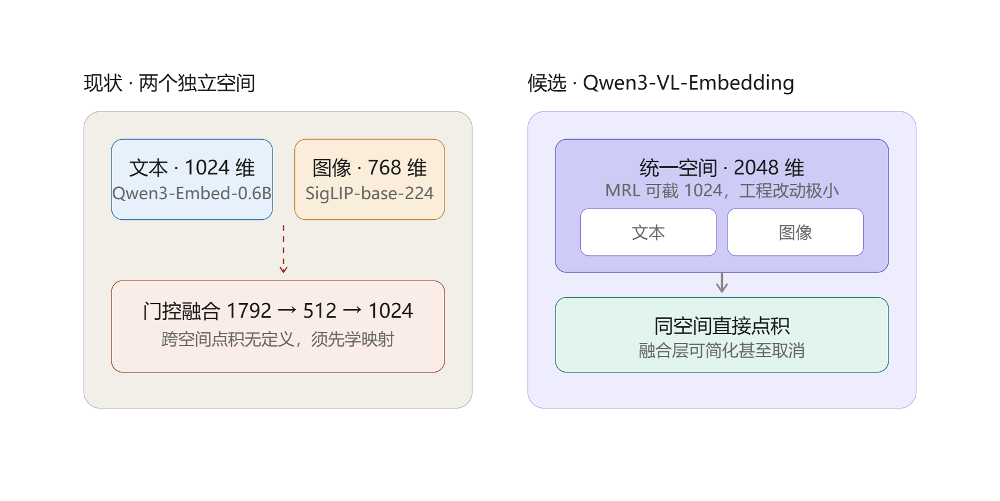

# GenRetrieval 升级方案：MiniOneRec → 多模态生成式召回 2.0

> 状态：**已确认**（决策结果见 §13），**执行中**（2026-09-13 更新）
> 日期：2026-09-11（2026-09-13 刷新执行状态）
> 基线锚点：本项目复刻版 MiniOneRec（原 `D:\Codings\cs\Rec\MiniOneRec_oneGPU_preject`，已完整复制到本目录）

### 执行状态（2026-09-13）

| 里程碑 | 状态 | 交付 |
|---|---|---|
| M1 数据（Amazon23 I&S + VG，图文 100%/99.9% 可得） | ✅ 完成 | `docs/DATASET.md` |
| M1 多模态编码 + 融合 | ✅ 完成 | 定版 `gate_e60`：**I&S R@10 0.1100（vs 纯文本 +32.5%）｜VG 0.2113（+41.2%）**；指标定义见 §4.5 |
| M2 SID 构建（RQ-VAE） | ✅ 完成 | **定版配方 = gate + `--init_samples 8192` + 5000 轮 + `sid_raw`（语义桶）**，两域各跑一遍 |
| M2 SID 质量评估 | ✅ 完成 | 三件套双域：**I&S ICR 0.9582 / LCP 222.1 / R² 0.6530 / L0 死码 0%**；**VG ICR 0.9744 / LCP 163.6 / R² 0.8691 / L0 死码 3.52%**。VG 为跨域复验，未重做消融（公式见 §4.5；结论见 `SID_PIPELINE.md` §3.8） |
| M3/M4 基座与 SFT | ⏳ 待启动 | — |
| M5 RL | ⏳ 待启动 | — |

**两处相对原方案的调整**：

1. **碰撞不再消解**（原计划默认走 Sinkhorn）：碰撞组实拍是同系列规格变体，且 Snap 论文证明
   唯一性 ~70% 以上即平台期、其线上就是"一码多品 + 启发式消歧"→ 交付 `sid_raw`，`sid_sk` 存档。
2. **不做 raw vs sk 的 SFT 端到端消融**（原 §4.1 择优规则里的"小规模 SFT 一锤定音"）：
   时间与成本有限，决策依据改为离线结构指标 + 工业界先例，已在文档中标注为"未经端到端验证"。

👉 **SID 阶段的完整实验与结论整理见 `docs/SID_PIPELINE.md`**（新读者入口）。

---

## 0. TL;DR

在单卡可跑的 MiniOneRec 框架上做五个方向的系统性升级，全部保留 V0 作为公平对照锚点：

| 模块 | V0 现状 | 升级方向 |
|---|---|---|
| **数据** | Amazon 2018 I&S / Office（5-core，纯文本，~10k items）**（已按决策移除）** | **Amazon Reviews 2023** I&S 类目 + 商品图像 → 多模态 |
| **Item Embedding** | Qwen text2emb（title+description） | Qwen3-Embedding 文本向量 + SigLIP 图像向量 → 门控融合 |
| **SID 构建** | RQ-VAE / FAISS RQ 3×256 + Sinkhorn | **RQ-VAE 为默认**（RQ-KMeans/FAISS-RQ 作挑战者，三件套 + 端到端择优）+ 融合向量 + 归一化 + **新 SID token embedding 语义初始化** |
| **基座模型** | Qwen2.5-0.5B-Instruct | **Qwen3-0.6B**（同词表家族，迁移成本低）；teacher 用 Qwen3-1.7B |
| **SFT** | 全参、随机初始化新 token、任务混合 | 语义初始化 + 课程学习 + 任务配比消融；本地 4GB 卡走 QLoRA |
| **RL** | GRPO + 二值 rule / ndcg ranking / semantic / sasrec | 双路线：**A) 分层奖励设计**；**B) OPD 在线策略蒸馏**（KL-to-teacher 替代 KL-to-ref） |

核心增量创新点（面试可讲的三个）：
1. **多模态融合 SID**：图像+文本融合向量做残差量化，并用 ICR/LCP 三层评估体系验证融合有效性；
2. **SID token 语义初始化**：用 codebook 向量投影到 LLM 隐空间初始化新 token embedding，替代随机初始化（预期加速收敛、提升 SFT 上限）；
3. **OPD（Online Policy Distillation）替代/增强 GRPO**：teacher（Qwen3-1.7B）在线蒸馏提供稠密梯度信号，解决二值奖励稀疏问题。

---

## 1. V0 现状盘点（升级前基线）

### 1.1 现有 pipeline（复刻版实测，RTX 3090）

```
Amazon 2018 (5-core) ──> item.json (title/description)
        │
        ▼ text2emb (Qwen embedding, title+description)
emb-*.npy ──> 量化器（两套并存）:
        │      A) RQ-VAE (rq/models/rqvae.py + rq/trainer.py)   ← 本项目默认
        │      B) FAISS ResidualQuantizer 3×256 + optional Sinkhorn (rqkmeans_faiss.py)
        ▼
index.json (<a_i><b_j><c_k> 三层 SID)
        │
        ▼ convert_dataset.py ──> train/valid/test CSV (SID 序列化)
        │
        ▼ SFT (Qwen2.5-0.5B, 全参, 3任务混合: SidSFT + SidItemFeat + FusionSeqRec)
        │
        ▼ GRPO RL (minionerec_trainer, rule/ranking/semantic/sasrec 奖励)
        │
        ▼ evaluate (约束解码 + beam=10) ──> HR/NDCG
```

### 1.2 V0 指标（Industrial_and_Scientific, beam=10）

| 配置 | HR@1 | HR@3 | HR@5 | HR@10 | NDCG@10 |
|---|---|---|---|---|---|
| 0.5B SFT | 0.036 | 0.057 | 0.068 | 0.093 | 0.060 |
| 0.5B RL-epoch2 | 0.047 | 0.070 | 0.083 | 0.109 | 0.074 |
| 官方 1.5B 权重 | 0.085 | 0.113 | 0.133 | 0.154 | 0.116 |

### 1.3 已识别的问题（升级动机）

| # | 问题 | 证据/来源 | 对应升级 |
|---|---|---|---|
| P1 | 数据陈旧（2018，7 年前）且纯文本，商品外观/风格信息完全丢失 | 2018 数据只有 title/description | §3 |
| P2 | 新 SID token 随机初始化，SFT 需大量步数学"这些 token 是什么" | sft.py L160-170 只 add_tokens + resize | §5.3 |
| P3 | RL 奖励稀疏：rule 奖励二值（全对才有 1.0），大量 group 全 0 无梯度 | rl.py rule_reward，GRPO 组内归一化后优势全 0 | §6.1 |
| P4 | KL-to-ref 只防遗忘，不提供正向监督信号；1.5B teacher 的知识没被利用 | GRPOConfig beta 参数 | §6.2 |
| P5 | 本地硬件 3050 Ti 4GB 跑不动 0.5B 全参 SFT（原项目在 3090 上跑的） | VRAM 实测 ~3.46GB 可用 | §7、§12 |
| P6 | 无 SID 质量独立评估（ICR/LCP），SID 改动只能靠端到端指标盲判 | esci 项目已建好三层评估框架，可迁移 | §4.4 |
| P7 | **副本缺失 RQ-VAE 实现**：`rq/rqvae.py`、`rq/generate_indices.py`、`rq/rqkmeans_plus.py` 均 `from models.rqvae import RQVAE`，但 `rq/models/` 整个目录在复制时不存在 → RQ-VAE 路线开箱即崩 | 4 处 import 全部失败 | 已从上游 `AkaliKong/MiniOneRec` 恢复 `rq/models/{rqvae,rq,vq,layers,generate_indices}.py` |

### 1.4 本次复制时补齐的上游文件（2026-09-11）

| 文件 | 原因 |
|---|---|
| `rq/models/rqvae.py`、`rq/models/rq.py`、`rq/models/vq.py`、`rq/models/layers.py`、`rq/models/generate_indices.py` | 原副本缺失，RQ-VAE 路线（用户选定的默认方案）依赖 |
| `ts_rec_data.py`、`ts_rec_sft.py`、`ts_rec_sft.sh`、`ts_rec_data/IandS.description_keywords.json` | 上游新增的 text-summary 变体 pipeline，作 SFT 改进参考 |
| `tests/` | 上游测试文件（最小覆盖） |

> 其余上游与本地差异仅为数据文件；代码侧已 1:1 对齐上游 `main` 分支。

---

## 2. 升级路线总览

```
V0 基线（已复制，随时可重跑）
 │
 ├─ M1  数据升级     Amazon 2023 I&S（官方 5core 分片）+ 图像下载 + 多模态编码（文本+图像→融合向量）
 ├─ M2  SID 升级     融合向量 → RQ-VAE（默认） vs RQ-KMeans / FAISS-RQ 对照 + 三件套评估（ICR/LCP/MSE）
 ├─ M3  基座迁移     Qwen3-0.6B 跑通 SFT/RL 全流程 + 在新数据上重建 V0 锚点
 ├─ M4  SFT 优化     语义初始化 + 课程学习 + 任务配比 + LoRA/QLoRA 消融
 ├─ M5  RL 升级      路线A（分层奖励）与路线B（OPD）双线对比
 └─ M6  总报告       全量指标对比表 + 消融 + 成本/延迟
```

每个里程碑结束写入 `docs/EXPERIMENT_LOG.md`（实验记录与踩坑文档，已建好模板）。

---

## 3. M1：数据集升级（多模态）

### 3.1 候选数据集对比

| 数据集 | 年份 | 多模态 | 规模 | 优点 | 缺点 | 推荐 |
|---|---|---|---|---|---|---|
| **Amazon Reviews 2023**（McAuley-Lab） | 2023 | ✅ 图像（URL 在 metadata） | 按类目，几十万~百万级 | 与 V0 同源可对照；metadata 含图像 URL；esci 项目已有 Amazon 处理经验 | 图像需自行下载，有失效链接 | ⭐⭐⭐ 首选 |
| MicroLens-100k | 2023 | ✅ 视频/封面 | 10 万级视频推荐 | 真多模态（帧级） | 视频处理重、领域差异大（短视频 vs 电商）、冷门难对标 | 备选 |
| Amazon ESCI（2022） | 2022 | ❌ 查询侧文本 | 121 万商品 | 已在 esci-ai-search 用熟 | 无图像；是搜索不是序列推荐；两项目撞车 | 不选 |
| Tenrec / Taobao MM | 2023 | 部分 | 大 | 工业界数据 | 无公开图像 or 申请门槛 | 不选 |

**结论：Amazon Reviews 2023 子类目。** 与 V0 同为 Amazon（纵向可比），且 metadata 的 `images.hi_res` 字段直接给图像 URL。

### 3.2 类目：已定 Industrial_and_Scientific（2023 版）

决策理由：与 V0 同类目 → 纵向对照最干净（能说清"升级带来的增益"而不是"换了类目所以数字变了"）。

**M1 数据源实测（2026-09-11 验证，走 `hf-mirror.com`，官方站不可达）**：

| 文件 | 体积 | 用途 | 是否下载 |
|---|---|---|---|
| `benchmark/5core/timestamp/{train,valid,test}.csv` | 17.3MB / 2.6MB / 4.1MB | **官方 5-core 切分**（`user_id, parent_asin, rating, timestamp`），免自跑 k-core | ✅ 已下 |
| `raw/meta_categories/meta_Industrial_and_Scientific.jsonl` | **1130.0MB（实测）** | 商品 metadata，**图像 URL 唯一来源**；427,564 行，命中目标物品 25,848（100%） | ✅ 已下载 |
| `raw/review_categories/Industrial_and_Scientific.jsonl` | 2238.3MB | 全量评论（含评论文本） | ❌ 不需要（除非要自跑 k-core / 用评论文本做文本向量） |
| `raw_meta_.../full-0000x-of-00002.parquet` | 217.4 + 187.9MB | 同上 metadata 的 parquet 版（压缩更小，需 pyarrow） | ⏸ 备选（若 jsonl 解析太慢） |

策略调整（相对初版方案）：**用官方 5core 切分代替自跑 k-core** —— 省掉 2.2GB 下载 + k-core 迭代，且官方切分是文献通用口径（可比性更好）。规模控制不再靠"截断到 5 万 items"，改为：**先用全量 I&S 2023 跑通，若 items 规模超出本地承受范围（>10 万）再按交互频次截断**。

### 3.3 多模态编码 pipeline（新增 `scripts/multimodal/`）

```
metadata.jsonl ─┬─ title/brand/categories/features/store ──> Qwen3-Embedding-0.6B ──> e_text ∈ R^1024
               └─ images[0].hi_res ──下载──> SigLIP-base-patch16-224 ──> e_img ∈ R^768
                                                     │
                                                     ▼
                                    门控融合: e = g ⊙ W_t·e_text + (1-g) ⊙ W_i·e_img
                                    （g、W_t、W_i 用对比目标学习；
                                      消融基线：直接 concat + MLP / 纯文本）
                                                     │
                                                     ▼ L2 归一化 ──> M2 的量化器输入
```

要点：
- **图像下载容错**：并发 + 断点续传 + 失效 URL 回退纯文本（图像向量置 0，门控自适应降权）。预期失效 10~20%，方案必须把"纯文本回退"作为一等公民。
- **模型选型**：SigLIP-base（而非 CLIP）——小模型里检索性价比最优一档，4GB 卡可跑。文本侧沿用 esci 项目已验证的 Qwen3-Embedding-0.6B（MTEB 70.7，本地 `embqwen` venv 可复用，torch 2.5.1+cu121）。
- **文本字段比 V0 多**：V0 只用 title+description；2023 metadata 还有 `features`（要点列表，信息密度高于 description）、`categories`、`store/brand`、`details`。这里要做**字段组合消融**（title / title+features / title+features+category），因为文本向量是 SID 的上游，影响比 SFT 超参大得多。
- **融合层先简后繁**：v1 = concat+MLP → v2 = 门控融合。融合质量用"文本↔图像互检索 recall@k"作为独立代理指标，否则多模态有没有用只能靠端到端盲判（同 P6 教训）。

### 3.4 交付物（M1 执行清单）

| # | 动作 | 脚本 | 状态 |
|---|---|---|---|
| 1 | 下载官方 5core 切分 + metadata | `scripts/data/download_amazon23.sh` | ✅ 切分已下 / metadata 下载中 |
| 2 | 构建 item.json（title/features/brand/categories/images）+ 交互序列 | `scripts/data/prepare_amazon23.py` | ⏳ 待写 |
| 3 | 图像并发下载 + 失效记录 | `scripts/multimodal/download_images.py` | ⏳ 待写 |
| 4 | 文本向量（Qwen3-Embedding）+ 图像向量（SigLIP） | `scripts/multimodal/encode_{text,image}.py` | ⏳ 待写 |
| 5 | 融合 + 互检索质量评估 | `scripts/multimodal/fuse_embeddings.py` | ⏳ 待写 |
| 6 | 复用/改造 `data/amazon23_data_process.py`（其已采集 images 字段，可部分复用其 metadata 解析逻辑） | — | ⏳ 待改 |

---

## 4. M2：SID 构建优化

### 4.1 路线选择：RQ-VAE 默认，KMeans 作挑战者（按决策）

**默认走 RQ-VAE**（`rq/models/rqvae.py` + `rq/trainer.py`，已从上游恢复），因为：
- 它带**编码器/解码器**（MLP：in_dim→2048→1024→512→256→128→64→e_dim），能端到端优化 reconstruction，量化保真度上限高于"KMeans + 残差"；
- codebook 是**可学习的**（+ commitment loss + kmeans 初始化），能适应融合后的多模态空间；
- 原仓库的 `generate_indices*.py` 就是 RQ-VAE 路线，改动量最小。

**同时保留对照**（用手上的两个现成实现，成本极低）：
- `rq/rqkmeans_plus.py`（RQ-KMeans 变体）
- `rq/rqkmeans_faiss.py`（FAISS ResidualQuantizer + Sinkhorn uniform mapping，esci 项目验证过：119s 训完 121 万向量，last-layer Sinkhorn → ICR 92.1% / LCP 19.21%）

**择优规则（先离线、后端到端）**：三者用 §4.4 三件套评分（fidelity 优先、结构指标次之、uniqueness 设硬门槛），**只有三件套胜出的才进 SFT**；若三件套打平，再用小规模 SFT（10% 数据）比 NDCG@10 一锤定音。谁好就用谁，**不做预设结论**。

### 4.2 关键超参（RQ-VAE 默认档，来自上游脚本）

| 参数 | 默认 | 说明 / 消融计划 |
|---|---|---|
| `num_emb_list` | `[256,256,256]` | 3 层 SID。消融 `[256,256]`（2 层，序列更短）与 `[256,256,256,256]` |
| `e_dim` | 32 | codebook 向量维度。**消融 64/128**——32 维承载多模态信息可能不足，这是 RQ-VAE 最容易吃亏的点 |
| `layers` | `[2048,1024,512,256,128,64]` | 编解码 MLP 宽度 |
| `kmeans_init` | True | 避免 codebook 死码 |
| `sk_epsilons` | `[0,0,0]`（**Sinkhorn 关闭**） | 打开 = 逐层 Sinkhorn 均衡；但 esci 实测逐层 Sinkhorn 会伤 LCP → **只在最后一层做，或作为消融项**（复用 `rqkmeans_faiss.py` 的 `sinkhorn_balance_level`） |
| `beta` (commitment) | 0.25 | — |
| `quant_loss_weight` | 1.0 | 消融 0.5 / 2.0 |
| `epochs` / `batch_size` / `lr` | 5000 / 2048 / 1e-3 | 早停看 collision rate |

### 4.3 输入侧升级

1. **多模态融合向量**（§3.3）替换纯文本向量；
2. **L2 归一化**（esci 上隐式受益，这次显式化）——注意 RQ-VAE 的 MSE 重建在归一化空间上做，需在 eval 时反归一化换算真实 MSE；
3. **文本字段组合消融**（title / +features / +features+category），这是比 SID 超参更上游的杠杆。

### 4.4 升级：新 SID token embedding 语义初始化（关键创新点）

V0 现状（P2）：`tokenizer.add_tokens()` 后新 token embedding 随机初始化，模型要花大量 SFT 步数学"SID token 长什么样"。

方案：SID 第 l 层 token `<a_i>` 的初始化向量 = 该层 codebook 向量 `C_l[i] ∈ R^{e_dim}` 投影到 LLM 隐空间：

```
E_init[<a_i>] = W · C_l[i] + b,   W ∈ R^{d_llm × e_dim}
```

`W, b` 用 ridge regression 在全体 items 上拟合。锚点（回归目标）取法（消融）：
- **v1（简单）**：锚点 = 该 item title 的 LLM 词向量（冻结模型，取 title token embedding 均值）；
- **v2（对齐量化结构）**：锚点 = 该 item 的 RQ-VAE **解码器重建向量** `x̂_i = Dec(Σ_l C_l[codes_l])` → 让"SID token 组合 ≈ item 语义"在同一个空间对齐；
- **v3（残差感知，进阶）**：每层单独拟合——第 l 层 token 的目标是"第 l 层的残差方向在 LLM 空间的投影"，让前缀天然携带粗到细的语义。**v3 是新东西，值得写成方法论**。

实现落点：新增 `sid_token_init.py`，在 `sft.py` 的 TokenExtender 之后调用；配 `freeze_LLM=True`（现有开关）= 极低成本消融，**本地 4GB 卡就能跑**（只训新 token embedding）。

### 4.5 SID 质量评估三件套（从 esci 项目迁移，新增 `rq/eval_sid.py`）

| 层 | 指标（定义与公式） | 含义 |
|---|---|---|
| uniqueness | **ICR** `= 不同 SID 元组数 / N`，碰撞率 `= 1 − ICR`；**per-layer entropy** `H_l = −Σ_k p_{l,k} log p_{l,k}`（归一化 `H_l / log K`，K = 256）、死码率 `dead_l = 1 − 该层用过的码数 / K` | SID 是否唯一、是否死码 |
| fidelity | **reconstruction MSE** `= 1/(N·D) · Σ_i ‖ x̂_i − x_i ‖²`，`x̂_i = Dec(Σ_l C_l[c_{i,l}])`；**R²** `= 1 − MSE / Var(x)` | 量化损失（RQ-VAE / KMeans 直接可比） |
| retrieval structure | **LCP** `lcp(i,j) = Σ_{l=0}^{L-1} Π_{t≤l} 1[c_{i,t} = c_{j,t}]`，**LCP ratio** = 近邻对均值 ÷ 随机对均值（基线 ≡ 1）；**prefix cohesion** = 同前缀组内两两余弦均值 ÷ 随机分组同值 | SID 前缀是否语义聚类 |

> 融合侧的共现检索 `R@K = 1/Q · Σ_q 1[Top-K(q) ∩ Gold(q) ≠ ∅]`（随机基线 `≈ avg_pos · K / N`）、
> 端到端 `HR@K / NDCG@K` 的定义与公式见 **§8** 与 `docs/SID_PIPELINE.md §0.1`。

**消融矩阵**（M2 交付）：{纯文本, 融合} × {RQ-VAE, RQ-KMeans, FAISS-RQ(+last-layer Sinkhorn)} × {2/3/4 层}，其中 {纯文本 × RQ-VAE × 3 层} 为 V0' 锚点。每次 SID 变更先过三件套，再进昂贵的 SFT。

### 4.6 待验证消融：SID 源 embedding 换成统一多模态空间（Qwen3-VL-Embedding）

**动因**：当前双塔的两条腿来自**两个互不相通的嵌入空间**——这是门控融合之所以复杂、跨模态评估必须绕道的根因。

| 现状（实测） | 值 |
|---|---|
| 文本向量 | `Qwen3-Embedding-0.6B` → **1024 维** |
| 图像向量 | `google/siglip-base-patch16-224` → **768 维** |
| 跨模态可比性 | **点积无定义**。`fuse_embeddings.py::cross_modal_align` 注释原文：“text 是 1024 维、image 是 768 维，分属两个独立的嵌入空间，点积没有定义” |
| 现有绕行 | 先在拟合子集解岭回归学线性映射，再到留出集算 recall（text→image R@10 = I&S 0.6217 / VG 0.6363） |

**候选**：`Qwen3-VL-Embedding`（阿里通义 **2026-01-08** 发布，Apache-2.0，论文 arXiv:2601.04720）

| 项 | 事实 |
|---|---|
| 基座 | **Qwen3-VL**（不是 Qwen3-Embedding）；双塔，取最后一层 `[EOS]` 隐态 |
| 训练 | 多阶段：大规模对比预训练做跨模态对齐 → reranker 蒸馏 → MRL |
| 空间 | 文本 / 图像 / 视觉文档 / 视频 → **同一语义空间** |
| 维度 | 2B→2048、8B→4096；**MRL 支持 2048→{256,512,1024,2048}**，可截 1024 与现有 RQ-VAE 输入兼容 |
| 规格 | 2B：28 层 / 32K tokens / bf16 约 4GB（int8 ~2GB，int4 ~1GB） |
| 基准 | MMEB-v2：2B **73.2**、8B **77.8**（发布时第一）；MMTEB 纯文本检索 2B **68.1** |

🔴 **必须先纠正的前提**：它**不是**和 `Qwen3-Embedding` 对齐训练出来的，两者是 2026-01 与 2025-06 两个独立系列。官方明确说 VL 版在纯文本 MMTEB 上比**同规模**纯文本版“有少许差距”。
**推论：统一空间只在 Qwen3-VL-Embedding 内部成立。只换图像侧、保留 `Qwen3-Embedding-0.6B` 做文本，两边照旧不对齐**——收益只剩“图像特征更好”一项，且融合层仍须重训。

**预期收益（三重，置信度递减）**

1. **图像侧表征**：SigLIP-base（ViT-B 量级、2023 年 CLIP 式对比模型）→ Qwen3-VL 的 ViT（2B 量级）。**域匹配度高**：Amazon 商品图大量是包装盒白底图、带型号规格文字，Qwen3-VL 系强在 OCR 与布局理解，SigLIP-base 对此近乎无能为力。
2. **文本侧参数量**：0.6B → 2B。
3. **架构简化（最值得期待）**：同空间后图文天然可比，门控网络（1792→512→1024）里“学跨空间映射”那部分参数**可省**，融合退化为加权/拼接，甚至直接用混合模态输入得单一向量。

**成本与风险（诚实）**

| 项 | 评估 |
|---|---|
| 显存 | 2B bf16 ≈ 4GB，**本地 3050 Ti 4GB 跑不了**；int8/int4 可跑但 embedding 对低位量化敏感（社区共识 Q6_K 为下限）→ **建议上云 3090 编码**（一次性离线任务，符合既有约定） |
| 规模 | 51,458 商品 × 图文各一遍 ≈ 10 万次编码；沿用已下载的本地图片，无需重下 |
| 🔴 孪生不解决 | VG 那 133 组逐位重复的融合向量，根源是同品多 listing **主图 URL 相同**；相同输入 → 相同输出，换编码器不影响，死码与碰撞该在还在 |
| 🔴 域适配未知 | MMEB 是自然图像/文档图像，本项目是白底商品图。**“榜单分高”不等于“在这批图上更好”，必须实测** |
| 🔴 窗口在关闭 | SFT 数据集已按现 SID 生成，换 SID 源 → SID 变 → 数据集须重生成。现在（SFT 未开训）是成本最低窗口；但**不建议同时动两个变量**（raw/sk 端到端消融尚未跑，会混淆归因） |

**消融设计（按建议执行序）**

| 编号 | 内容 | 成本 | 通过判据（可证伪） |
|---|---|---|---|
| **V4-A** | **跨模态对齐先行验证**：抽 3000 对，用 Qwen3-VL-Embedding-2B 编码图文，**直接点积**算 text→image R@10 | 极低（分钟级，纯离线、不动现有 pipeline） | **> 0.66**（即高于现有岭回归后的 0.6217/0.6363，且无需学映射）。**不通过则 V4-B/C/D 全部免做** |
| **V4-B** | **两侧全替换 + SID 三层评估**：MRL 截 1024，重跑融合 → SID，双域对照 raw ICR / 重建 R² / L0 死码 / holdout R@10 | 中（10 万次编码 + 现 SID 流程 68 min 级） | holdout R@10 不低于现 `gate_e60`（I&S 0.1100 / VG 0.2113）**且** raw ICR ≥ 现（0.9582 / 0.9744） |
| **V4-C** | **单换图像侧**（归因用）：SigLIP → Qwen3-VL-Embedding 的 image-only 编码 | 低 | 逻辑上不解决对齐，仅用于量化“图像特征质量”单独贡献多少 |
| **V4-D** | **混合模态单向量**：直接把 `{text, image}` 喂进同一模型得单一向量，**彻底取消门控网络** | 中 | 与 V4-B 对比，验证融合层是否真的可以省掉 |

**建议执行序**：**V4-A 先做**（几分钟给出方向性答案，完全不影响现有 pipeline）→ 通过后再排 **V4-B**，且**排在 SFT 基线跑通之后**，让 SFT 保留一个“旧 SID”锚点、换 SID 前后可比。V4-C/D 视 V4-A 结果再定。

> 判据口径提醒：V4-A 用的是与 `fusion_report.json → modality_alignment` 完全相同的构造（同一批 pair、同一 n_query），
> 唯一差别是 Qwen3-VL-Embedding 下**不再需要岭回归**，可直接点积。这是全流程里最灵敏、最早能读出信号的指标。



### 4.6.1 文献地图：图像-文本对齐的四条技术路线（检索于 2026-09-15）

> 检索先给一个反直觉的结论：**「有没有做图文对齐训练的模型」这个问题，本项目其实已经在用模型回答了**——
> 图像侧的 `google/siglip-base-patch16-224` 就是**拿图文对比对齐当训练目标**训出来的（CLIP 系，见路线 ①）。
> 所以真正缺的**不是「对齐模型」，而是「与我们的文本嵌入空间同源的对齐模型」**。
> 下面按「对齐发生在哪一层」分四条路线，各自给代表工作、事实与成本。

#### 路线 ①：CLIP 式双塔对比对齐（**本项目图像侧已在用**）

| 工作 | 时点 | 对齐目标 | 事实 |
|---|---|---|---|
| CLIP | 2021 | softmax 对比 | 开山，图文共享空间 |
| SigLIP | 2023 | **sigmoid** 损失 | 免去 batch 内伪竞争；`SigLIP-SO400M` 成 LLaVA-OneVision / DeepSeek-VL2 的默认视觉塔 |
| **SigLIP 2** | 2025-02 | sigmoid + LocCa + SILC/TIPS 自蒸馏与掩码 | 百语种训练，密集特征更强 → 被 **Qwen3-VL / Gemma 3** 采用 |
| **MetaCLIP 2** | 2025-07 | 全球 300+ 语种原生图文对 | ViT-H/14 打破「多语言诅咒」：ImageNet 81.3%、XM3600 I→T 64.3% |

🔴 **这条纠正很重要**：`SigLIP-base` 早已是图文对齐的产物，所以 §4.6 说的「两条腿互不相通」
**不是图像侧没对齐，而是它对齐到的文本塔不是 `Qwen3-Embedding-0.6B`**
（SigLIP 的文本塔是 77-token 上限的小编码器，语义容量与被换掉的那条腿不是一个量级）。
**推论：把 SigLIP 换成「更会做图文对齐」的同族模型（SigLIP 2 / MetaCLIP 2）不解决本项目的问题**——
问题在「和谁对齐」，不在「对齐得好不好」。
（另一种零训练解法是用同一个 CLIP 模型的**文本塔 + 图像塔**，天然对齐；代价是文本侧退回小编码器，SID 质量恐难接受。未见有人在本任务上验证，可作 V4-C 的补充对照。）

#### 路线 ②：VLM 统一空间嵌入（当前 SOTA 主流）

把 VLM 改造成 embedder：文本/图像/视频/视觉文档走**同一次前向**，取末层特殊 token 隐态 → 一个向量。
通用基准 **MMEB-v2**（78 个任务：图像 / 视频 / 视觉文档）。

| 模型 | 规模 | MMEB-v2 | 时点 | 备注 |
|---|---:|---:|---|---|
| **WeMM-Embedding-9B** | 9.41B | **80.6** | 2026-08 | 腾讯微信视觉；MMEB-v2 榜首快照（2026-08-24） |
| DME-Large | — | 80.2 | 2026-08 | 抖音（闭源） |
| **WeMM-Embedding-4B** | 4.54B | 79.2 | 2026-08 | |
| DME-Medium | 9.4B | 78.4 | 2026-08 | |
| **WeMM-Embedding-2B** | 2.21B | **77.9** | 2026-08 | **2B 反超 `Qwen3-VL-Embedding-8B`**；MRL 64~4096 维；MMEB-v3 56.0 |
| Qwen3-VL-Embedding-8B | 8.14B | 77.8 | 2026-01 | §4.6 原候选 |
| DME-Small | 2.21B | 74.8 | 2026-08 | |
| Qwen3-VL-Embedding-2B | 2.13B | 73.3 | 2026-01 | §4.6 原候选（2B 档） |
| UEmbed-9B (dense) | 9B | 71.8 | 2026-08 | 阿里，**Apache-2.0、纯公开数据**；dense+sparse 单次前向 |
| UEmbed-4B (dense) | 4B | 70.4 | 2026-08 | |
| e5-omni-7B | 7B | 67.8 | 2026-01 | 见路线 ④ 的方法论 |
| UEmbed-2B (dense) | 2B | 66.5 | 2026-08 | |
| UME-R1-7B | 8.29B | 64.1 | ICLR 2026 | 厦大 + **腾讯微信**；**生成式嵌入 + RL** |
| UME-R1-2B | 2.21B | 59.7 | ICLR 2026 | |
| gme-Qwen2-VL-7B | 8.29B | 57.3 | 2024-12 | 阿里 GME，统一多模态嵌入的开篇之一 |
| VLM2Vec-V2-2B | 2.2B | 55.4~56.2 | 2025 | TIGER-Lab，MMEB 基准的提出方 |
| VLM2Vec-V1-7B | 8.29B | 47.0 | 2024-10 | |

**对本项目的含义**

1. 候选池比 §4.6 当初写的更宽，且**格局变了**：2B 档里 **WeMM-Embedding-2B（77.9）明显优于 `Qwen3-VL-Embedding-2B`（73.3）**，甚至超过后者的 8B 版。
2. WeMM-Embedding 出自**腾讯微信视觉团队**，**已在微信视频号/公众号/电商/微信搜索的 14 项 A/B 中取得一致提升并全量上线**——这是「能不能进生产」最有力的外部证据（也是面试可讲的一手锚点）。
3. **UME-R1 的方法论与本项目主线同源**：把 embedding 放进「生成 + RL」范式（生成式嵌入 + 相似度反馈的可验证奖励），ICLR 2026 且与腾讯微信合作。本项目 M5 正在做 RL 升级，这是可直接引用的邻居工作。
4. `[设计]` 若最终走路线 ②，**V4-B 的候选应从「Qwen3-VL-Embedding」改为「WeMM-Embedding-2B vs Qwen3-VL-Embedding-2B」二选一或并列**，两者都需实测（榜单分高 ≠ 白底商品图更好，见 §4.6 风险表）。

#### 路线 ③：把新模态对齐到**既有的、冻结的**文本嵌入空间（← 直击本项目痛点）

路线 ② 的统一空间是**模型内部**的，换就得两侧一起换。这条路线目标不同：
**保留现有文本嵌入几何（不重训、不重建索引），只新增一个对齐的图像塔。**

| 工作 | 时点 | 做法 | 事实 |
|---|---|---|---|
| ImageBind | 2023 | 以**图像**为中心绑定六模态 | 跨模态 emergent，但绑到图像空间 |
| **LanguageBind** | ICLR 2024 | 以**语言**为中心：**冻结语言编码器**，对比学习把视频/音频/深度/红外映射进语言空间 | 15 个 zero-shot 检索基准 SOTA；「language as the bind」的范式定义者 |
| **jina-embeddings-v5-omni** | 2026-05（SIGIR 2026，arXiv 2605.08384） | **frozen-tower composition**：文本骨干 + 全部任务 LoRA 适配器**冻结**，只训跨模态投影器 | 🔴 **只训 0.35% 参数**（Small 约 5.5M）；**文本输出与 `jina-embeddings-v5-text` 逐位相同（bit-identical）**，**升级无需重建索引**；1024 维 MRL→32；视觉塔 SigLIP2-So400m |

**对本项目的含义（本次检索最有价值的一条）**

1. 「**保留文本腿几何 + 外挂对齐的图像塔**」被证明**可行且极便宜**——Jina 只用 0.35% 参数就拿到与更大统一模型相近的效果。
2. 它**直接解掉 §4.6 那条「窗口在关闭」的焦虑**：若文本侧向量逐位不变，文本侧 SID 就是稳定的，**SFT 数据集不必重生成**，变的只是融合向量。代价比「两侧全换 → 全链路重生成」低一个量级。
3. 验收方式极简且是**二元的**：训完对文本输入断言逐位相等（`np.array_equal`），无阈值、无噪声。

#### 路线 ④：推荐/电商场景「量化之前的对齐」（与本项目 pipeline 最同构）

这一族不问「用哪个通用嵌入模型」，而问「**在喂给 RQ-VAE 之前，图文该怎么对齐**」。

| 工作 | 出处 | 与本项目的关系 | 关键数字 |
|---|---|---|---|
| **MMQ**（多模态混合量化） | 阿里国际 Lazada，**WSDM 2026**（arXiv 2508.15281） | 与我们的 `gate 融合 + RQ-VAE` 是**同一问题的两个解法**：共享-特定混合专家 + 专家正交约束 + **行为感知微调**（Soft Index + STE 把下游行为梯度回传到 tokenizer） | 召回/精排均超同类 SOTA；**Lazada 线上 A/B：REV +1.29% / GMV +2.61% / ROI +1.18%** |
| **When Text-as-Vision Meets Semantic IDs** | arXiv 2601.14697 | 🔴 **依据最强**：不动模型，把商品描述**渲染成图**、用 OCR 模型（DeepSeek-OCR 主 / Donut / TrOCR）编码——视觉塔输出天然与图像嵌入几何兼容，**直接绕开 modality gap 而不是修复它** | 4 个 Amazon 类目（含 **Scientific / Instruments**，与本项目 IandS 重叠）；Scientific 单模态 NDCG@5 **+8.06%**；多模态早融合 **TIGER(O+I) Recall@5/N@5 +13%**；1024→256 分辨率压缩仍鲁棒 |
| **TGQ-Former** | **KDD 2026**（arXiv 2605.17366） | 针对电商图的促销贴片 / 背景噪声，用结构化 metadata 引导视觉 token 提取；**其 connector 设计可对照我们的门控融合** | H@100 +3.03%（另一快照写 6.04%，⚠️ 回原文核对） |
| **DeepInterestGR / CMSA** | arXiv 2604.20861 | 用 VLM 把非文本模态**对齐到统一文本语义空间** + LLM 挖 intent + RL 质量奖励；明确把「Modality Distortion」列为三大瓶颈之一 | NDCG@5 最高 **+15.1%** |
| VL-CLIP | Walmart，RecSys 2025（arXiv 2507.17080） | 视觉定位（Grounding DINO 抠主体）+ LLM 改写文本；**「不去噪就对齐」的反面教材** | 千万级商品上线；**CTR +18.6% / ATC +15.5% / GMV +4.0%** |
| Factorized Transport Alignment | **Etsy**，WSDM 2026（arXiv 2512.18117） | 多视图（非主图 + 辅助文本）用最优传输的轻量近似对齐，推理时融合为单向量 | 1M listings；R@500 **+7.9%** |
| **e5-omni** | 人大 + Würzburg + 早稻田，**2026-01**（arXiv 2601.03666） | 🔴 **「显式对齐」的方法论论文**：指出「继承 VLM 的隐式对齐」不够用，给出三件套（下详） | MMEB-v2：7B 67.8 / 3B 63.6 |
| PixRec | arXiv 2601.06458（2026-01） | ⚠️ **疑似同源**（原文只写 "Amazon Reviews"，**未注明 2018 / 2023**，🔴 2026-09-16 由「同源数据」**降级** → `§4.6.6(a)`）：商品图 + 文本做序列推荐，**VLM backbone 双塔 + 混合目标（next-item 生成 + 对比对齐）+ BM25 检索层**，**QLoRA 单卡可训**（与我方算力画像一致） | top-rank **3×**、top-10 **+40%**（vs 纯文本） |

**e5-omni 的三件套值得单列**——本项目当前的对齐做法是「**事后**岭回归」，它给的是「**训练时**对齐」：

| 组件 | 解决什么 | 与本项目现状对照 |
|---|---|---|
| 模态感知温度校准 | 相似度 logits 的锐度随模态变化，单一全局温度造成对比梯度失衡 | 现有 InfoNCE 用单一温度 |
| 可控负样本课程 + 去偏 | 混合模态 batch 的负样本难度分布失衡、假负样本拖累 | 现有实现是共现对上的对称 InfoNCE，**无课程、无去偏** |
| **batch whitening + 协方差正则** | 跨模态 embedding 的一阶/二阶统计量不匹配 → 排序不稳 | 🔴 现有做法是**事后在拟合子集上解岭回归**（`cross_modal_align`）；whitening 相当于把这件事挪进训练，且不做线性映射假设 |

### 4.6.2 由文献新增的三条消融（V4-E / V4-F / V4-G）

§4.6 原有的 V4-A/B/C/D 全是「**换模型**」路线。文献显示还有三条**不改主干**的路线，成本低一个量级：

| 编号 | 内容 | 文献依据 | 成本 | 通过判据（可证伪） |
|---|---|---|---|---|
| **V4-E** | **显式对齐（不换模型）**：在现有 `fuse_embeddings.py` 的 InfoNCE 上加 e5-omni 三件套（模态温度校准 / 去偏负样本课程 / batch whitening + 协方差正则），看 `cross_modal_align` 的 R@10 能否逼近「同空间直接点积」的水平 | e5-omni（arXiv 2601.03666） | **极低**：只改损失函数，重跑 `gate` 60 轮 ≈ 50 min | text→image R@10 **> 0.66**（高于现岭回归 0.6217 / 0.6363），**且** `gate_e60` 的 holdout R@10 不下降 |
| **V4-F** | **frozen-tower：锁死文本腿，只新增对齐的图像投影塔**。冻结 `Qwen3-Embedding-0.6B`，训一个把图像特征投影进 1024 维文本空间的轻量塔（参数按 jina-v5-omni 的量级，≪1%） | jina-embeddings-v5-omni（arXiv 2605.08384） | 低 | ① **文本侧向量逐位不变**（`np.array_equal` 断言，二元判据）；② text→image R@10 > 0.66；③ raw ICR ≥ 现（I&S 0.9582 / VG 0.9744） |
| **V4-G** | **Text-as-Vision**：title（+description）渲染成图，用 OCR-VLM 编码作为文本侧，**绕开 modality gap 而非修复它** | arXiv 2601.14697（Instruments/Scientific 上 +8%~+13%） | 中（需引 OCR 模型 + 重跑全链路） | raw ICR / 重建 R² 不低于现文本塔，且跨模态几何错配指标显著下降 |

**优先级建议**：**V4-A**（分钟级，先读方向）→ **V4-E**（50 min，不改主干）→ **V4-F**（低成本，且解掉「SFT 窗口」焦虑）→ **V4-B/C/D**（换模型，代价最高）。

**V4-G 单独排队**：它改的是「文本侧表示形式」，会同时改掉 T2（`sid↔title`）与 T4（`text2sid`）两个任务里 title 的语义（见 `SFT_PIPELINE §2 四个任务的定义`），与 SFT 数据集构造耦合，**建议排在 SFT 基线跑通之后**。

> ⚠️ **引用纪律**：本节所有数字（MMEB-v2 榜单、各论文增益）均为**文献值**，非本项目实测，
> 按 `baseline/SURVEY.md` 的规矩只作「量级参照」，**不得与 `RESULTS.md` 的内部排序横比**。
> 另有两处已在表内标注「回原文核对」（TGQ-Former 的 3.03%/6.04%、PixRec 的 3×/+40%），
> 原因是检索到的二手摘要在这些数字上互相冲突或存在排版乱码——**二手转述不是引用**。

---

### 4.6.3 「映射到同一语义空间」这一族：谱系 + 双域实测（2026-09-15）

**问题**：§4.6 的 V4-A~G 全是「换模型」或「改损失」。但还有第三条路——
**已有两路向量不动，只学一个映射把它们对齐到同一语义空间**。
本项目的 `fuse_embeddings.py::cross_modal_align` 用的就是这条路的最朴素版本（岭回归），
所以这一节问的是：**同一族里有没有更强的做法，代价多少，值不值？**

> ⚠️ **术语澄清（2026-09-15 补）**：口语里常把本项目的做法笼统说成「**事后岭回归**」，这**不准确**，三件事必须分开：
> ① **岭回归 = 评估口径** —— `cross_modal_align(t_emb, i_emb, ...)` 为算跨模态 recall，在拟合子集上解
>    `W = (XᵀX + λI)⁻¹XᵀY`，再到留出子集检索（文本 1024 维 ↔ 图像 768 维，**跨空间点积无定义**，必须先映射）；
> ② **岭回归 = 对照基线** —— `probe_alignment_methods.py` 的 M0（raw1024+ridge）/ M1（PCA768+ridge）/ M2（两侧白化+ridge），
>    用途是**正交拆解**「降维 / 白化 / 映射族 / 检索空间」各自的贡献，不是生产做法；
> ③ **`gate` 融合 = 生产做法**（`SID_PIPELINE §3.3` 定版）—— `e = g ⊙ W_t e_t + (1−g) ⊙ W_i e_i`，`g = sigmoid(MLP([e_t; e_i]))`，
>    **用共现 InfoNCE 训练**。它是可学习的、有监督的，**既不是闭式解也不是岭回归**。
>
> 🔴 两个轴要分开：**「事后」描述时间点**（编码器先训完冻结，再补一层），**「岭回归」描述求解方式**（闭式线性解）。
> `gate` 属于「**事后融合**」（对照 = GR4AD 的「**训练时统一**」，`§4.6.5(b)(1)`）；岭回归属于「**事后映射**」。
> 说 `gate` 是「事后融合」对，说它是「事后岭回归」错。

#### (a) 方法谱系（按「是否需要配对样本」分）

| 方法 | 需要配对 | 关键性质 | 文献出处 |
|---|---|---|---|
| **岭回归 / 最小二乘** | ✅ | 无约束、可处理 `d_src ≠ d_dst`（本项目现状：1024→768） | 本项目 `cross_modal_align` |
| **正交 Procrustes (OP)** | ✅ | `min‖XQ−Y‖_F, QᵀQ=I`，闭式解 `Q=UVᵀ`（SVD of `XᵀY`）。**保内积、保距离**，对余弦检索天然友好。**要求方阵**（本项目需先统一维度） | Schönemann；graspologic `OrthogonalProcrustes` |
| **β-Procrustes** | ✅ | OP 在少样本下会**极端过拟合**，往 identity 插值再正交化做正则 | LFA / ICCV 2023（Ouali et al.） |
| **白化 (ZCA / W-CLIP)** | ❌ | 去均值 + 去相关，**training-free**。文献称其同时闭合「modality gap」与「narrow cone effect」 | Whitened CLIP |
| **CCA / DCCA / KCCA** | ✅ | 经典 CCA = 「各自白化 + 联合 SVD」。**天然把两侧映射到同一公共空间**（这才是字面意义上的「同一语义空间」）。DCCA 用网络学非线性 | Hotelling 1936；DCCA 2013 |
| **Wasserstein Procrustes** | ❌ | 配对矩阵 `P` 与正交映射 `Q` **联合优化**，Gold-Rangarajan 松弛 + Frank-Wolfe 初始化 | arXiv 2203.04863 |
| **Seedless Procrustes** | ❌ | 无需配对、**甚至无需样本数相等**；交替「最优传输 ↔ Procrustes」 | graspologic |
| **Gromov-Wasserstein OT** | ❌ | **只靠各域内部的距离矩阵**对齐，两域不必共享度量空间。`O(n²)` 内存，靠熵正则 + 低秩近似可扩展 | POT 库；神经科学工具箱 |
| **JK-EGW**（2026-08） | ❌ | 联合核熵 GW，多模态共享隐空间，显式控制 latent 几何，样本复杂度 `n^{-1/2}`，专攻**数据稀缺下的 post-hoc 对齐** | arXiv 2026-08（Northwestern / Michigan） |
| **Procrustes Bounds** | ✅ | 理论：若成对点积近似保持，则存在等距映射，误差界 `(2D)^{1/4}√ε`（数据无关）。应用含 **MovieLens 跨版本兼容**与**混合模态检索** | arXiv 2510.13406 |

**工业界落地**（可直接对照的工程先例）：
- **eBay**：Siamese two-tower + **Triplet Loss with TransH**，把 BERT 文本嵌入与 ResNet-50 图像嵌入投进同一空间，buyer engagement **+15%**。原话是「text and image embeddings … stored in separate spaces, making it challenging to create a unified … system」——**与本项目处境逐字相同**。
- **LINE**（2026 技术博客）：**低秩 SVD + 正交 Procrustes** 做 embedding 空间跨天稳定化，Spark 分布式实现。稳定化后跨周相似度 ~0.88、跨月 ~0.87。**证明 OP 在十亿级工业场景可落地**。

#### (b) 双域实测（`scripts/multimodal/probe_alignment_methods.py`）

口径与 `cross_modal_align` **完全一致**（同一 seed=42、同一 half/half 划分、`n_query=3000`、
同样的 `cos(l2n(q), l2n(pool))`），I&S `n_fit=12,912` / VG `n_fit=12,785`。
⚠️ 第一版脚本曾把「白化后的输出空间」去对「未白化的目标池」，得到一个虚高的 0.8328；
**正确写法是「映射的输出空间 == 目标池所在空间」**，下表全部为修正后口径。

| 方法 | I&S T→I / I→T / 均值 | VG T→I / I→T / 均值 | vs 现状（I&S / VG） |
|---|---|---|---|
| **M0 现状**：raw1024 + 岭回归 | 0.6217 / 0.5377 / **0.5797** | 0.6363 / 0.5837 / **0.6100** | — ✅ 精确复现 `fusion_report.json` |
| **M1**：PCA 到 768 + 岭回归 | 0.7443 / 0.6857 / **0.7150** | 0.8123 / 0.7810 / **0.7967** | **+23.3% / +30.6%** |
| **M2**：原空间 + 正交 Procrustes | 0.7440 / 0.6860 / **0.7150** | 0.8453 / 0.7340 / **0.7897** | +23.3% / +29.5% |
| **M3**：两侧白化 + 岭回归（白化空间） | 0.8010 / 0.8130 / **0.8070** | 0.8740 / 0.8777 / **0.8758** | **+39.2% / +43.6%** |
| **M4**：两侧白化 + OP → 原图像空间 | 0.8507 / 0.7557 / **0.8032** | 0.8983 / 0.8160 / **0.8572** | +38.6% / +40.5% |
| **M5**：CCA 截断 256 维 | 0.8093 / 0.8200 / **0.8147** | 0.8763 / 0.8743 / **0.8753** | **+40.5% / +43.5%** |
| **反例**：两侧**各自**白化后直接点积 | 0.0033 / 0.0033 / **0.0033** | 0.0033 / 0.0037 / **0.0035** | **−99.4%**（≈ 随机） |

**逐步归因（两域同向，这是本节最重要的结论）**：

1. **降维（1024→768）是第一个免费大收益**：+23.3% / +30.6%，PCA 保留方差 **99.42% / 99.35%**——
   砍掉的是近零方差方向，语义几乎无损，纯粹消除了 1024 维小特征值方向对岭回归估计的污染。
2. **白化是第二个免费收益**：在降维基础上再 **+14.1% / +10.3%**。两条独立证据表明它**不是数值条件数效应**：
   - **单调性**：partial whitening 强度 α 从 0→1，R@10 逐点单调上升——
     I&S `0.7073 → 0.7397 → 0.7747 → 0.8008 → 0.8070`，
     VG `0.7938 → 0.8315 → 0.8568 → 0.8732 → 0.8758`。
   - **与 λ 无关**：ridge 的 λ 从 `1e-6` 扫到 `1e-1`，白化后成绩**恒定** 0.8070 / 0.8758；
     未白化时则从 0.7143 掉到 0.7102。若是正则化效应，白化后应当对 λ 更敏感而非更迟钝。
3. **换更强的映射族，收益 ≤1%**：M2(OP) 与 M1(岭回归) 在 I&S 上**完全相同**（均 0.7150），
   VG 上 OP 还略低 → **最优线性映射本就是近似正交的**，正交约束不产生增益。
   CCA-k256 与「白化 + 岭回归」打平（0.8147 vs 0.8070 / 0.8753 vs 0.8758）。
   **结论：这一族的瓶颈不在「映射形式」，在「输入空间的各向异性」。**

#### (c) 反例与诊断：为什么「分布对齐」不等于「语义对齐」

`M5` 是本节最有信息量的一行：**两侧各自白化后，两个模态的边缘分布都已接近标准高斯，gap 从量上被«闭合»了，但 R@10 = 0.0033（≈ 1/3000 随机水平）**。
说明白化改善的是**边缘分布**，而跨模态检索需要的是**实例级对应**——后者只能由配对监督提供。
**这条反例直接否掉了「白化后就能跨模态直接检索」的朴素读法**，也解释了为什么 M3/M4 仍然必须学一个映射。

gap 诊断（e5-omni 的一阶 / 二阶口径，我们此前只测过 recall 这一项）：

| | I&S 原始 → 白化后 | VG 原始 → 白化后 |
|---|---|---|
| centroid gap（一阶） | 0.6916 → **0.0081** | 0.6829 → **0.0098** |
| 协方差失配比（二阶，`‖Cov_T−Cov_I‖_F / ‖Cov_T‖_F`） | 1.073 → **0.224** | 1.119 → **0.237** |

CCA 的典型相关系数谱（白化空间，`s/(n−1)`）：

| | top-1 | top-20 | 全 768 维均值 |
|---|---|---|---|
| I&S | 0.9522 | 0.8336 | 0.3232 |
| VG | 0.9769 | 0.8068 | 0.3251 |

**谱很平坦**（前 20 个仍高达 0.83，第 20 个才降到首位的 88%）——图文相关性**弥散在几百个方向里，没有少数主方向**。
这解释了 CCA 的 k 曲线为什么是这个形状：`k=16 → 0.4860 / 0.5345`（比现状还差）、
`k=64 → 0.7003 / 0.8282`、`k=128 → 0.7805 / 0.8625`、**`k=256 → 0.8147 / 0.8753`（最优）**、
`k=768 → 0.7558 / 0.8162`（尾部噪声进来，反而变差）。**截断是必需的，且 k 必须开大。**

#### (d) 新增消融

| 编号 | 内容 | 成本 | 通过判据（可证伪） |
|---|---|---|---|
| **V4-H** | **把这套预处理接进 SID 链路**：源向量换成「PCA768 + 两侧白化」，重跑 RQ-VAE 三件套，看代理指标的涨能否传导到 SID | **中**：改 `fuse_embeddings.py` 的产出 + 重跑 RQ-VAE（I&S ≈ 68 min/域） | raw ICR ≥ 现（0.9582 / 0.9744）**且** 重建 R² ≥ 现（0.6530 / 0.8691）**且** L0 死码不恶化（I&S 0% / VG 3.52%）。**三项全过才算传导成功** |
| **V4-I** | **CCA-k256 作为融合向量的对照路**：与 `gate` 融合并列进 §4.3 消融矩阵 | 低（离线 + 一次融合评估） | `cooccurrence_retrieval_holdout` R@10 超过 `gate_e60`（I&S 0.11 / VG 见 §3.8） |
| **V4-J** | **无配对对齐兜底**：GWOT / Seedless Procrustes，用于「部分物品无图」的场景 | 中 | 在**人为抹掉 50% 配对**的设定下，R@10 优于「只用剩余配对训岭回归」 |

**🔴 优先级修正（2026-09-15，同日实测后）**：上文把 V4-H 排第一，前提是「它是唯一能回答
**§4.6.3 那 +39~44% 跨模态检索 R@10（代理指标）** 有没有用」的实验。当日补做的两个零训练探针把**靶子本身**问清楚了，故修正：

| 探针（零训练，双域） | 实测结论 | 对 V4-H 的含义 |
|---|---|---|
| `probe_fusion_rank.py`：四融合模式在**同一份输入**上的输出几何 | 同输入下 `concat` VG PR **73.6** vs `gate` VG PR **32.0**（差 2.3×）；IandS 上两者持平（110.8 vs 109.2）。`mlp` 两域都塌（35.6 / 21.6） | §4.6.3 的 +39~44% 拆开是「**降维 +23~31% / 白化再 +10~14% / 映射族 ≤1%**」，**主体是输入侧预处理，不是映射本身**（措辞已于 2026-09-16 修正）；`gate`/`mlp` 这类**可学习**融合第一层本就是可学习线性变换，输入白化 ≈ 对其做固定重参数化，**不改变可实现函数类**。VG 的表示集中由**融合目标**造成 → 前置白化打不到这个靶子 |
| `probe_latent_rank.py`：量化**真正面对**的 latent 谱 | latent PR 两域仅差 20%（**6.5 / 5.4**），而输入 PR 差 3.4 倍（109.2 / 32.0） | 输入各向异性只是 latent 几何的**弱代理**（IandS 输入 109 → latent 仍只有 6.5，是现成反例）→ 治 latent 几何要动**量化器/码本**（V4-M）或**训练目标**（V4-K），不是输入预处理 |

**因此把 V4-H 拆成两段，并下调其优先级**：

| 编号 | 内容 | 成本 | 判据（可证伪） |
|---|---|---|---|
| **V4-H0**（新，先做这个） | **只验融合层增量**：同一份输入、同一 gate 配置，对比「raw 输入」vs「PCA768 + 两侧白化 输入」训出的融合向量的**共现召回 R@10 + PR**。**不重跑 RQ-VAE** | 低（fuse ≈ 50 min/域） | 留出 R@10 相对 `gate_e60` 提升 ≥10% **且** PR 不降；达不到 → **V4-H 整条关闭**，省下重建 SID + 重生成 SFT 数据集 |
| **V4-H1** | 原 V4-H：预处理接进 SID 链路，重跑 RQ-VAE 三件套 | 中（+1 h/域，且**需重生成 SFT 数据集**） | 三项全过（ICR / R² / 死码）**且** `sid_prefix` 下游不降 |

**重排后的上游优先级：`V4-M ≈ V4-K > V4-H0`。** 理由三条：
① 两者的靶子都在 **latent / 量化目标**，与实测病灶（latent PR ≈ 6、VG 9 个孤岛）直接对齐；
② 成本同级（≈ 1 h/域）而判据更硬；③ V4-H0 成本同级但期望值更低，等前两项验证完再插空跑。

> 🔴 **判据升级（同日新增）**：上游实验的采纳判据不应只看三件套 —— **三件套与下游召回效果之间的传导性从未被验证过**。
> 现成的零成本下游闸门：`baseline/generative/retrieval.py::SidPrefix`（零训练 SID 前缀检索，
> 全量 test 仅需 **58 s / 110 s**），归档数字 I&S test HR@10 **0.0545** / NDCG@10 0.0246、
> VG HR@10 **0.0627** / NDCG@10 0.0309（`baseline/_dropped/2026-09-13_cut_models/<域>/sid_prefix/metrics.json`）。
> **建议 V4-K / V4-M 一并双报**：三件套（解释「为什么」）+ `sid_prefix`（回答「有没有用」）。

> **（原文优先级结论，已被上方同日修正取代）**：~~V4-H 排第一~~ → 现拆为 **H0/H1**，优先级落在 `V4-M ≈ V4-K` 之后。
> **不变的一条**：在 **V4-H0** 出结果之前，**白化不得直接接进正式 SID 生产链路**。

> ⚠️ **诚实边界（四条）**：
> ① 本节所有收益都是 **`modality_alignment` 代理指标**，它衡量「两个空间线性互还原的程度」，
> **不等于**下游 SID 质量或召回效果——这正是 V4-H 要验证的，**在验证前不得当结论引用**。
> ② 白化统计量必须用**全库**拟合，虽然无监督（不需要配对），但它把「全库分布」耦合进了单条向量，
> 增量更新时统计量会漂移，需评估重算频率。
> ③ CCA 的 `k` 是必须调的超参（本数据最优 256），换域要重调；岭回归/白化则无此问题。
> ④ 采用任何一个方案都要**重建 SID 并重生成 SFT 数据集**，成本远超离线实验本身。

### 4.6.4 图文怎么构建 SID：学术界与工业界的五族路线（检索于 2026-09-15）

> 回答的问题：**别人家的「图文 → SID」具体是怎么接的？** 按「图文在哪一层合并」分族，
> 因为这一族划分直接决定工程量与可替换性（换编码器 vs 换量化 vs 换训练目标）。

| 族 | 合并发生在 | 代表工作（年份） | 一句话机制 |
|---|---|---|---|
| **R0 纯文本** | 不合并 | TIGER (NeurIPS'23)、MiniOneRec | 只用 title/description 编码后量化；**本项目的 V0' 锚点在这一族** |
| **R1 早期融合** | **量化前**融成一个向量 | **GR4AD** (快手广告, 2602.22732, → `§4.6.5`)、**PLUM SID-v2** (Google/YouTube, WWW'26)、**FusID** (2601.08764)、**MMQ** (阿里国际/Lazada, WSDM'26)、**OneMall** (快手电商, 2601.21770)、**Text-as-Vision** 早融合 | concat/门控/MLP/MoE 学一个联合向量，再送 RQ；**本项目现在的 `gate` 融合在这一族** |
| **R2 晚期融合** | **各自量化**再拼 token 序列 | **MQL4GRec** (ICLR'25)、**MSCGRec** (Meta AI+ETH, 2602.03713) | 文本 SID 与图像 SID 各自成序列后拼接/交错；共享码本（MQL4GRec 用小写/大写区分模态）或独立码本 |
| **R3 跨模态量化** | **量化过程本身**被跨模态监督 | **MACRec**、**MSCGRec 的 RQ-DINO**、**MoToRec** (AAAI'26) | 双模态伪标签做对比（MACRec）／把 RQ 塞进 DINO 自蒸馏、学生量化、教师 EMA 稠密（RQ-DINO）／稀疏正则化 RQ-VAE（MoToRec） |
| **R4 协同信号入模** | 把**行为信号**当一等公民接进 SID 链路 | **GR4AD**（Swing 共现 + InfoNCE 作用在 **MLLM last hidden states**，即**进编码器**；→ `§4.6.5(b)(2)`）、**PLUM**（共现对比正则）、**OneRec**（I2I 对比 + caption loss）、**MSCGRec**（SASRec embedding **单独 RQ**）、**MMQ**（behavior-aware 微调）、**MMGRec**（GCN 进 encoder） | 四条不同强度：加一项损失 / 加一个辅助任务 / **当成第四个模态** / 让 CF 反向更新分词器（STE） |
| 旁支 A | **绕开融合** | **When Text-as-Vision Meets Semantic IDs** (2601.14697) | 把商品描述**渲染成图**、用 OCR 模型编码 → 文本向量天然与图像向量几何兼容，不需要对齐 |
| 旁支 B | **不做 SID** | **I-LLMRec** (ICLR'26, 2503.06238) | 图像经 adaptor 压成**单个 token** 直接进 LLM，改走检索而非生成 |

#### (a) 各族的关键设计与实测数字

| 工作 | 关键设计 | 报告的数字 |
|---|---|---|
| **PLUM SID-v2** | ① 多模态 embedding concat + MLP；② **多分辨率码本**（`2048 / 2^(level-1)` 逐层递减）；③ **progressive masking**（训练时随机只用前 r 层量化）；④ **共现对比正则** `L = L_recon + L_rq + L_con` | 唯一性 **94.0% → 96.7%**、Video R@10 **12.3% → 14.4%**；**去掉共现对比后唯一性掉到 91.8%**（该族里单项贡献最大）；线上 YouTube Shorts **Panel CTR +4.96%**、Effective Vocab **13.2×** |
| **OneRec** | miniCPM-V-8B 吃（caption/tag/ASR/OCR/封面+5 帧）→ 1280 token → **QFormer 压到 4 个**；I2I 对比 + caption loss 防幻觉；**RQ-Kmeans** 3 层 | RQ-Kmeans 重建损失比 RQ-VAE **低 25.18%**、码本利用率 **100%** ⚠️二手来源，引用前回原文核对 |
| **OneMall**（快手电商，4 亿 DAU） | Swin-Transformer 视觉 + Qwen2.5-1.5B 文本，InfoNCE 取特殊 token 的隐态；**Res-Kmeans 前两层 + FSQ 最后一层** | **代码冲突率 36% → 11%**、HR@50 **33.9% → 35.4%**；线上商品卡片 **GMV +14.71%** |
| **MMQ**（阿里国际/Lazada） | **shared-specific 专家**（模态共用 + 模态特有），**正交正则**保低冗余；behavior-aware 微调用 **soft index + STE** 让推荐损失反传分词器 | 线上 **REV +1.29% / CVR +4.33% / GMV +2.61% / ROI +1.18%**；语义 ID 从 6 增到 18 个 token 仍单调变好 |
| **MSCGRec**（Meta AI + ETH） | 「异构输入、独立量化、统一处理、**单模态解码**」；RQ-DINO；**协同信号当独立模态**；**前缀树约束 softmax** | 首个在**大规模商品库**上超过 SASRec 的生成式方法（Amazon'23 Beauty / Sports / PixelRec） |
| **MACRec**（arXiv **2511.15122**, AAAI'26） | RQ-VAE **每层**加 InfoNCE 跨模态对比（伪标签 = 另一模态 K-Means 聚类中心，**无需跨模态标注**）；另加重构对齐 / 编码器侧隐式对齐 / 解码器侧显式对齐，共四项损失 | 降低冲突率、提升码本可用性；在 Musical Instruments / Arts / **Video Games** 上超过 TIGER 与 MQL4GRec。🔴 **数据 = Amazon'18**，与我方 VG **类目同名但非同一版本** → 禁横比（`§4.6.6(a)(b)`） |
| **MQL4GRec** | 文本与图像**共享码本**（小写/大写字母区分模态）；三种跨模态生成任务（NIG / AIG / QLA）；**距离重分配**解碰撞 | Amazon 三域 NDCG@10 **+11.58% / +12.56% / +7.66%** |
| **FusID** | 单一融合网络 + **VICReg 式正则**（`L_cov` 罚子嵌入相关、`L_var` 防塌） + PQ | **零 ID 冲突**、缓解码本欠利用 |
| **OneSearch**（快手搜索） | **KHQE 关键词增强分层量化**：Qwen-VL 提 item 关键词、Aho-Corasick 提 query 关键词；RQ-Kmeans **4096-1024-512** + 第三层 **balanced k-means 防塌缩** + **OPQ 256-256** 补残差 | 7 天内新商品冷启动 CTR **+3.31%** |
| **Meta Ads（prefix-ngram）** | RQ-VAE 从**文本+图像**得层级码，按前缀 n-gram 映射到嵌入表的行 | 线上 **+0.15%**、A/A 预测方差 **−43%** |

#### (b) 🔴 反直觉证据：图文的增益**不是给定的**

这一族最容易被误读成「接了图像就更好」。三份独立实测都在反驳它：

1. **OneSearch-V2（快手，arXiv 2603.24422）在电商搜索上做了正面对照**（500 万点击对，统一 RQ-OPQ，`Recall@10`）：

   | 类型 | 模型 | 规模 | ICR↑ | R@10↑ |
   |---|---|---:|---:|---:|
   | 单模态文本 | bge-base | 109M | 96.88% | 0.2445 |
   | 单模态文本 | **qwen3** | **0.6B** | **97.56%** | **0.2468** |
   | 多模态 | uniecs（跨模态检索模型） | 200M | 94.62% | 0.2368 |
   | 多模态 | bge-vl | 149M | 94.46% | 0.2364 |
   | 多模态 | **qwen3-vl** | **2B** | 95.27% | 0.2389 |
   | 多模态 | CLIP | 188M | 94.16% | 0.2358 |
   | 关键词增强 | **KHQE**（bge + 关键词） | 109M | **99.50%** | **0.2542** |

   结论三条：① **单模态文本显著优于多模态**——连最小的 bge-base 都打赢 2B 的 Qwen3-VL；
   ② **「各自编码再拼接」是最差的一档**（作者原文：separate-then-concatenate performs worst）；
   ③ 赢家是**关键词增强**而非「加一个模态」。作者归因：跨模态表示差异 + 冗余属性（多张图可能展示互斥属性，如一件裙子的不同颜色）**把核心属性淹没了**。
2. **`Are Multimodal Embeddings Truly Beneficial for Recommendation?`（arXiv 2508.07399，ECIR'26）**：
   对 **14 个 SOTA 多模态推荐模型**做 modality knockout（把某一模态替换成常量/噪声），
   结论「**文本单模态在多数组模下已接近全多模态，而图像单模态做不到**」；且简单融合模型（VBPR/BM3）
   在双 knockout 下几乎不掉——说明它们**本来就在靠 CF 信号，没真用多模态**。
3. **IDFREE（arXiv 2507.05715）** 的模态消融：`R@5` 视觉单模态 0.0365 < 文本单模态 0.0466 < 全模态 0.0910
   ——两模态都正向，但**文本贡献更大**。

**这三条对本项目的直接含义——我们已实测过，结论比预期好（2026-09-15 修正）**：

🔴 **更正**：本条最初写成「我方 V0' 纯文本锚点与 `gate` 融合打得有来有回」，**是错的**。
查 `SID_PIPELINE §3.3` 的实跑对照（同一 I&S 数据、同一 RQ-VAE 配方），**不是打平，融合全面胜出**：

| 指标（raw，I&S） | text（纯文本 = V0'） | gate__init0 | gate__init8192（定版） |
|---|---:|---:|---:|
| raw ICR ↑ | 0.8383 | 0.9505 | **0.9582** |
| L0 死码率 ↓ | 65.5% | 32.6% | **0%** |
| LCP ratio ↑ | 117.5 | 151.4 | **222.1** |
| prefix-1 内聚比 ↑ | 1.548 | 2.003 | **2.086** |
| 碰撞消解改码比例 ↓ | 23.40% | 7.58% | **6.54%** |
| 重建 R² ↑ | **0.8698** | 0.6399 | 0.6530 |

下游共现召回（holdout，R@10）：`text` 0.0830 → `concat` 0.0883 → `mlp` 0.1013 → **`gate` 0.1100（+33%）**；
VG 同向：0.1497 → 0.1587 → 0.1917 → **0.2113（+41%）**。

**这张表恰好把文献的两种结论分开了**：

- **`concat`（PCA、无监督、线性）只比纯文本高 +6%** —— 这才是与 OneSearch「各自编码再拼接最差」
  和 MKF4MMRec「文本单模态 ≈ 全多模态」真正对应的那一档，**我们复现了它**；
- **`mlp` / `gate`（用 72 万共现对监督训练）比纯文本高 +22% / +33%** —— 增益**来自共现监督，
  不是来自「接了图像」**。这与 PLUM「共现对比项是消融里单项贡献最大」是同一条机理，
  区别只在**放置位置**：我们把这项监督放在**融合阶段**（上游），PLUM 放在 RQ 损失里。

**准确的自我定位**：我们**不在「图文融合无效」那一侧**，因为没有停在浅融合；
但 `text` 唯一胜出的是**重建 R²**（0.8698 vs 0.6530，纯文本空间更好压）——
融合换到的是**唯一性、语义结构与碰撞代价**，不是保真度。
由此，**缺口 #14 的措辞也要修正**：我方实为 **R1 + R4 最弱一档**（共现监督已在，但只施于融合阶段、
未进 RQ 损失）；R2/R3 全空白，R4 的后三档（辅助任务 / 当第四模态 / STE 反传）未试。

**量级校准：他们的收益有多大？我们落后吗？**

| 层级 | 工作 | 报告增益 | 备注 |
|---|---|---|---|
| **线上**（换整条链路 + 后训练） | Meta Ads | **+0.15%** | 最干净的对照：同一排序模型内只换 ID 参数化 |
| | MMQ（Lazada） | GMV **+2.61%** | REV +1.29% / CVR +4.33% |
| | OneSearch（快手搜索） | 冷启 CTR **+3.31%** | 仅新建商品 |
| | PLUM SID-v2 | Shorts Panel CTR **+4.96%** | 加入了生成式召回候选池 |
| | OneMall（快手电商） | GMV **+14.71%** | 换掉整条链路 + RL |
| | VL-CLIP（Walmart） | CTR **+18.6%** | 含商品图画框 |
| **离线**（SID/召回层，与我们可比性最高） | OneMall | HR@50 33.9% → 35.4%（**+4.4%**） | ⚠️ 二手来源，回原文核对 |
| | MQL4GRec | NDCG@10 **+7.7% ~ +12.6%** | Amazon 三域 |
| | Text-as-Vision | Scientific NDCG@5 **+8.06%** | Amazon，与 I&S 直接重叠 |
| | PLUM SID-v2 | Video R@10 12.3% → 14.4%（**+17%**） | — |
| | OneSearch-V2 | **文本 0.2468 > 多模态 0.2389（−3.2%）** | 负收益案例 |
| | **本项目（实测）** | 共现召回留出 **R@10 +33%（I&S）/ +41%（VG）**；SID 层 ICR +14.3%、LCP +89% | ⚠️ **自有口径，不可与上行横比** |

🔴 **三条读法**：① 线上增益量级差 **100 倍**（+0.15% ~ 两位数），
差别来自**换了多少东西**（只换 ID 参数化 vs 换整条链路 + RL），**不能拆给 tokenizer 单独记功**；
② 与本项目可比性最高的是**离线那一组**（+4% ~ +17%），**我们的实测值在同一量级甚至更高**，
但**任务与指标不同（我们是共现召回留出、他们是推荐/搜索指标），只能说"量级不落后"，不能说"我们更好"**；
③ **真正落后的是三件还没做的**（对齐前置 / 协同进 RQ 损失 / 码本工程）**与数据规模**（2.5 万 vs 千万级商品），
**不是融合本身的设计**。
反过来，**`Text-as-Vision`（2601.14697）给了另一种赢法**：不修 modality gap，直接**让文本走视觉通道**——
在 Amazon **Scientific** 上单模态 NDCG@5 **+8.06%**，早融合 `TIGER(O+I)` 的 R@5/NDCG@5 **+13% 以上**，
且分辨率压到 256×256 仍稳健。**它用的正是 Amazon 的 Instruments/Scientific 类目，与我们 I&S 直接重叠。**

#### (c) 工业界的七条共性

1. **图文不是「两个 embedding 拼一下」**——先做**对比对齐训练**（InfoNCE / I2I 对比），再量化（PLUM、OneRec、OneMall、MMQ 无一例外）。
2. **协同信号必须显式注入**，且强度递增：加一项损失（PLUM）→ 加辅助任务（OneRec）→ **当成第四个模态**（MSCGRec）→ 让推荐损失反传分词器（MMQ 的 STE）。
3. **码本工程是第一梯队问题**：多分辨率码本（PLUM）、progressive masking（PLUM）、balanced k-means 防塌缩（OneSearch 第三层）、**FSQ 收尾**（OneMall）、OPQ 补残差（OneSearch）。
4. **冲突率/唯一性是硬 KPI**，不是附带指标：OneMall 36%→11%、FusID 报告 0 冲突、PLUM 唯一性 94%→96.7%。
5. **简单 K-Means 派在工业界占上风**：OneRec 用 RQ-Kmeans（码本利用率 100%）、OneSearch 用 RQ-Kmeans+OPQ、
   Snap GRID 的消融发现 **RK-Means 匹配或超过 RQ-VAE（后者多训 5× 仍未胜）**——与本项目 I&S 的选型结论同向。
6. **后训练承担一半效果**：DPO/GRPO/ECPO、排序模型当奖励模型（OneMall）。**光有好 SID 不够。**
7. **线上增益量级要校准预期**：Meta Ads 的 SID 化 **+0.15%**（同一个排序模型内换 ID 参数化，最干净的对照）；
   YouTube Shorts **+4.96%**（加入生成式召回候选池）；快手电商 **GMV 两位数**（换掉整条链路 + RL）。
   **量级差 100 倍，差异来自「换了多少东西」，不来自 SID 本身。**

#### (d) 由本节新增的三条消融

| 编号 | 内容 | 出处 | 成本 | 通过判据（可证伪） |
|---|---|---|---|---|
| **V4-K** | **共现对比正则**：在 RQ-VAE 目标里加一项 item-item 共现对比（`L = L_recon + L_rq + λ·L_con`），不改结构、只改损失；目标是**约束量化器不破坏已学好的协同结构**（协同信号早已进融合层，`§4.6.5(b)(2)` 有浅/深分层） | PLUM SID-v2（该项是消融里单项贡献最大的） | **极低**（一次 RQ-VAE 训练，I&S ≈ 68 min） | raw ICR ≥ 现（0.9582 / 0.9744）**且** 重建 R² 不降 **且** VG 的 L0 死码 ≤ 现（3.52%） |
| **V4-L** | **协同信号当独立模态**：把序列模型（SASRec 类）学到的 item embedding **单独量化**，与图文码拼成序列 | MSCGRec | **中**（要先训一个序列模型 + 改 SID 拼接口径） | 三件套不降 **且** 冷启动桶（33% 用户那批）的召回提升——**这是唯一能回答「协同能不能救冷启动」的实验** |
| **V4-M** | **码本工程**：多分辨率码本 / balanced k-means / FSQ 收尾，**直接对口 VG 的 L0 死码** | PLUM、OneSearch、OneMall 三家各自的一招 | 低（只改量化器，不用重训 encoder） | raw ICR ≥ 现 **且** VG L0 死码**降到 0%** **且** 重建 R² 不降 |

> 🔴 **V4-M 与 §2.8 的呼应**：我们在 `SID_PIPELINE §2.8` 由 VG 死码反推出的结论是
> **「码本大小应由数据有效秩决定」**。PLUM 的**多分辨率码本**（`2048/2^(level-1)`，越深越窄）
> 与 Snap GRID 的「**3 层 × 256 最佳、不是越大越好**」是这条结论的**两份独立工业界证据**——
> 我们从下游现象逆推的东西，上游是这么设计的。这让 V4-M 的期望值明显高于另外两条。

> ⚠️ **引用纪律（延续 §4.6.1/§4.6.3）**：本节数字**全为文献值**，按 `baseline/SURVEY.md` 只作**量级参照**，
> **不得与 `RESULTS.md` 的内部排序横比**。其中两处为二手中文来源（OneRec 的「重建损失低 25.18%」、
> MQL4GRec 的「L=8 层 / K=1024」），**引用前回原文核对**。
> 另外工业界的线上增益是**换整条链路 + 后训练**的复合结果，**不能拆给 tokenizer 单独记功**——
> 想要干净的 SID 归因，只能看本仓库自己的三件套（`docs/SID_PIPELINE.md §0.1`）。

### 4.6.5 GR4AD（快手广告，arXiv 2602.22732）逐项对标：定位最像我们的工业系统

> 为什么单独立一节：这是 §4.6 族里**唯一一个「MLLM 统一 embedding → 共现对比 → RQ 量化 → 生成式解码 → 线上 A/B」全链路贯通**的系统，
> 与我方整体定位重合度最高（其余工作只覆盖其中一两段）。它同时给出**三条我们没有的量化工程**与**一条对 V4-H 的反向证据**。
> 论文：*Generative Recommendation for Large-Scale Advertising*（快手，arXiv **2602.22732**），已全量部署（4 亿+ 用户），
> 线上 A/B：广告收入 **+4.2%**（对照现有 DLRM 栈）。⚠️ 本节数字为**文献值**，按 `baseline/SURVEY.md` 只作量级参照。

#### (a) 骨架级重合：四条几乎逐项对应

| 环节 | GR4AD · UA-SID | 本项目现状 |
|---|---|---|
| 总体结构 | 两阶段：先得统一 embedding（UAE），再量化成离散 SID | 同 |
| 共现怎么估 | **Swing** 估计物料共现强度（(视频, 商品, 广告主) 三元组共现为正） | `fuse_embeddings.py::load_pairs`：history 滑窗共现 + `(history_last, target)` 共现 |
| 对比目标 | **InfoNCE**，正 = 共现对，负 = **in-batch** | **InfoNCE**（`info_nce`），正 = 共现对，负 = **in-batch**，对称双向 |
| 注入位置 | 量化**之前**，作用于**表征** | 量化**之前**，作用于**融合层**（`gate` / `mlp` 两个监督模式） |
| 目标 | 让向量**同时**具语义理解与协同信号 | 同（`SID_PIPELINE §3.3` 融合阶梯：gate +33% / +41%） |

→ **「是不是差不多」在骨架层面成立**：我方基本是这条链路的一个**离线轻量复刻**。

#### (b) 三处实质差异

**(1) 「统一」是训出来的，不是映射出来的 —— V4-H 的第二份反向证据**

GR4AD 用**指令微调 MLLM**（针对快手 6 种广告形态设计 6 套 prompt 模板）让多模态/多字段在同一模型内部统一，
走的是 `§4.6.1` 的**路线②（VLM 统一空间）**，而非**路线③（事后映射）**。快手有算力也有动机，仍未选「事后映射 / 白化」（术语见 `§4.6.3` 澄清块）。

> 🔴 这是 `§4.6.3(d)` V4-H 降级的**第二份独立证据**（第一份是本仓库自己的 latent/输入代理关系实测）。
> ⚠️ 但设定不同：GR4AD 的「多视角」主体是**多套文本模板**（商品名/行业/类目/品牌、主播画像/地域），
> 视觉（直播截图）只是其中一个视角。**我们才是真正的「双塔异质融合」**——不要把两者混为一谈。

**(2) 共现信号的受力面不同 —— V4-K 的措辞要分「浅 / 深」两层**

| | GR4AD | 本项目 |
|---|---|---|
| CL 作用对象 | **MLLM 的 last hidden states** | **融合层（gate/mlp）的参数** |
| 编码器本体是否被协同信号碰过 | ✅ 是（IT 与 CL 是同一模型的两个训练阶段） | ❌ 否（文本/图像 embedding 是**预计算 numpy**，全程冻结） |
| 量化器是否吃到协同梯度 | ❌ 否（**RQ-Kmeans 无梯度**，物理上不可能） | ⚠️ 理论可以（**RQ-VAE 有梯度**），但现在没接 |

| 层次 | 内容 | 参照工作 | 成本 |
|---|---|---|---|
| **浅** | 共现**穿过量化器**（`L = L_recon + L_rq + λ·L_con`），约束量化器别破坏协同结构 | PLUM SID-v2（该项是其消融中单项贡献最大：唯一性 94.0→96.7，**去掉掉到 91.8**） | 低（≈68 min/域） |
| **深** | 共现**反传进编码器**，让协同信号改到表征本体 | **GR4AD**、MMQ（behavior-aware 微调 + STE）、MSCGRec | 高（微调/重训编码器；GR4AD 训的是 MLLM） |

> 🔴 精确表述：V4-K 的价值**不是**「协同信号没进来」（它早进了融合层），而是
> **「量化器会不会破坏已经学好的协同结构」**。GR4AD 因 RQ-Kmeans 无梯度走不了这条，**不构成反证**——
> 只说明「码本工程」与「共现正则」在工业界是两条并行路线。
> 反过来说：**RQ-VAE 有梯度是我方相对 RQ-Kmeans 派唯一的结构性优势**，V4-K 就是在兑现它。

**(3) 量化的三个工程，我们一个都没有 —— 全落在 V4-M 射程内**

| GR4AD 的招 | 机制 | 我方现状 |
|---|---|---|
| **MR 多分辨率码本** | 低层用**更大**码本捕获主导语义因子，高层用更小码本建模低熵残差 | 三层**都是 256** |
| **balanced K-means**（每层） | 均衡聚类直接抬升码本利用率 | 有 Sinkhorn 备选（`sid_sk.npy`），**定版选了 raw 语义桶** |
| **MG 最后一层哈希** | 最后一层**不做向量量化**，改用非语义业务特征的哈希映射（转化类型 / 账户 ID） | 三层**全是纯语义量化** |

> 🔴 **不可横比警告**：GR4AD 的碰撞是**「相同内容、不同投放策略」的真碰撞**（必须区分，故主动用非语义信号消解）；
> 我方的「碰撞」是**同系列规格变体**（`SID_PIPELINE §8`：组内 cos 0.92~0.95，本来就该近）。
> **两边 collision ratio 分子分母都不是一回事，禁止对比。**
> MG 对我们的启示不是「照抄哈希」，而是：**碰撞该不该消，取决于碰撞是否同质**——
> 我们的碰撞同质（保留是对的），他们的异质（必须拆）。

#### (c) 下游：GR4AD 比我们多一整段

UA-SID 之后还有 **VSL（Value-Aware Supervised Learning，把 eCPM 类商业价值直接当监督信号）**
+ **RSPO（Ranking-Guided Softmax Preference Optimization，列表级 RL）**，外加 **LazyAR 懒惰解码**
（观察：第一层 SID 最难学但 Beam=1，后续层容易却 Beam 指数膨胀 → 把对上层 token 的依赖延迟到第 K 层注入）。

→ 对应本项目 **M4（SFT）/ M5（分层奖励 + OPD RL）**。VSL 的「业务价值当监督」与我方**分层奖励设计**同源，是可借鉴的接口；
LazyAR 是**推理侧**优化，与我方 Trie 约束解码互补（我们不存在 Beam 膨胀问题，因为解码深度固定为 3 层）。

#### (d) 对上一层决策的净影响

| 结论 | 方向 |
|---|---|
| V4-H（事后映射 + 白化） | **再降一档**（第二份反向证据，且是工业界的） |
| V4-M（码本工程） | **再升一档**（GR4AD 三条招全在这；第四份工业界证据） |
| V4-K（共现穿量化器） | **保持**，措辞改为「约束量化器不破坏协同结构」；它是 RQ-VAE 相对 RQ-Kmeans 的**结构性优势兑现** |
| 深路线（共现进编码器） | **不做**：我方 embedding 是预计算 numpy，端到端微调编码器超出 4GB 显存与离线流水线预算 → 记为诚实边界 |

#### (e) 由本节新增的一条低成本消融

| 编号 | 内容 | 出处 | 成本 | 通过判据（可证伪） |
|---|---|---|---|---|
| **V4-N** | **多视角 prompt 编码**：对同一段文本用 **k 套模板**分别编码，再 concat/平均后送入融合（**不微调 MLLM**） | GR4AD 的 IT 阶段（6 套 prompt）的**廉价代理** | 极低（k 次额外编码，无需训练、无需下载新权重） | 融合层 `cooccurrence_retrieval_holdout` R@10 **高于现 `text` 单视角基线**；≤ 基线则关闭 |

### 4.6.6 同源论文的精确方法核对：谁真的用了我们这份数据？（2026-09-16 逐篇核实）

> 回答的问题：「不是有几篇论文也基于这个数据集吗，能不能精确找到他们的方法？」
> 本节把候选论文落到六列：**数据版本 / 类目 / 编码器 / 融合位置 / 量化器 / 监督信号**，
> 全部读原文（或原文 HTML 全文）核实，**不用二手转述**。

#### (a) 第一道筛子：数据版本 —— 决定「能不能横比」

| 论文 | 出处 | 数据版本 | 类目 | 与我方的关系 |
|---|---|---|---|---|
| **MGR-LF++**（Snap + UMich） | arXiv **2503.23333** | **Amazon'18**（原文引 Ni et al. 2019） | Toys / Beauty / Sports | 类目不同；**但它是唯一系统对比「早融合 vs 晚融合」的工作** → (d)① |
| **MACRec** | arXiv **2511.15122**（AAAI'26） | **Amazon'18**（原文："between May 1996 and October 2018"） | Instruments / Arts / **Video Games** | 🔴 **类目名与我方 VG 相同、版本不同** → 禁横比 |
| **MQL4GRec** | **ICLR'25** | **Amazon'18**（仓库脚本 `amazon18_data_process.py`） | 6 源域 + Instruments / Arts / **Games** | 同上 |
| **MSCGRec** | arXiv **2602.03713**（Meta AI + ETH） | **Amazon'23** ✅ | Beauty / Sports + PixelRec | **同版本、不同类目**；唯一在 '23 上做图文 SID 的 |
| 多模态是否真被利用（分析型，非方法） | arXiv **2508.04571** | **Amazon'23** ✅ | Baby / Pets / Clothing | 同版本、不同类目；**方法学可直接借用** → (d)④ |
| **PixRec** | arXiv **2601.06458** | "Amazon Reviews"（**原文未注明版本**） | 未明确 | ⚠️ 版本不明，**不能当同源证据** → `§4.6.4` 中「同源数据」标注须降级为「疑似」 |

🔴 **核实结论（本节最重要的一条）：目前没有找到任何一篇「在 Amazon Reviews 2023 的 I&S / VG 上做图文 SID」的论文。**
最接近的两篇是 **MSCGRec**（同版本 '23，Beauty/Sports）与 **MACRec**（同类目 Video Games，2018 版）。
→ **这个格子是空的。空位本身即定位依据：2023 版 I&S/VG + 图文 SID 目前无人占。**

> ⚠️ **顺带修正**：本章 `§4.6.4` 表格此前把 **MQL4GRec 标为 KDD'25**（与其 ICLR'25 会议论文 PDF 不符），
> 已于 2026-09-16 修正为 **ICLR'25**。

#### (b) 把「不能横比」量化：数据规模对照

| 数据集 | #Users | #Items | #Interactions | 切分 |
|---|---:|---:|---:|---|
| **我方 IandS（Amazon'23）** | 50,985 | **25,847** | 310,965 | LOO（`*.stats.json` 实测） |
| **我方 VG（Amazon'23）** | 94,762 | **25,611** | 625,054 | LOO（同上） |
| MQL4GRec / MACRec **Games**（Amazon'18） | 42,259 | 13,839 | 373,514 | LOO |
| MSCGRec **Beauty**（Amazon'23） | ~720,000 | 203,843 | 6,420,000 | LOO, 5-core |
| MSCGRec **Sports**（Amazon'23） | ~400,000 | 151,632 | 3,430,000 | LOO, 5-core |

🔴 我方 VG 与他们的 **Games 同名类目**，但 items 差 **1.85×**、users 差 **2.24×**。
即类目名相同，**年份 / 5-core 过滤 / 规模三者都不同** → 数字只能当量级参照（同 `SURVEY §4.3` 的纪律）。

#### (c) 第二道筛子：方法精确拆解（逐篇）

| 论文 | 文本侧 | 图像侧 | 融合发生在 | 量化 | 监督信号 | 关键超参 |
|---|---|---|---|---|---|---|
| **MGR-LF++** | CLIP **文本塔** | CLIP **图像塔** | **晚融合**：各自量化成 SID 后进同一序列 | RQ-VAE（**每模态各一套**） | ① 对比模态对齐（i2t + t2i 预训练，再微调推荐）② 模态切换**特殊 token** | T5 backbone；codebook 256 最优；长 ID 适合大数据集 |
| **MACRec** | LLaMA encoder（+K-Means 伪标签） | ViT encoder（+K-Means 伪标签） | **R2 + R3**：各自 SID，但**量化过程被跨模态监督** | RQ-VAE，**每层**加 InfoNCE | 四项：`L_con`（逐层量化对比）`L_align`（双模态重构对齐）`L_implicit`（编码器侧）`L_explicit`（解码器侧跨模态生成任务） | 🔴 对比损失**从第 3 层开始加**最优（前两层保留模态特有信息）；k-means K=512 |
| **MSCGRec** | 文本走语义模态 | **RQ-DINO**（量化塞进 DINO 自蒸馏，教师 EMA 稠密） | **各自量化 + 协同当第四模态** | RQ-DINO（图像）；SASRec embedding **单独 RQ**（协同） | 受限序列学习（softmax 限制在前缀树子节点）+ 自适应位置嵌入 | 前缀树约束；缺失模态鲁棒（mask 训练） |
| **2508.04571** | Sbert (all-mpnet) / LVLM 文本 | ResNet50 / ViT / CLIP / **Qwen2-VL** | 受控对照（**不提出新方法**） | 无（评的是特征，非 SID） | —（含**高斯噪声 / 结构化噪声合成基线**做 placebo） | 5-core（Baby/Pets）/ 10-core（Clothing） |
| **PixRec** | VLM backbone 文本侧 | VLM backbone 图像侧 | 晚融合 + 双塔 | 无 SID（直接生成文本/检索层 BM25） | next-item generation + 对比对齐（user/item 级） | **QLoRA + 单张消费级 GPU** |

**各篇的关键数字（引用前请回原文核对）**：

| 论文 | 数字 |
|---|---|
| **MGR-LF++** | 早融合 MGR-EF（Toys MRR **0.0231**）≈ 晚融合 MGR-LF（0.0220）< **MGR-LF++（0.0280）**；LF++ 比 LF **+20%**；两者比纯文本 TIGER(CLIP-text) 已 **+7%**。早融合的病灶 = **modality collapse**（文本主导，AMI 重叠 0.48~0.64）；晚融合的病灶 = **correspondence 失败**（联合预测 Hits@5 0.0598→0.0482） |
| **MACRec** | Games HR@10 **0.1078** > MQL4GRec 0.1007 > TIGER 0.0857；**移除 `L_con` 掉最多**（0.1078→0.1018）；ID 碰撞率 text **3.51%→2.91%** |
| **MSCGRec** | Beauty Recall@1 **0.0060（+11.1%）**；**RQ-DINO 0.0173 vs 事后 RQ 0.0158 = +9.5%**；Shapley 归因：协同 **0.0135** > 文本 0.0099 > 图像 0.0076 |
| **2508.04571** | Borda 排名：**Qwen2-VL 50.0 > Phi-3.5-VI 46.0 > RNet50-Sbert 38.0 > RNet50 16.5 > ViT 16.0 > CLIP 13.5**；噪声基线 Recall@20 仅 **Baby 1.05% / Pets 0.036% / Clothing 0.028%** |
| **PixRec** | top-rank **3×**、top-10 **+40%**（vs 纯文本） |

#### (d) 从这五篇里能直接抄的四件事

| # | 抄什么 | 出处 | 对应我方哪条消融 |
|---|---|---|---|
| ① | **晚融合作为对照臂**：文本 SID 与图像 SID **各自量化**再拼序列，看是否优于「融合成一个向量再量化」（我方 `gate` 路线） | MGR-LF++（唯一做早/晚系统对比的） | **V4-P（新增）** |
| ② | **共现/跨模态监督进量化损失**，且**从第 3 层（而非第 1 层）开始加**；伪标签用另一模态的 K-Means 中心 → **不需要跨模态标注** | MACRec（消融里单项贡献最大） | 收窄 **V4-K** 的超参空间 |
| ③ | **学习式量化 > 事后量化**：RQ-DINO 比「冻结编码器 + 事后 RQ」**+9.5%**；协同信号当独立模态（Shapley 贡献最大） | MSCGRec | 支撑 **V4-M / V4-L** |
| ④ | 🔴 **噪声对照法（placebo）**：把图像特征换成**高斯噪声**，看指标掉不掉。掉 → 图真被用了；不掉 → 融合是摆设。**成本为零、结论最硬** | 2508.04571（该文的核心方法学） | **V4-O（新增）** |

> ⚠️ **同时注意一条反向证据**：2508.04571 的 Borda 排名里 **CLIP 位列末位（13.5）**，
> 而 LVLM（Qwen2-VL）第一。这**不是**说 CLIP 系不能用，而是说「**换更强的跨模态编码器**」
> 与「**把已有两塔接好**」相比，前者在受控实验里并不稳赢 —— 与我方 `§4.6.4(b)` 的三份反直觉证据同向。

#### (e) 由本节新增的两条消融

| 编号 | 内容 | 出处 | 成本 | 通过判据（可证伪） |
|---|---|---|---|---|
| **V4-O** | **模态 placebo 对照**：把 `gate` 的图像输入替换为①同形状高斯噪声 ②打乱 item↔image 对应关系（shuffle），重算共现召回 R@10。**不训练** | 2508.04571 的 noise-baseline 方法学 | **极低**（零训练，仅前向 + 评估，分钟级） | 真实图 R@10 必须**显著高于**两种 placebo；若持平 → 宣告「**图文融合无收益**」，据此关闭整个图文方向（这是最省钱的证伪路径） |
| **V4-P** | **晚融合对照臂（R2 路线）**：文本、图像**各自量化成 SID**（复用现成 RQ-VAE，码本共用或分立），拼成 `[text_SID][SEP][img_SID]`，下游走同一 `sid_prefix` 闸门 | MGR-LF++（早融合 modality collapse 的直接对照） | 中（两域各跑一次量化 + `sid_prefix`，≈ 2 h/域） | ① 三件套不劣于 `gate` 单序列；② `sid_prefix` HR@10 高于 `gate` 路线的同口径值。**两条都过才换路线** |

> ⚠️ **落地顺序**：**V4-O 应排在 V4-K / V4-M 之前先做** —— 它零成本、且是唯一能一票否决整个图文方向的实验。
> 若 V4-O 显示图无贡献，则 V4-K/M/P 全部不必做。

---

## 5. M3/M4：基座模型与 SFT 优化

### 5.1 基座：Qwen2.5-0.5B-Instruct → Qwen3-0.6B

| 项 | Qwen2.5-0.5B | Qwen3-0.6B |
|---|---|---|
| 发布 | 2024-09 | 2025-04 |
| 词表 | ~151k BPE（同源） | ~151k BPE（同源，新 token 注入流程不变） |
| 隐维 | 896 | 1024 |
| 训练数据 | 18T | 36T |
| 选择理由 | — | 同家族最小迁移成本；数据质量翻倍；社区 trl/transformers 支持成熟 |

teacher 候选：**Qwen3-1.7B**（OPD 用，见 §6.2；同 tokenizer 保证 logit 对齐，无需处理词表映射）。备选 Qwen3-4B（显存压力大，仅 3090+ 场景）。

风险：trl GRPOTrainer 对 Qwen3 的兼容性（thinking 模式模板差异）→ 统一用 non-thinking 模式 + 锁版本（transformers==4.51+/trl==0.15+，以实测为准，记录进实验文档）。

### 5.2 SFT 训练策略升级

| 项 | V0 | 升级 | 预期收益 |
|---|---|---|---|
| 新 token 初始化 | 随机 | §4.3 语义初始化（v1/v2 消融） | 收敛加速 + 上限提升 |
| 课程 | 3 任务均匀 concat | 阶段1 只训 SidItemFeat（title↔SID 对齐）→ 阶段2 全混合 | 先学会"读 SID"再学"序列预测" |
| 任务配比 | 均匀 | 消融：SidSFT:ItemFeat:FusionSeqRec = 1:1:1 / 2:1:1 / 1:1:2 | 数据效率 |
| 显存 | 全参（3090 专用） | 全参(3090) / **QLoRA r=32(本地 4GB)** 双轨 | 本地可迭代 |
| 采样 | cosine + warmup20 | 沿用（V0 的调度已含 min lr=0.1·peak 的 floor，不动） | — |
| 早停 | patience=3 | 沿用 | — |

注意：V0 `sft.py` 里 `torch_compile=True` 在 Windows + 4GB 卡上大概率开不了（编译缓存爆磁盘 + 首步极慢），本地脚本需关掉——进踩坑记录。

### 5.3 SFT 消融矩阵（M4 交付）

固定数据 + SID，跑：{随机 init, 语义 init-v1, 语义 init-v2} × {全参, LoRA}，主指标 NDCG@10 + 收敛步数（到 90% 最终性能所需 step 数）。

---

## 6. M5：RL 升级（双路线）

### 6.1 路线 A：分层奖励设计（改 `rl.py` reward 函数）

V0 的问题（P3）：rule 奖励二值，组内全错时 advantage 全 0，白烧采样预算；semantic 奖励（余弦）虽然稠密但单独用时无"正确"概念。

**升级为分层组合奖励**：

```
r = 1.0  · exact_match(completion, target)                     # 正确性（保留）
  + α    · cos(e_completion, e_target)                        # 语义部分分（稠密）
  + β    · prefix_hit(completion, target)                      # 前缀命中（层粒度，0~1）
  + γ    · beam_ndcg(组内排名)                                 # 组内排序塑形
```

- `prefix_hit`：SID 三层逐层比对，第 1 层命中记 1/3……（约束解码下非法 token 已被 mask，奖励只需区分"合法但错"的层次）；
- `α/β/γ` 网格：{0.2, 0.5} × {0.1, 0.3} × {0, 0.1}，共 8 组，先在小数据（10%）上筛；
- **去流行度偏置**（针对 Amazon 长尾）：对高频 item 的 exact 奖励乘 `1/sqrt(pop)` 截断系数，消融开关；
- 所有 reward 函数向量化（V0 的 for 循环 + dict 查询在 GRPO 里是瓶颈之一，顺手修）。

### 6.2 路线 B：OPD（Online Policy Distillation）

动机（P4）：GRPO 的 `beta` 项是 KL-to-ref（只会拉住不跑偏），而 teacher 的知识是稠密信号。OPD 把 KL 目标从 ref 换成在线 teacher：

```
L = L_GRPO(student; 分层奖励)
    + λ · KL(π_student ∥ π_teacher)     # 替代 KL(π_student ∥ π_ref)
```

- **teacher**：Qwen3-1.7B，先用 student 同款 SFT 数据训一版（或在 3090 上全参 SFT 一次性产出），之后 RL 阶段冻结；
- **student**：Qwen3-0.6B；
- 实现落点：`minionerec_trainer.py`（已自定义 ReReTrainer，加 teacher forward + KL 替换是最小侵入改动）；GRPOConfig 的 `beta` 复用为 λ，`sync_ref_model` 路径改挂 teacher；
- **成本**：teacher 前向 ≈ 显存 +2× student。4GB 本地卡跑不动在线 OPD → OPD 实验默认在 3090 做；本地卡只做路线 A（teacher-free）；
- **风险**：teacher 太弱会把 student 拉向 teacher 的局部最优 → λ 用 cosine 退火（先强后弱，后期让奖励主导）；teacher 与 student 容量差 3 倍是甜点区（差太多蒸馏不动，差太少没信息量）。

### 6.3 RL 实验矩阵（M5 交付，固定 SFT 最优 checkpoint）

| 实验 | 算法 | 奖励 | KL 对象 | 价值 |
|---|---|---|---|---|
| R0 | GRPO | rule | ref | V0 对照 |
| R1 | GRPO | 分层 | ref | 隔离"奖励设计"贡献 |
| R2 | GRPO | rule | **teacher (OPD)** | 隔离"OPD"贡献 |
| R3 | GRPO | 分层 | **teacher (OPD)** | 全量升级 |
| R4（可选） | + DAPO / GSPO 开关 | 最优奖励 | 最优 KL | V0 代码已有 dapo/gspo flag，白捡的消融 |

主指标 NDCG@10；副指标：组内 reward 方差（衡量信号稀疏度是否改善）、KL 曲线（是否 mode collapse）。

---

## 7. 硬件与算力预算（两套环境）

| 阶段 | 本地 3050 Ti 4GB / 17GB RAM | 3090（租/云） |
|---|---|---|
| 图像下载+SigLIP 编码 | ✅（batch 32 fp16） | ✅ 更快 |
| Qwen3-Embedding 文本编码 | ✅（复用 `embqwen` venv） | ✅ |
| RQ-VAE / RQ-KMeans / FAISS-RQ 训练（CPU 或小卡） | ✅（py3.11 `aisearch` env，分钟级~小时级） | ✅ 更快 |
| SID 三件套评估 | ✅（CPU） | ✅ |
| SFT 0.6B | QLoRA r=32, micro_bs=1~2 | 全参 bf16 |
| RL 路线 A | num_generations=4, bs=2（勉强，需实测） | num_generations=16 |
| RL 路线 B (OPD) | ❌ | ✅（teacher 前向需 ~10GB 额外） |
| 评估 beam=10 | ✅（慢） | ✅ |

策略：**本地做 SID/消融/路线 A 的快速迭代，3090 跑正式数字**（与 esci 项目相同的双环境节奏）。

---

## 8. 评估体系（M6）

- 主指标（定义与公式，实现见 `utility.py: calculate_hit`）：
  - **HR@K** = `1/U · Σ_u 1[ rank_u ≤ K ]` —— 真实下一个物品是否进 top-K；
  - **NDCG@K** = `1/U · Σ_u 1[ rank_u ≤ K ] / log₂(rank_u + 1)` —— 单正样本 ⇒ IDCG = 1；
  - **MRR** = `1/U · Σ_u 1 / rank_u`（未命中记 0）—— 对"第一个命中项的位置"更敏感；
  - K = 1/5/10，beam=10，约束解码，与 V0 完全同口径；
- 新增：
  - **样本效率曲线**：达到 V0 最终 NDCG@10 所需 step 数（衡量语义初始化/OPD 的训练效率收益）；
  - **覆盖率/多样性**：推荐分布的 catalog coverage、gini 系数（去流行度偏置奖励的效果验证）；
  - **多模态归因**：无图像 item（下载失败子集）上的分桶指标——若融合有效，有图 item 应显著高于无图 item；
  - **延迟**：SFT/RL 模型单 query 推理耗时（P95）。
- 公平性：所有新配置与"V0'"在**同一份 2023 数据**上重跑（V0 的 2018 数字只作历史参考，不进对比表；2018 数据已从工作区移除，见 §13 决策 4）。

---

## 9. 里程碑与产出

| 里程碑 | 内容 | 产出 | 验收标准 |
|---|---|---|---|
| M1 | 数据+多模态编码 | 新数据集 + 融合向量 + 下载/编码脚本 | 互检索 recall@k > 单模态基线 |
| M2 | SID 优化 | SID + `eval_sid.py` 报告 | 三件套全量指标 ≥ 纯文本 SID |
| M3 | 基座迁移 + 锚点 | Qwen3-0.6B 全流程跑通 + V0' 锚点数字 | SFT 不塌（NDCG@10 ≥ V0' 预期带内） |
| M4 | SFT 消融 | §5.3 矩阵结果 | 语义初始化有显著收益（否则诚实记录无效） |
| M5 | RL 双路线 | §6.3 R0~R3 对比 | R1/R2 至少一个显著优于 R0 |
| M6 | 总报告 | 升级前后全表 + 消融 + 踩坑复盘 | 写入 EXPERIMENT_LOG.md + README |

每个里程碑完成即写入 `docs/EXPERIMENT_LOG.md`（含失败实验——尤其重要，踩坑记录是这份文档一半的价值）。

---

## 10. 风险与回退

| 风险 | 概率 | 影响 | 回退 |
|---|---|---|---|
| 图像 URL 大量失效（>40%） | 中 | 多模态退化 | 融合向量图像位补零 + 门控降权，纯文本退化为 V0'，项目仍成立 |
| **RQ-VAE `e_dim=32` 承载不了多模态信息**（最可能的 SID 侧坑） | 中 | 量化保真度低、碰撞率高 | 三件套直接暴露（MSE/ICR）→ 升 e_dim 到 64/128 重训；再不行切 RQ-KMeans 路线 |
| RQ-VAE 5000 epochs 训练慢 / codebook 死码 | 中 | M2 延期 | 早停按 collision rate；`kmeans_init=True` 已有；减少 epochs + 提高 quant_loss_weight |
| 2023 I&S items 规模远超本地承受（>10 万） | 中 | 编码/训练慢 | 按交互频次截断到 ≤5 万 items（保留长尾消融对照组） |
| Qwen3 + trl 版本兼容问题 | 中 | M3 延期 | 锁 transformers/trl 版本；最坏回 Qwen2.5-0.5B（其余升级不受影响） |
| 语义初始化无收益 | 中 | M4 结论变负 | 保留实验记录，转为"我们试过 X，原因是 Y"的面试素材 |
| OPD 被 teacher 上限锁死 | 中 | R2/R3 不及 R1 | λ 退火调度 / 换 4B teacher（3090 场景） |
| 4GB 本地 RL OOM | 高 | 本地不能迭代 RL | 本地只跑 SFT 消融 + 路线 A 小规模；RL 正式实验全部上云 |
| hf-mirror 单点依赖（官方站不可达） | 高 | 数据下不下来 | 已实测 mirror 可用；metadata 下完即本地留档，后续不再依赖网络 |

---

## 11. 新目录结构规划（增量）

```
GenRetrieval/
├── docs/
│   ├── UPGRADE_PLAN.md          # 本文档
│   └── EXPERIMENT_LOG.md         # 实验记录与踩坑
├── data/
│   ├── Amazon23/raw/             # M1：官方 5core 分片 + metadata（下载物，不入 git）
│   └── Amazon23/IandS/           # M1：item.json / inter.json / train|valid|test CSV
├── scripts/data/                 # M1 新增
│   ├── download_amazon23.sh
│   └── prepare_amazon23.py
├── scripts/multimodal/           # M1 新增
│   ├── download_images.py
│   ├── encode_text.py / encode_image.py
│   └── fuse_embeddings.py
├── rq/
│   ├── models/                   # ✅ 已从上游恢复（rqvae/rq/vq/layers/generate_indices）
│   ├── eval_sid.py               # M2 新增：SID 三件套评估
│   └── rqkmeans_faiss.py         # 沿用（对照路线）
├── sid_token_init.py             # M4 新增：语义初始化
├── sft.py / rl.py / minionerec_trainer.py   # 原地升级
├── ts_rec_*.py                   # 上游新变体（SFT 参考）
└── ...（V0 文件全部保留，git 历史可回溯）
```

**数据不进 git**：`data/Amazon23/` 下的大文件（1GB metadata、图像、.npy）走 `.gitignore`，只提交脚本与小的样本/统计摘要。

---

## 12. 环境与版本规划

| 环境 | 用途 | 关键依赖（实测确定） |
|---|---|---|
| **`.venv`（项目内，py3.11.7）** | 全部阶段：文本/图像编码、RQ-VAE、SID 评估、SFT/RL | **torch 2.6.0+cu118** / torchvision 0.21.0+cu118 / transformers 4.57.1 / trl 0.24.0 / peft 0.14.0 / accelerate 1.10.1 / datasets 4.2.0 / numpy 1.26.4 / pandas 2.2.2 / scipy 1.13.1 / pyarrow 17.0.0 / faiss-cpu 1.8.0 / pot |
| 系统 python（`C:\Users\z\.workbuddy\binaries\python\versions\3.13.12`） | 数据下载/准备等零依赖脚本 | 仅标准库 |

> **栈版本 = 与 `requirements.txt` 完全一致**（torch 2.6.0 / transformers 4.57.1 / trl 0.24.0）。这不是随意选的：`minionerec_trainer.py` 直接 import trl 的内部符号（`trl.trainer.utils.selective_log_softmax`、`trl.models.unwrap_model_for_generation`…），trl 0.16 与 0.24 之间有差异 → **必须保持 0.24**，因此 torch 不能停在 2.0.0。
> torch wheel 已离线保存在 `.wheels/torch-2.6.0+cu118-cp311-cp311-win_amd64.whl`（2.73GB），换机器/重装无需再下。
> **下载性能铁律**：沙箱把网络限速到 ~110kB/s（实测沙箱外 6-7MB/s，差 51 倍）→ 所有 >100MB 下载必须在沙箱外跑。
> 踩坑全记录：conda 沙箱失败（E-04）、清华/中科大镜像 403（E-05）、torch 源慢（E-06）、日志混写（E-07）、pandas 3 与 numpy 冲突（E-08）、**沙箱限速（E-09）**、WINPID（E-10）→ 详见 EXPERIMENT_LOG。

---

## 13. 决策记录（2026-09-11 已确认）

| # | 决策点 | 决定 | 影响 |
|---|---|---|---|
| 1 | 数据类目 | **① Industrial_and_Scientific 2023 版** | 与 V0 纵向对照最干净（§3.2） |
| 2 | 硬件形态 | **① 本地 4GB 迭代 + 云 3090 出正式数字** | SFT 双轨（QLoRA/全参）；OPD 只在云上跑（§7、§12） |
| 3 | RL 路线 | **① 双线并行**（R1 隔离奖励设计 / R2 隔离 OPD） | §6.3 实验矩阵 R0~R3 全跑 |
| 4 | 2018 老数据 | **不用** —— 已从工作区移除（`git rm data/Amazon`） | 数据脚本保留；如需恢复：`git checkout ac0d0b9 -- data/Amazon`（原提交内有完整备份） |
| 5 | SID 路线（本轮追加） | **RQ-VAE 为默认**；RQ-KMeans / FAISS-RQ(+last-layer Sinkhorn) 作挑战者，**用 §4.5 三件套 + 端到端择优，不预设结论** | §4.1；并触发补齐上游缺失的 `rq/models/`（§1.4） |

> 决策 5 的落地顺序：先 RQ-VAE（默认）跑通 3 层 × 256 + e_dim 32/64 两档，同时跑 RQ-KMeans 与 FAISS-RQ 对照，三件套结果出来后写进 EXPERIMENT_LOG 再决定主路线。

---

## 附：与 esci-ai-search 项目的关系

本项目（GenRetrieval）= **序列生成式推荐/召回**（query 是行为序列）；esci-ai-search = **查询-商品搜索排序**。两者共享：Qwen3-Embedding 编码资产（`embqwen` venv）、FAISS RQ + last-layer Sinkhorn 的 SID 代码经验、三层 SID 评估框架。面试叙事上互为补充：一个讲生成式召回，一个讲搜索排序。
